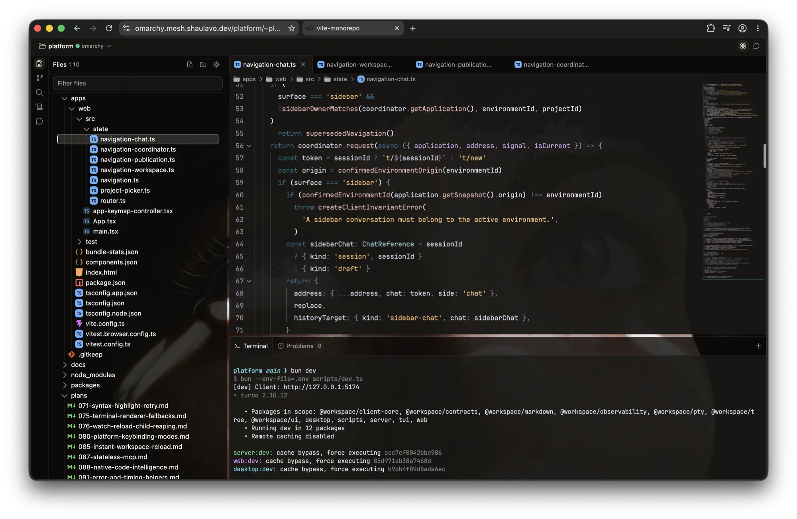

# fregat

a local-first code editing workspace. one bun monorepo, four frontends, one server



a vite react client talks to an elysia server that does the filesystem, git and lsp work. a shared contracts package keeps both sides agreeing on shapes. an electrobun shell wraps the same client into a desktop app, a swift client is going native on mac, and a tui speaks to the same server over the same routes

the editor is [singapore](https://github.com/ShaulLavo/singapore) and the terminal is [ghostty-webgpu](https://github.com/ShaulLavo/ghostty-webgpu). both are sibling checkouts, both are linked from source, and neither is vendored

## running it

```bash
bun install
bun run dev
```

`dev` brings up web, server and desktop together. `bun run dev:web` skips the desktop app, `bun run desktop:dev` runs only it, and `bun run dev:tui` opens settings, commands and file browsing against the server that is already up. see the [tui guide](apps/tui/README.md) for connection options and headless frames

a root `.env` is optional. it is read only for overrides like `PORT`, `WEB_PORT` and the `OBSERVABILITY_*` knobs

open the url `dev` prints and you land on the workspace shell with the tree and the editor

```bash
bun run verify
```

that is the full gate: typecheck, lint, format:check, test. lint is oxlint, formatting is oxfmt. narrow it with `bun --filter web test` or `bun --filter server typecheck`

commit hooks are opt-in. `bun run hooks:install` gets you oxfmt and oxlint over staged files, then a repo typecheck

## what's where

- `apps/web`, the editor shell, workspace tree, git views, file picker, client state
- `apps/server`, elysia rpc for filesystem, git, file watching, auth, and the typescript lsp websockets
- `apps/desktop`, the electrobun shell, a bun main process and a preload bridge
- `apps/mac`, the native swift client
- `apps/tui`, the terminal client
- `packages/contracts`, shared dtos, runtime schemas, the settings registry
- `packages/ui`, react components, styles, primitives
- `packages/tree`, the file tree, its hooks and its path store
- `packages/observability`, structured logging and telemetry config

the rough rule: anything with side effects lives on the server, product workflows and ui state live in web. web reaches the server through `apps/web/src/lib` helpers or feature-local api modules, never by redeclaring a dto inside a component. the ui package stays app-agnostic and keeps react as a peer dependency

every user-facing knob is a registry entry in `packages/contracts/src/settings/keys.ts`, never a loose localStorage key. `docs/settings-reference.md` is generated, so rerun `bun run settings:reference` after touching the registry

[filesystem boundaries](docs/filesystem-boundaries.md) covers ordinary editor access, the optional server root restriction, and the separate permissions agents run under

## the linked checkouts

singapore and ghostty-webgpu are not vendored, and not published under the names used here. you need both as siblings, at `../Editor` and `../ghostty-webgpu`, registered once with `bun link` inside each package. the root `overrides` map then points every `@singapore-editor/*` and `ghostty-webgpu` at those checkouts through bun's `link:` protocol. ci does the same thing, cloning both repos as siblings and linking each package

they are deliberately not bun workspaces. turbo skips any workspace package whose realpath falls outside the repo root, so a `"../Editor/packages/*"` glob breaks `bun run dev` outright. `overrides` plus `link:` gets live source without workspace membership

`dev` and `dev:web` serve both libraries from their linked typescript. no second demo server, no build watcher. startup prints every source package with the directory it resolved to, and a missing source file stops startup rather than quietly falling back to `dist`

editing fregat's own ui hot-reloads. editing singapore or ghostty reloads the page, so mounted instances pick up the new code. `bun run --cwd apps/web typecheck:dev` runs the source typecheck once against the same module map vite uses

two things still need a build step. ghostty's `ghostty-vt.wasm` and `bridge.wasm` are compiled artifacts, so run `bun run build:wasm` or `bun run build:bridge` in that checkout after changing their native inputs. and production builds read `dist`, which source development never updates

restart dev after changing a package's export map or relinking a checkout

## shipping it

`bun run deploy` builds the web app, verifies the candidate, swaps a symlink and runs a headless check against the live url. nothing restarts, so open terminals and agent sessions survive it. server changes need `bun run deploy --server`, which restarts the unit and drops every live session, so do not reach for it on web-only work

`bun run deploy --rollback` moves back one release. `GET /platform/release` answers whether a change actually landed, reporting the served release, its commit, and the dirty-file count it was built from

the route still says `platform`. renaming it costs a restart, and a restart costs every open session, so it waits for a moment when that is free
