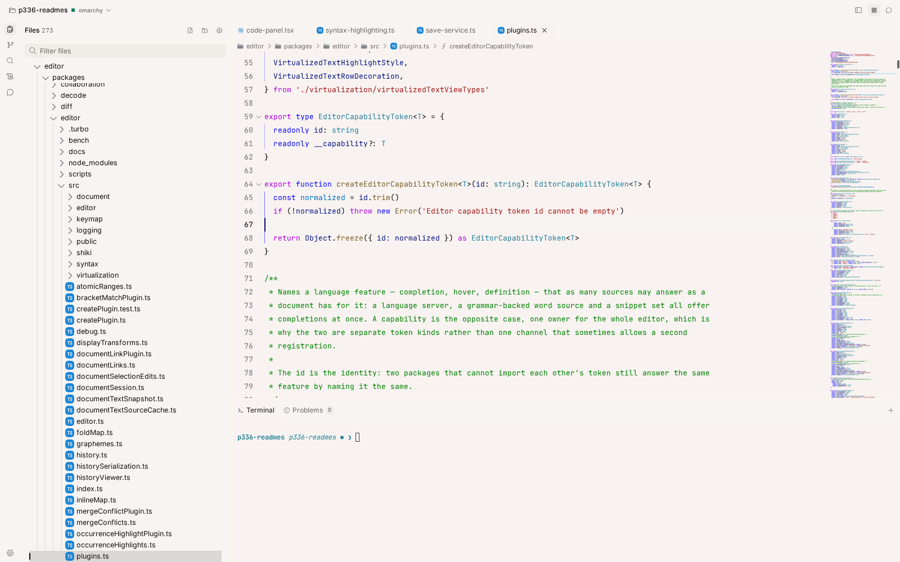

# fregat

an open cursor, built from scratch

open a folder and get an editor, terminals, git, and language servers in panes, with claude code and codex beside them. agents use the subscriptions you already have

everything runs on your machine. open the same workspace from a browser, the desktop app, a terminal, or a phone over tailscale

## try it

clone this repo, then run with [bun](https://bun.sh)

```sh
bun install
bun run dev
```

open the url it prints and pick a folder. for agents, install [claude code](https://code.claude.com/docs/en/setup) or [codex](https://developers.openai.com/codex/cli), then sign in

## what's in it

- [singapore](https://github.com/ShaulLavo/singapore), a browser editor written from scratch, with multi-cursor editing, syntax highlighting, and language servers
- [ghostty-webgpu](https://github.com/ShaulLavo/ghostty-webgpu), a terminal powered by libghostty-vt in wasm, with gpu rendering
- claude code and codex sessions side by side, each with its own permissions
- web, desktop, native mac, and terminal clients sharing one local server

## benchmarks

[editor typing latency](editor/examples/stress/results/input-latency/README.md) · [terminal comparisons](ghostty-webgpu/docs/benchmarks.md)

## more

[development and releases](docs/development.md) · [tui](apps/tui/README.md) · [docs](docs/README.md) · [settings](docs/settings-reference.md) · [roadmap](PLAN.md)
