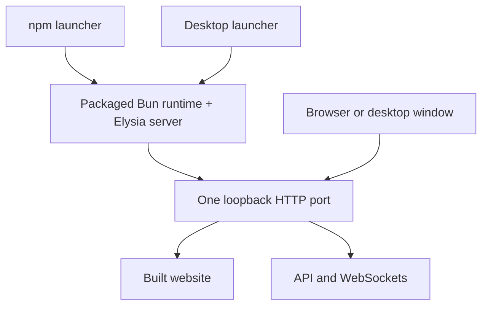

# Desktop and one-command web deployment

Status: proposed design, implementation not started. Based on Platform `548cebdf`, inspected on 2026-09-11. This document does not change execution order in `PLAN.md`.

## The launch experience

Platform ships as a desktop application and as a local web application. Both run the same server and built React frontend on the user's machine.

The intended web command is:

```sh
npx <published-package>@latest
```

It obtains the release, starts Platform, prints the local URL, and opens the browser once the server is ready. There is no source checkout, build step, separate frontend process, or Bun installation for the user. Node and npm are prerequisites for the npm entry point. Agent providers still need their own installation and authentication, but missing providers must not prevent the application from opening.

The desktop installer contains the same runtime bundle. Opening Platform starts that runtime and opens its URL in the existing Electrobun window, with the native bridge available. Desktop does not require Node, npm, or a separately installed Bun.

T3 Code provides the reference experience: its documented `npx t3@latest` command starts the local server and opens the web app, while its desktop application includes its runtime. This proposal adopts that launch experience, not its backend implementation. [T3 Code installation](https://github.com/pingdotgg/t3code/blob/main/docs/user/install.md)

The npm package name is undecided. `platform` already names an unrelated platform-detection library. A scoped package can still install a command named `platform`. All command names and options here describe the proposed release. [Existing npm package](https://registry.npmjs.org/platform/latest)

## One server owns the application



The launchers are alternative entry points. The runtime owns HTTP serving, application state, orchestration, watchers, terminals, and language servers. Provider and language-server subprocesses still exist. “One server” means one application listener, not one operating-system process for every feature.

Use Elysia's static-file support for the release's `web/` directory. Keep Vite for frontend development and builds. Production does not run Vite or `vite preview`. The static plugin supports an asset directory and URL prefix; verify the package version against our pinned Elysia release during implementation. [Elysia static plugin](https://elysiajs.com/plugins/static)

The production frontend derives its primary backend address from the page's origin. One build then works on any selected local port. Development can retain its explicit backend address. Remote environment selection and forwarded endpoints remain explicit through the existing client-core transport.

Keep the current API paths. The frontend currently owns `/`, workspace URLs starting with `/~`, and remote workspace URLs starting with `/@`. These are already distinct from backend routes, so adding an `/api` prefix and changing every transport caller is unnecessary for this release.

Static serving has a narrow contract:

- Serve only packaged public files, never the runtime directory, project directory, dependencies, or application data.
- Serve `index.html` for document navigation to known frontend route shapes, including refreshed deep links.
- Return ordinary backend errors for unknown API routes. A missing script, stylesheet, worker, or WASM file stays a 404.
- Serve fingerprinted assets with long-lived immutable caching. Revalidate HTML and unversioned public files.
- Preserve correct content types, including WASM. Verify editor and terminal workers through the actual production build.

Do not enable an unrestricted SPA catch-all. Elysia's documented `indexHTML` fallback can answer any unmatched request, which is broader than this contract. Keep fallback ownership in the web-serving module. [Elysia fallback behavior](https://elysiajs.com/plugins/static)

Public document and asset requests must work without an `Origin` header. Existing API and WebSocket origin checks remain inside the API boundary. The current guard already handles same-origin GET requests through fetch metadata and the referrer; verify the packaged browser behavior before changing that policy. Validate the local host for the whole listener and preserve loopback binding. Public internet hosting and pairing remain part of the existing remote-access work, outside this release.

## Ship a complete runtime directory

The selected initial artifact is a directory containing a pinned Bun executable, built JavaScript, web assets, and the runtime dependencies that cannot be reduced to bundled JavaScript:

```text
release/<target>/
  manifest.json
  bin/bun
  server/index.js
  server/claude-discovery-worker.ts
  node_modules/...
  web/index.html
  web/assets/...
  web/<other public files>
```

The actual dependency closure is generated and checked during packaging. This layout is a contract to prove, not a claim that the current build already creates it.

Repository constraints make this important:

| Current code                                                                           | Packaging implication                                                                      |
| -------------------------------------------------------------------------------------- | ------------------------------------------------------------------------------------------ |
| `scripts/prod.ts` starts Bun and Vite preview separately                               | Replace the production launch path with one application server.                            |
| `apps/desktop/src/bun/index.ts` launches source files and Vite from a checkout         | Packaged desktop needs a release-relative runtime path.                                    |
| `apps/server/package.json` externalizes `@parcel/watcher` and the Claude SDK           | Include their required files and platform-specific native payloads.                        |
| `provider/claude-discovery.ts` launches a separate file using `process.execPath`       | Package that worker and preserve interpreter execution.                                    |
| `lsp/typescript/runtime.ts` resolves package metadata and executable files             | Include runtime-resolved packages, not only statically imported code.                      |
| `lsp/installers.ts` invokes Bun to install optional language servers                   | Keep a usable Bun CLI available without a global installation.                             |
| `packages/pty/src/process.ts` uses Bun Terminal and rejects other runtimes and Windows | A Node-only launcher cannot run the application server directly.                           |
| Root dependency overrides use local editor and Ghostty links                           | Release builds resolve them in CI; installed releases contain no links back to a checkout. |
| `installation/descriptor.ts` and remote scripts describe a source checkout             | Update remote installation discovery to describe the packaged runtime.                     |

Bun can compile an executable and expose its CLI with `BUN_BE_BUN=1`. Compilation is therefore possible, but it does not eliminate the need to account for workers, dynamically located packages, and native files. Start with a directory because it preserves current execution semantics and makes missing files observable. Reconsider compilation only after that artifact passes the release checks. [Bun executable and CLI behavior](https://bun.com/docs/bundler/executables)

Include the search tools required by the shipped search experience, or explicitly document and verify the supported fallback. Do not accidentally inherit `rg`, `fd`, or language-server dependencies from the build machine. Git, a usable shell, and provider accounts are host prerequisites where their features need them. Optional language-server downloads continue through the existing managed installation path.

## npm and desktop distribute the same artifact

Two delivery designs were considered:

| Design                                                                         | Benefit                                                                    | Cost                                                                                                  | Decision                                                            |
| ------------------------------------------------------------------------------ | -------------------------------------------------------------------------- | ----------------------------------------------------------------------------------------------------- | ------------------------------------------------------------------- |
| A small Node launcher with exact-version optional npm packages for each target | npm acquires the matching payload; no separate downloader or release cache | Larger npm artifacts and a package for each supported target                                          | Select for the first release.                                       |
| A small Node launcher downloads and caches a release archive on first launch   | Small npm package; archive also suits remote installs                      | We own checksums, staging, retries, proxies, cache cleanup, and an additional availability dependency | Defer unless artifact limits or measured download costs justify it. |

Use npm's `bin`, `optionalDependencies`, and platform metadata for the first design. Check OS, CPU, and Linux libc before dispatch. Optional packages can be omitted or fail installation, so the launcher must explain a missing payload rather than throwing a module-resolution error. It must not silently fall back to an arbitrary global Bun. [npm package metadata](https://docs.npmjs.com/cli/v11/configuring-npm/package-json/)

The launcher only selects the installed release, starts its Bun entry point, and forwards signals and exit status. The server owns browser opening and readiness. Desktop suppresses browser opening, receives a structured readiness message through a dedicated child channel, and opens the returned URL. Readiness must not depend on parsing human logs or guessing a port.

Release files are immutable. Application data stays under the existing Platform home, outside npm caches and desktop installation directories. Keep logs and managed downloads out of the release directory and launch working directory. On this development machine, staging and release caches belong under `/work`, following `AGENTS.md`.

Resolve code and public assets relative to the installed release. Carry the user's invocation directory separately as the initial project context. Do not automatically load a cloned project's `.env` or Bun configuration as Platform startup configuration.

Updates select a complete new release. The npm launcher and target packages use identical versions, and the desktop installer contains a matching server/frontend pair. First delivery can use manual desktop replacement; an automatic updater is a separate feature. Restarting a previously installed release does not need a second runtime download. npm cache availability still determines whether an offline `npx` invocation can resolve that package.

## Startup and shutdown behavior

The CLI runs in the foreground by default. It prints the actual URL and opens it after readiness. A headless launch prints the URL without opening a browser. Ctrl+C shuts down a runtime owned by that invocation through the existing cleanup path.

Choose a preferred local port and retry binding if another application occupies it. An explicitly requested port fails clearly when unavailable. Retry the actual bind instead of relying on a port probe, and initialize provider/watch resources only after the attempt is known to own the listener. Never kill another process to claim a port.

Derive both the API origin allowlist and the machine service's local web origin from the actual bound URL. `app.ts` currently snapshots the first allowed origin when constructing the machine service, so changing only the frontend URL is insufficient. Initialize these consumers with the selected port before declaring readiness; preserve additional explicitly trusted client origins. A non-default port must pass HTTP, WebSocket, and remote-proxy checks.

Only one runtime may own a Platform data home. Enforce this independently of the listening port, before initializing orchestration or watchers. A second invocation can reopen the existing compatible runtime after validating its identity, release version, and live ownership record. A stale record does not authorize killing an unrelated PID. An incompatible running version produces a clear request to close it before starting the selected version.

Desktop stops a runtime it started. If it attaches to a runtime owned by another launcher, closing the window does not stop that runtime. Attachment does not transfer ownership: Ctrl+C in the owning CLI still stops the server, and an attached desktop shows the resulting disconnection. Record this ownership explicitly. Do not add daemon installation, service managers, or profile management to the initial launcher.

Port and browser-opening preferences must be registry entries with working consumers. Startup reads application or machine settings directly before binding, without depending on its own HTTP endpoint. CLI overrides for registered preferences apply to that invocation. Workspace settings never select a listening address, executable, or environment. Add no ad-hoc localStorage keys or environment variables.

## Implementation boundaries

The proposed module map is deliberately small:

| Owner                                      | Responsibility                                                                             |
| ------------------------------------------ | ------------------------------------------------------------------------------------------ |
| `packages/cli/`                            | Published Node-compatible executable and installed target selection. No application logic. |
| `apps/server/src/runtime/`                 | Launch options, installed paths, instance ownership, listen/readiness, and shutdown.       |
| `apps/server/src/web/`                     | Asset serving, caching, and constrained frontend navigation fallback.                      |
| Existing `apps/server/src/app.ts`          | Domain services, routes, and testable application construction.                            |
| Existing web client transport              | Same-origin production default and existing remote endpoint behavior.                      |
| `scripts/release.ts`                       | Assemble and audit target artifacts and generate npm package metadata.                     |
| Existing Electrobun entry point and config | Include the artifact, launch it, and open its ready URL with native preload.               |
| Existing installation and machine modules  | Describe and invoke the release for managed remote servers.                                |

The launch boundary can be expressed without exposing Elysia or raw child-process objects to desktop:

```ts
type ListenPort =
  | { readonly kind: 'automatic'; readonly preferred: number }
  | { readonly kind: 'fixed'; readonly value: number }

type LaunchRequest = Readonly<{
  port: ListenPort
  presentation: 'browser' | 'headless' | 'desktop'
  initialDirectory: string
}>

type RunningApplication =
  | { readonly kind: 'owned'; readonly url: URL; stop(): Promise<void> }
  | { readonly kind: 'attached'; readonly url: URL }

declare function startApplication(request: LaunchRequest): Promise<RunningApplication>
```

This is a signature sketch, not a new shared framework. Keep the Node dispatch shim small. Extract a shared launcher package only if the implementation actually needs meaningful behavior in both Node and Electrobun. Readiness and installation metadata must be validated at their process boundaries and include the existing environment identity and release version.

## Delivery sequence and proof

1. **Serve the production website through Elysia.** Add constrained static serving, preserve the API guard boundary, switch the built client to same-origin addressing, and make the root production command start one listener. Prove initial navigation, a refreshed workspace route, API requests, a real WebSocket, missing assets, and unknown endpoints. Keep development HMR working.
2. **Create a relocatable runtime artifact.** Include Bun, workers, native payloads, runtime package metadata, and all frontend assets. Launch it from an unrelated directory without the source checkout, global Bun, development dependencies, or linked sibling repositories. Prove terminal input/output, file watching, search, TypeScript startup, provider-worker startup, and shutdown. Test missing provider configuration as a usable onboarding state.
3. **Add npm launch and runtime ownership.** Pack the real publishable packages, install them in an isolated test environment, and run their executable. Verify port contention, duplicate invocation, release mismatch, browser-open failure, signals, restart, and persistence outside the install directory. The application stays usable if opening the browser fails; its URL remains printed.
4. **Package desktop from the same artifact.** Replace source/Vite spawning only in the packaged path. Verify native file picking, preload delivery, editor/terminal rendering, launch without npm/Bun, and quit cleanup. Produce installation artifacts and validate platform signing requirements for advertised distribution targets.
5. **Unify remote installation and release automation.** Replace source-only installation descriptors and checkout imports in remote launch scripts, updating all callers together. Keep managed servers headless and loopback-bound. CI builds tested target artifacts, verifies their file inventory and linked-dependency closure, then packs desktop and npm outputs from the same release. Publish only after those artifacts pass.

Run the narrow checks for each failure listed above. No package-wide or repository-wide test suite is required merely for editing this design. Future release checks must exercise the packed artifact in a disposable CI environment. During development, reuse the already running dev server rather than starting a competing one.

## Scope still to settle

The working assumption is macOS and Linux first. Start certification with the developer targets, Linux x64 glibc and macOS arm64; add macOS x64 and Linux arm64 only with passing target runs. Windows requires terminal support before it can claim the same experience. Alpine/musl is not automatically covered by a Linux release.

Use the existing Electrobun desktop shell for this plan. The separate native macOS client is not substituted for the React desktop product.

The remaining product choices are the public package name, advertised OS/architecture matrix, and desktop distribution channels. They do not block the first two implementation units. Public hosting, pairing, automatic desktop updates, and daemon management remain separate work.
