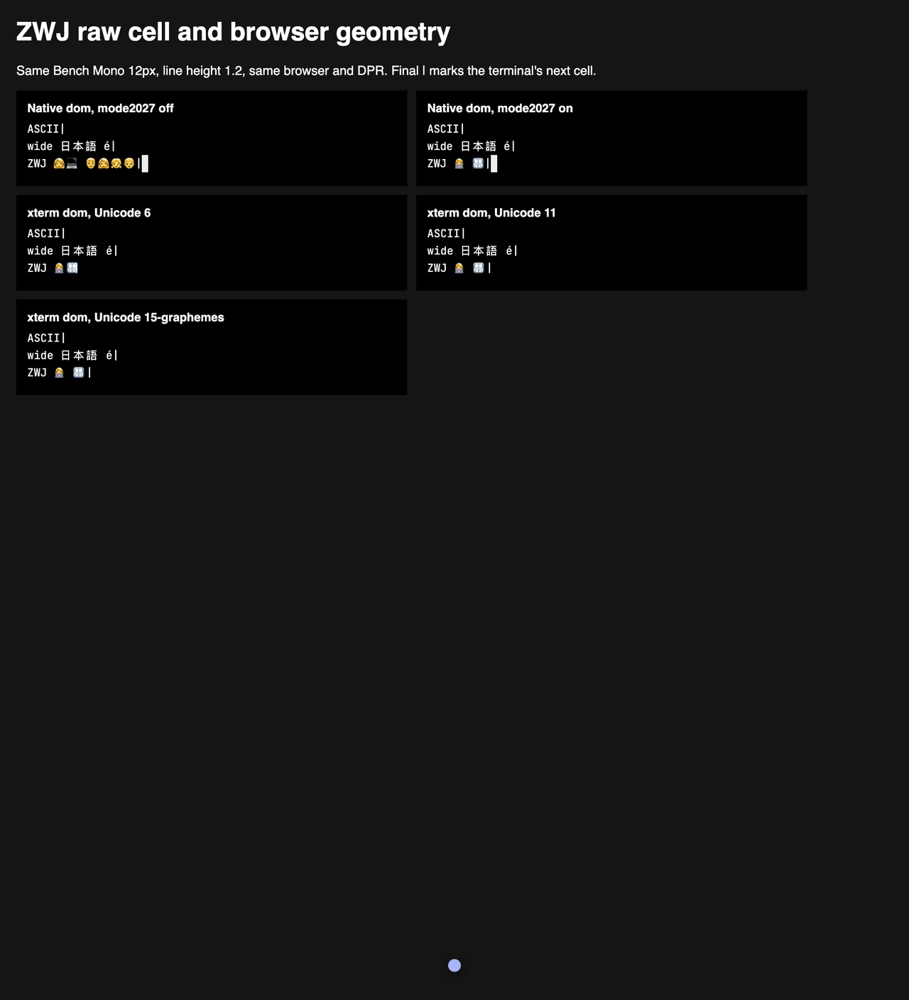

# ZWJ cell controls, 2026-10-03

[Issue #360](https://github.com/ShaulLavo/fregat/issues/360) compares different Unicode providers
and grapheme modes. For the reported sequences, native raw ABI cells, packed row decoding and
cursor positions agree. Native legacy geometry matches xterm's Unicode 11 provider, and native
mode 2027 matches xterm's Unicode 15 grapheme provider. Keep the packaged default unchanged.
The consistent configuration prerequisite is in
[Plan 283](../../plans/283-ghostty-output-and-input-latency.md#consistent-grapheme-policy).

## Cell owners

Write `ASCII|\r\nwide 日本語 é|\r\nZWJ 👩‍💻 👨‍👩‍👧‍👦|` into a 40-column,
3-row terminal. The final `|` makes the next cell observable. Columns below are zero-based.

| Provider or mode | Technologist owners | Family owners | `|` column | Cursor column |
| --- | --- | --- | --- | --- |
| Native, mode 2027 off | `👩‍` at 4, `💻` at 6, each width 2 | `👨‍` at 9, `👩‍` at 11, `👧‍` at 13, `👦` at 15, each width 2 | 17 | 18 |
| xterm Unicode 11 | Same native legacy owners | Same native legacy owners | 17 | 18 |
| Native, mode 2027 on | `👩‍💻` at 4, width 2 | `👨‍👩‍👧‍👦` at 7, width 2 | 9 | 10 |
| xterm Unicode 15-graphemes | Same native clustered owners | Same native clustered owners | 9 | 10 |
| xterm default Unicode 6 | `👩‍` at 4, `💻` at 5, each width 1 | `👨‍` at 7, `👩‍` at 8, `👧‍` at 9, `👦` at 10, each width 1 | 11 | 12 |

The native WebGL, Canvas and DOM backends report identical owners, spans and cursors. Their
packed rows match the direct `ghostty_render_state_row_cells_get` reader in both modes.
Selection and history retain every codepoint, which explains why the original string assertions
passed. The ASCII and Japanese/combining controls retain matching cell ownership across providers.

xterm DOM also lets the browser shape adjacent strings into joined emoji. Its visual `|` position
can precede its buffer column. The Unicode 6 DOM capture paints `|` about seven cells from the
row origin while its buffer stores `|` at column 11. A compact screenshot alone therefore cannot
establish terminal cell-width correctness. Browser fallback fonts shape full clusters in native
mode 2027 too, so missing emoji shaping is ruled out for these exact controls.

## Sources and reproduction

The checked source is Fregat `a8c481489`. Native WASM is the unpatched official Ghostty revision
[`c8554f28e0efe2f5595f32020371c34b25ec628f`](https://github.com/ghostty-org/ghostty/tree/c8554f28e0efe2f5595f32020371c34b25ec628f).
Its [grapheme mode](https://github.com/ghostty-org/ghostty/blob/c8554f28e0efe2f5595f32020371c34b25ec628f/src/terminal/modes.zig#L328)
defaults off in the VT core. Full Ghostty's
[`grapheme-width-method`](https://github.com/ghostty-org/ghostty/blob/c8554f28e0efe2f5595f32020371c34b25ec628f/src/config/Config.zig)
configuration defaults to `unicode`. The pinned C ABI already exposes
[`GHOSTTY_TERMINAL_OPT_MODE_DEFAULT`](https://github.com/ghostty-org/ghostty/blob/c8554f28e0efe2f5595f32020371c34b25ec628f/include/ghostty/vt/terminal.h#L1447),
which changes both the current mode and its RIS reset default. No upstream upgrade is needed to
implement a future configuration policy.

The xterm controls use `@xterm/xterm` 6.0.0 with its default `unicode.activeVersion === '6'`,
`@xterm/addon-unicode11` 0.9.0 and `@xterm/addon-unicode-graphemes` 0.4.0. Both addon packages
record source commit `f447274f430fd22513f6adbf9862d19524471c04`. The comparison benchmark loads
neither Unicode addon. Its narrower default emoji widths are expected from the provider's
[Unicode 6 table](https://github.com/xtermjs/xterm.js/blob/f447274f430fd22513f6adbf9862d19524471c04/src/common/input/UnicodeV6.ts).

Use the same loaded `@fontsource/jetbrains-mono` 5.3.0 face, named `Bench Mono`, at 12px,
line height 1.2 and DPR 2. Await `document.fonts.load('12px "Bench Mono"')` before opening any
terminal. Native renderer cells round to 7 CSS pixels; xterm DOM retains 7.2 CSS pixels, while
xterm WebGL also rounds to 7. Report both measured geometry and logical columns.

For native controls, write `\x1b[?2027l` or `\x1b[?2027h` before the same payload. Read
`terminal.cursor`, `renderState.readRows({ packed: true })`, and the independent
`src/core/tests/per-cell-reader.ts` reader. Retain each cell's position, codepoints, continuation
flag and packed span. Read native selection and history as well.

For xterm, construct with `allowProposedApi: true` so the provider and buffer inspection APIs are
available. The flag does not select a different provider. For Unicode 11, load
`new Unicode11Addon()` and set `terminal.unicode.activeVersion = '11'`. For the grapheme control,
load `new UnicodeGraphemesAddon()` and select `'15-graphemes'`. Write the same payload, then
inspect `buffer.active.cursorX` and `buffer.active.getLine(2).getCell(x).getChars()/getWidth()`.
`\x1b[6n` also returns the corresponding one-based cursor report. Capture DOM span rectangles
and the actual rendered output separately from the buffer records.

## Evidence and limits

[The durable raw table](zwj-cell-controls-2026-10-03.json) contains native ABI and packed rows,
selection/history, xterm buffer cells, cursor reports, DOM rectangles and browser text widths.
The screenshot below was read back after the font loaded. It shows native legacy components,
native clustered emoji and xterm DOM's compact shaping across all three Unicode providers.

The T3 browser ran Chrome 152.0.7977.130 / Electron 44.4.2 on macOS at DPR 2. The raw controls
include all native backends and both xterm backends. A reduced DOM-only screenshot succeeded after
full twelve-panel T3 captures timed out. The complete control page is privately published at
`https://ack3.shaulavo.dev` for 24 hours from the run; the committed files above outlive that page.

A Linux Chromium 153.0.8010.12 `agent:browser look` at DPR 2 also passed and its screenshot was
read back. The three native backends show the same off/on geometry. xterm DOM shows the same
cross-cell shaping. Its headless WebGL panels render oversized and clipped in this one-off page,
so those panels support no precise pixel-geometry claim. The record names SwiftShader, and the
only warnings are screenshot `ReadPixels` GPU stalls. This run provides correctness evidence,
not performance evidence.

Raw scripts, complete JSON and captures are in
`/work/tmp/fregat-evidence/20261003-remaining-issues/fregat-360/`; the Linux look is in its
`linux/20261003T004118Z-look-fregat-1000x1100/` subdirectory. The reproduction script is one-off
machine proof and is not a committed test. The existing focused render-state, history and bulk
snapshot suite passes all 22 tests. No additional test mirrors already-correct behavior.

These controls rule out a native ABI/decoder or upstream grapheme-width defect for the reported
strings. They do not prove every Unicode sequence, font or renderer path correct, and do not
change the package's Unicode policy. The Zig frame path was outside this attribution because the
original mismatch also reproduced in every JS row path.
