# Keyboard shortcuts editor: research for Plan 166

Phase 0 of [Plan 166](../../plans/166-shortcuts-editor.md), 2026-09-26. Sources: `references/vscode`
at `90da900128e` (pulled 2026-09-26), `references/zed` at `933d8d9`, vscode.dev screenshots taken
with Playwright, and web sources linked inline. Mockups are static HTML built from the app's own
`globals.css`; see [Mockups](#mockups).

## What the research changes

1. **The row count moved.** `platformCommands` is 253 commands now, not 231. Unbound in the
   Platform preset: 83 on Linux, 82 on macOS; in the VS Code preset: 89 and 88. Measured with
   `commandKeyBindings(presetPlatformKeyBindings(platform, preset).bindings, {})` in a Bun probe
   (`/work/tmp/research2/166/probe.ts`).
2. **Commands already carry several shortcuts.** 9 commands (Linux, Platform) to 21 (macOS, VS
   Code) have more than one default chord: `Show command palette` is Ctrl+Shift+P and F1,
   `Settings` is Ctrl+, and Ctrl+K Ctrl+S, `Accept selected suggestion` has four. Today's row
   shows only the first (`keys: primary.keys`), and an override replaces all of them, so
   rebinding the palette silently drops F1. Phase 7 is less new than the plan assumed; Phases 2–6
   must at least show that a second chord exists.
3. **Live bug: an override narrows a multi-pane command to one pane.** `userKeyBinding`
   (`keymap/active-bindings.ts`) copies the pane of the _first_ default. `Undo session action` and
   `Redo session action` are bound in six panes (`global`, `git`, `logs`, `problems`, `search`,
   `settings`); overriding either to Ctrl+Alt+U yields one binding, `Ctrl+Alt+U@global`, so the
   new chord does nothing while Git, Logs, Problems, Search or Settings has focus. Probe:
   `/work/tmp/research2/166/probe5.ts`. Fix in Phase 1.
4. **Live bug: the recorder cannot record Control on macOS.** `recordedStroke`
   (`client-core/settings/recording.ts`) maps both `ctrlKey` and `metaKey` to `Mod`. On a Mac,
   pressing Ctrl+1 records Cmd+1, so the VS Code preset's own macOS `Ctrl+1`–`9` chords cannot be
   re-recorded. On Linux the Super key records as Ctrl. VS Code keeps the four modifiers apart.
5. **The resolution report is nearly empty now.** After Plan 080 it holds 4 entries on Linux (5 on
   macOS), all app-side reservations (Ctrl+Tab, Ctrl+Q, Ctrl+Shift+T, Ctrl+W, and Cmd+Alt+Tab on
   macOS); `unmapped` holds the same 4–5; `omitted` lists 21–22 editor commands. The before
   screenshot's `Mod+1`–`3` rows are gone. Phase 5 is small.
6. **"Browser reservation" means the opposite of what the recorder needs.** The report's
   reservations are chords the _app_ swallows so the browser does not act. The recorder needs the
   chords the _browser_ keeps, which a page never receives: in a Chrome tab Ctrl+N, Ctrl+T,
   Ctrl+W, Ctrl+Tab and Ctrl+Shift+T never arrive, while "in Apps mode, no keys are reserved"
   ([browser_command_controller.cc](https://chromium.googlesource.com/chromium/src/+/main/chrome/browser/ui/browser_command_controller.cc)).
   The app ships a manifest with `"display": "standalone"`, so the same chord works installed and
   fails in a tab. The recorder can tell with `matchMedia('(display-mode: standalone)')`.
7. **No web API says a hardware keyboard is attached.** `navigator.keyboard` is Chromium-only;
   WebKit and Firefox do not ship it. Pointer media queries describe the pointer, not the
   keyboard. The first keydown with a modifier or a non-text key is the only reliable signal.
8. **D2 differs from the plan's Phase 3 text in two keys.** In VS Code, Backspace is a recordable
   key, and Escape clears a recorded chord before a second Escape closes the widget. The plan's
   "Backspace drops the last stroke" would make bare Backspace unbindable (the editor pack binds
   it to `deleteBackward`). Following D2 means following VS Code here.
9. **Touch sizing does not reach menus.** The settings page forces 40 px controls with
   `@max-3xl/settings:` variants on its scroller, but dropdown and context menus portal outside
   the `@container/settings` element, so a row menu opened on a phone has 28 px items (compact
   density: 16 px line + 2 × 6 px). No primitive in `packages/ui` uses `pointer-coarse` today.
10. **On the unfiltered page, Usage renders below the shortcut list.** `Keyboard shortcuts` is the
    last registry category, and `matchesUsageSearch('')` is true, so `Usage` is appended after it.
    With 253 rows inline (5 k px on desktop, 12 k px on a phone) Usage becomes unreachable in
    practice. Keyboard shortcuts should render last.

## VS Code

Files under `src/vs/workbench/contrib/preferences/browser/` unless noted.

**Table** (`keybindingsEditor.ts:470-525`). Five columns: a 40 px actions column, then Command
(weight 0.3), Keybinding (0.2), When (0.35) and Source (0.15). The actions column shows a pencil
("Change Keybinding") on a bound row and a plus ("Add Keybinding") on an unbound one. The command
cell shows the title, and the command id only when the search matched it or the command has no
title (`:966-996`); the id is always in the hover. Keys are drawn by `KeybindingLabel`, one keycap
per key with `+` between. When is the raw context-key expression, `-` when empty (`:1236-1245`).
Source is System, User, or the extension name (`keybindingsEditorModel.ts:27-29`).

**Unbound rows** have an empty Keybinding cell, `-` in When, "System" in Source, and the plus in the
actions column. They sort after every bound row.

**Order** (`services/preferences/browser/keybindingsEditorModel.ts:244-265`): bound before unbound,
titled before untitled, then by title, then by command id; a user entry sorts before the default
of the same command. "Sort by Precedence (Highest first)" (`:148`) switches to resolver order.

**Search** (`keybindingsEditorModel.ts:43-47`, `preferences.contribution.ts:983-1027`):
`@command:<id>`, `@source:user|default|system|extension`, `@ext:<id>`, `@keybinding:<keys>`, and a
quoted string such as `"ctrl+k ctrl+s"` for an exact chord. Record Keys (`:145`) turns the search
box into a recorder: the placeholder becomes "Recording Keys. Press Escape to exit" (`:370`), a
"Recording Keys" badge shows (`:451`), and pressed keys become a quoted exact-chord query.

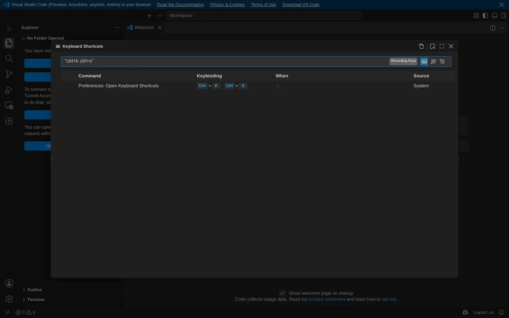

**Context menu** (`:724-750`): Copy, Copy Command ID, Copy Command Title; Change Keybinding… (plus
Add Keybinding… when bound); Remove Keybinding, Reset Keybinding; Change When Expression; Show Same
Keybindings. Remove and Show Same are disabled on an unbound row, Reset on a default row.

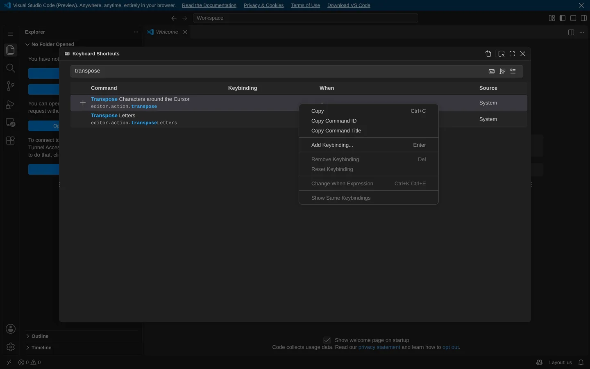

**Define widget** (`keybindingWidgets.ts`). A 400 × 110 overlay centred in the editor: "Press
desired key combination and then press ENTER." (`:169`), the recorded chord as text and as
keycaps, and "N existing commands have this keybinding" (`:230`), recounted on every stroke by
fetching the quoted chord (`keybindingsEditor.ts:354`) and clickable to show them. Nothing is
written until Enter. Escape clears a recorded chord, and a second Escape closes (`:276-285`);
blur cancels. Chords stop at two strokes; a third stroke starts over (`:121`). Backspace is
an ordinary key.

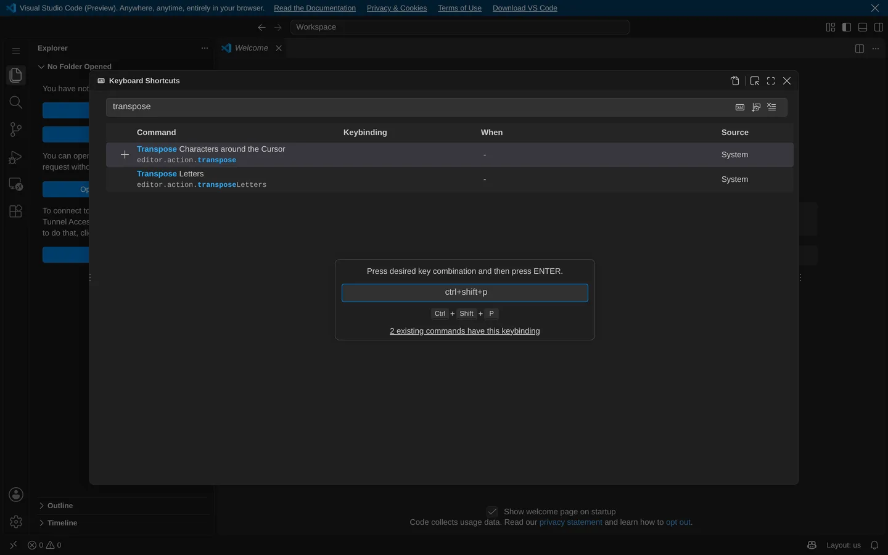

**Writes** (`services/keybinding/common/keybindingEditing.ts`). `keybindings.json` is a list of
`{ key, command, when }`. Change on a default writes a user entry and a removal entry
`{ key, command: "-<id>" }` for the default it replaces (`:75-85`, `:152-161`). Add appends an
entry and leaves the default alone. Remove on a default writes the removal entry; on a user entry
it deletes the entry. Reset deletes the user entry and every `-<id>` removal for that command
(`:108-120`, `:165-175`).

**Narrow.** VS Code has no narrow layout. At 390 wide the table keeps its columns and truncates
titles to "Accept Inline Co…" with When and Source off screen; the define widget spans the width.
This is the shape not to copy.

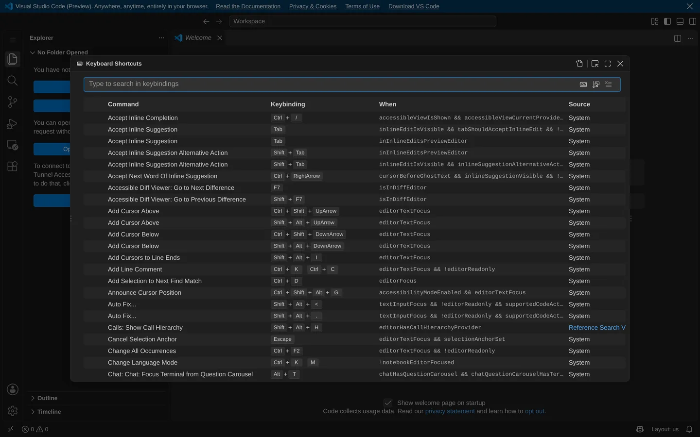 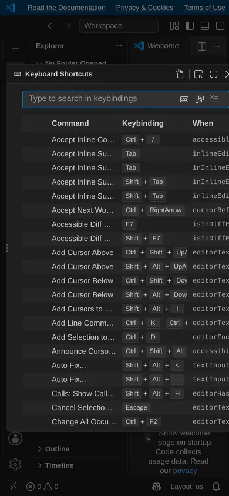

## Other keymap editors

**Zed** (`crates/keymap_editor/src/keymap_editor.rs`, 4,531 lines, read from source). Columns: an
indicator, Action, Arguments, Keystrokes, Context, Source (`:2149`). A filter menu holds Conflicts,
No Action, and source toggles User / Default / Vim (`:1636-1690`); "Search by Keystrokes" with an
exact-match toggle (`:1985`, `:2080`). A conflicting user binding shows a warning icon that opens
the edit modal, and an overridden row shows an info icon with "This keybinding is overridden by the
'X' binding from your keymap" (`:1170-1230`, `:2340-2355`). Editing is a modal with Edit
Keystroke, Arguments and Context fields and Cancel / Save. The keystroke field records up to three
strokes; Enter starts recording, `escape escape escape` stops it, Delete clears
(`assets/keymaps/default-linux.json:1435-1441`, `ui_components/keystroke_input.rs:71`). While
recording it shows "There are N bindings with the same keystrokes. View". The first Save with a
conflict shows "Your keybind would conflict with the "X" action" and the second Save goes through
(`:2830-2870`). Desktop only.

**Obsidian** (Settings › Hotkeys). A row is the command, one chip per hotkey with an × each, a
restore icon and a +. The first chord pressed is saved at once, with no confirm and no sequences.
A conflict turns the chip red after saving, and clicking it filters to the clash. A keyboard
button filters by keystroke. The tab exists on iPhone and iPad with or without a keyboard; users
call it useless without one. iPadOS 26 takes ⌘, for itself.
([help](https://obsidian.md/help/hotkeys), [forum](https://forum.obsidian.md/t/display-hotkeys-with-conflicts/88457),
[forum](https://forum.obsidian.md/t/ipados-26-overrides-obsidian-s-default-open-settings-hotkey/106447))

**JetBrains** (Keymap). A tree of actions with their shortcuts. Add Keyboard Shortcut opens a
dialog that records one stroke, with a "Second stroke" checkbox for a two-stroke chord, and shows
"Already assigned to:" live while recording. OK then asks "Remove / Keep / Cancel" for the other
assignments. Find Actions by Shortcut searches by keystroke. Each shortcut of an action has its
own Remove entry.
([docs](https://www.jetbrains.com/help/idea/configuring-keyboard-and-mouse-shortcuts.html),
[KeyMapBundle](https://github.com/JetBrains/intellij-community/blob/master/platform/platform-api/resources/messages/KeyMapBundle.properties))

**Warp.** One search box: `Search by name or by keys (ex. "cmd d")`. Clicking a row shows "Press
new keyboard shortcut"; each keydown replaces the pending chord and nothing is written until Save
(with Clear / Default / Cancel). "This shortcut conflicts with other keybinds" shows before Save.
One chord per action, no sequences.
([keybindings.rs](https://github.com/warpdotdev/warp/blob/master/app/src/settings_view/keybindings.rs))

**iPadOS.** Through iPadOS 18, holding ⌘ shows the frontmost app's shortcuts grouped by menu
(File, Edit, View), searchable and tappable. iPadOS 26 replaces it with a menu bar.
([MacStories](https://www.macstories.net/stories/ios-and-ipados-15-the-macstories-review/8/),
[MacStories 26](https://www.macstories.net/stories/ios-and-ipados-26-the-macstories-review/11/))

**Android** Keyboard Shortcuts Helper (Meta+/). Categories, a search box, and alternatives joined
by "or"; a bottom sheet on phones. Customising (Android 16) is tablet-only: + opens "Press key to
assign shortcut" with Set shortcut / Cancel, and a clash says "Key combination already in use. Try
another key."
([AOSP strings](https://github.com/aosp-mirror/platform_frameworks_base/blob/main/packages/SystemUI/res/values/strings.xml),
[Android Authority](https://www.androidauthority.com/custom-keyboard-shortcuts-android-16-3527394/))

**What they agree on.** Every editor that confirms (VS Code, Zed, Warp, JetBrains, Android) shows
the clash before the write; only Obsidian commits on the first stroke and reports afterwards.
Search by pressing keys is universal. None of them has a considered phone layout; Android's answer
is to hide editing on phones.

## Mobile facts

**Detecting a hardware keyboard.** No API reports one.

- `navigator.keyboard` (`getLayoutMap`, `lock`) is Chromium-only; Safari and Firefox lack it, and
  WebKit has no position on Keyboard Lock
  ([web-features](https://web-platform-dx.github.io/web-features-explorer/features/keyboard-map/),
  [WebKit #182](https://github.com/WebKit/standards-positions/issues/182)).
- On an iPad with a trackpad, `hover: hover` and `pointer: fine` stay false while `any-hover` and
  `any-pointer: fine` turn true ([WebKit 209292](https://bugs.webkit.org/show_bug.cgi?id=209292)).
  A plain Bluetooth keyboard has no trackpad and changes nothing.
- `visualViewport` resizing tracks the on-screen keyboard, late and indirectly.

Decision: a session flag `keyboardSeen`, set by the first keydown that carries Ctrl, Meta or Alt
or is a non-text key (arrows, Tab, Escape, F-keys). A software keyboard sends text keys, often as
`key: "Unidentified"`. Before the flag is set, `(any-pointer: fine)` is treated as likely. The
recorder never blocks on the flag: it shows the keyboard note and keeps listening.

**Chords a page never receives.**

| Chord                                                          | Kept by                                                      | Source                                                                                                                                                                   |
| -------------------------------------------------------------- | ------------------------------------------------------------ | ------------------------------------------------------------------------------------------------------------------------------------------------------------------------ |
| Ctrl+N, Ctrl+T, Ctrl+W, Ctrl+Tab, Ctrl+Shift+Tab, Ctrl+Shift+T | Chrome and Edge in a tab; nothing in an installed app window | [browser_command_controller.cc](https://chromium.googlesource.com/chromium/src/+/main/chrome/browser/ui/browser_command_controller.cc)                                   |
| Accel+N, Accel+T, Accel+W, Accel+Shift+W, Accel+Shift+P        | Firefox (`reserved="true"`)                                  | [browser-sets.inc.xhtml](https://github.com/mozilla-firefox/firefox/blob/main/browser/base/content/browser-sets.inc.xhtml)                                               |
| Cmd+N, Cmd+W, Cmd+Q, Cmd+T, Cmd+R, Cmd+L, Ctrl+Tab             | Safari on macOS                                              | [W3C thread](https://lists.w3.org/Archives/Public/public-webapps-github/2016Jan/0255.html)                                                                               |
| Cmd+T, Cmd+W, Cmd+N, Cmd+L, Cmd+R, Cmd+F, Cmd+[ ], Ctrl+Tab    | Safari on iPad                                               | [Cult of Mac](https://www.cultofmac.com/how-to/all-keyboard-shortcuts-you-ever-need-safari-ipad)                                                                         |
| Cmd+Space, Cmd+Tab, Cmd+Shift+3/4, Cmd+M, Globe+letter; Cmd+,  | iPadOS itself; Cmd+, since iPadOS 26                         | [Apple 102393](https://support.apple.com/en-us/102393), [Obsidian forum](https://forum.obsidian.md/t/ipados-26-overrides-obsidian-s-default-open-settings-hotkey/106447) |
| Ctrl+Tab, Ctrl+Shift+Tab, Ctrl+PageUp/PageDown                 | Chrome on Android (runs before the page)                     | [KeyboardShortcuts.java](https://chromium.googlesource.com/chromium/src/+/main/chrome/android/java/src/org/chromium/chrome/browser/KeyboardShortcuts.java)               |

Cmd+H and Cmd+Q on iPad: unverified. Whether iOS Safari delivers other Cmd+letter chords (Cmd+K,
Cmd+B) with `metaKey` is unverified; UIKit handles its own commands first and passes the rest to
WebKit ([r240742](https://trac.webkit.org/changeset/240742/webkit)). The iPhone check stays the
owner's, on the mesh; Playwright's WebKit does not start on this host.

The recorder's table lives in `client-core` beside `chord.ts` as data keyed by engine
(Chromium, Gecko, WebKit desktop, WebKit iPadOS). It warns only for the engine in use, and for
Chromium only outside `display-mode: standalone`. Default Platform bindings that land on a kept
chord (Ctrl+Shift+T reopen closed editor, Ctrl+W close tab) get the same fact on their row.

**Escape on iPad.** The Magic Keyboard has no Escape key and Cmd+. no longer stands in for it
([Apple discussion](https://discussions.apple.com/thread/255342632)). The recorder's popover
therefore keeps Cancel and Save buttons, which a touch or trackpad user can reach.

## Proposed row anatomy

Measured in the mockups: the settings dialog is `min(880px, 100vw − 3rem)` wide, so the
`@container/settings` element is 880 px at 1440 and 772 px at 820 (both at or above `@3xl`, 768 px),
and 390 px on a phone.

**Desktop (`@3xl/settings` and up).** One `ListRow` at the token height (`--density-row-height`,
20 px compact). Grid `minmax(0,1fr) 12rem 10rem 4.5rem 3.25rem`:

| Column  | Content                                                                                                                                                       |
| ------- | ------------------------------------------------------------------------------------------------------------------------------------------------------------- |
| Command | Title, truncated. The command id shows in the row `title`, and inline only when the search matched the id (VS Code's rule).                                   |
| Keys    | The first chord as `Kbd`, one chip per stroke (`formatChord` per stroke, as lane L1's call sites draw it), then `+N` in `font-mono text-2xs` for more chords. |
| Where   | Words, below. A shadowed row says "Taken by <command>" in `text-warning` with a warning icon.                                                                 |
| Source  | Default, Custom, Removed; blank on an unassigned row.                                                                                                         |
| Actions | Change (pencil) or Add (plus), and ⋯. Visible on hover, on the active row and on focus; `data-tooltip`.                                                       |

Unassigned rows draw nothing in Keys. Custom and Removed rows carry the `bg-info` modified bar at
the left edge. The row `title` holds title, id, every chord, every place, and who took a shadowed
chord.

**Narrow (below `@3xl/settings`).** A two-line row at a fixed 3 rem (48 px), so `VirtualList` needs
no measuring: line one is the title in `text-sm` with the first chord and `+N` on the right; line
two is where · source in `text-2xs text-muted-foreground`. No inline buttons; a tap opens the row
menu anchored to the row. Measured at 390: rows 44–50 px in the mockup (fix to 48), filter tabs
40 px, filter control fits with no overflow (0 px), no horizontal page scroll, the list has no
scroller of its own.

**Where words.** From the binding's `pane` and `editorWhen`:

| Input                                                                                      | Words                                                                |
| ------------------------------------------------------------------------------------------ | -------------------------------------------------------------------- |
| pane `any`                                                                                 | Everywhere                                                           |
| `editor`, `file-tree`, `git`, `search`, `logs`, `problems`, `settings`, `terminal`, `chat` | Editor, Files, Git, Search, Logs, Problems, Settings, Terminal, Chat |
| `global` (the app shell, focus in no pane)                                                 | App                                                                  |
| `writable`                                                                                 | editable                                                             |
| `hasSelection`                                                                             | with a selection                                                     |
| `findVisible` / `!findVisible`                                                             | find open / find closed                                              |
| `suggestWidgetVisible`                                                                     | suggestions open                                                     |
| `parameterHintsVisible`, `parameterHintsMultipleSignatures`                                | signature help open, several signatures                              |
| `inlineSuggestionVisible`                                                                  | inline suggestion shown                                              |
| `!tabFocusMode`                                                                            | Tab inserts                                                          |

Conditions join the pane with commas: "Editor, editable", "Editor, find open". Identical chords in
several panes merge into one entry: "App, Git +4" with all six in the `title`. These words
cover all 20 distinct where strings the current tables produce.

**Order and filters.** Bound (including shadowed) before unbound, then by title (VS Code). Filters
All · Custom · Conflicts · Unassigned with counts in `font-mono tabular-nums`. Search matches title,
id and chord text; Record keys switches to an exact-chord match.

**Recording popover.** Anchored below the row at every width. Title "Change shortcut" and the
command. The live chord as `Kbd` chips at a larger size. Before any write: the commands that use
the chord, with where each applies ("Used by 1 command · Quick Open · Everywhere · Saving takes
the shortcut from it"), and a browser-kept note when it applies. Footer: "Enter saves · Esc
clears", Cancel, Save. Keys: Enter saves, Escape clears then closes, blur cancels, every other key
records; two strokes at most and only after a Ctrl or Cmd first stroke (`isBindableChord`), a
third stroke starts over. The conflict list comes from a dry run of `keyBindingResolution` with the
candidate override, so it uses the same pane rules as the live keymap (a global Ctrl+F and an
editor Ctrl+F are separate slots).

**Row menu.** Change shortcut (Enter) / Add shortcut, Remove shortcut (Delete), Reset to default,
Copy command id, Show conflicts. Disabled like VS Code's: Remove on an unbound row, Reset on a
default row, Show conflicts without a chord. Chord hints hide until a keyboard has been seen.

## Several shortcuts per command (Phase 7)

VS Code's model: one table row per binding (command + chord + when), Add Keybinding appends a
binding, Remove on a default writes a `-command` removal entry, Reset deletes the user entry and
the command's removals.

Proposed for Platform: keep the per-command record (`merge: 'record'` already merges it across
layers) and make the value the complete list, `Record<commandId, string[] | null>`. An absent key
keeps the defaults, `null` or `[]` unbinds, a list replaces the defaults. Add writes defaults +
new; Remove writes the rest; Reset deletes the key. This is simpler than removal entries and
needs no negation grammar. The cost: a later preset change to that command's defaults does not
reach a user who edited it, which is what "Custom" already means. Every chord in the list gets one
binding per distinct default (pane, `editorWhen`) template of the command, which is the Phase 1
fix generalised. The page then shows one row per chord, as VS Code does.

## Mockups

Static HTML in `/work/tmp/research2/166/mockup/`, generated by `/work/tmp/research2/166/gen.mjs`
from the real row fixtures (`rows.json`, made by `probe4.ts` with four sample overrides: two
custom chords, one conflict, one removal). CSS is compiled by `build-css.mjs` from
`packages/ui/src/styles/globals.css` (bundled Graphite palette, `.dark`,
`data-density="compact"`) with Tailwind 4.3.3, so every token and utility is the app's.
Screenshots by `shoot.mjs` at 2× and read back; 1× copies below.

| Width | State                                                        | Image                                                 |
| ----- | ------------------------------------------------------------ | ----------------------------------------------------- |
| 1440  | Top of the list, one active row, one hovered                 | 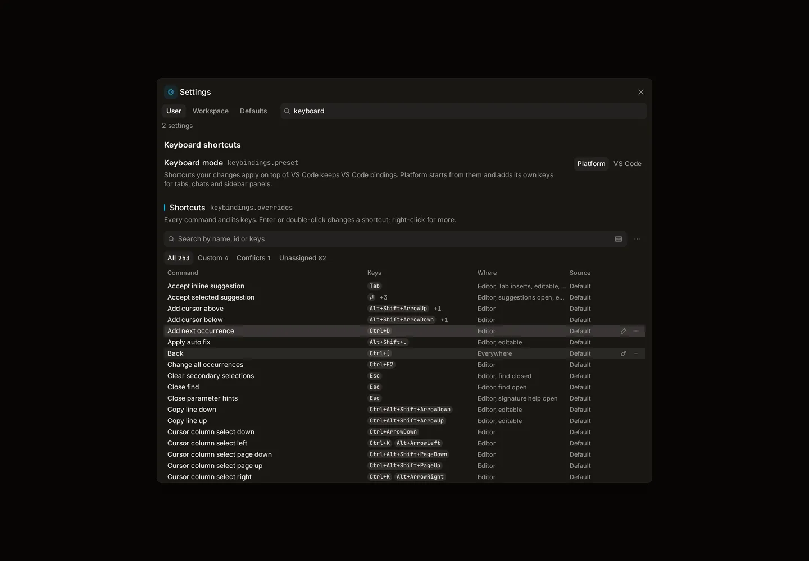          |
| 1440  | Custom, shadowed and removed rows                            | 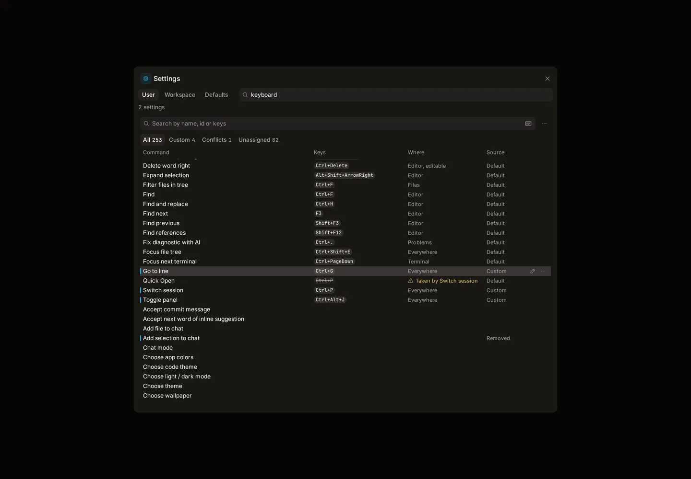         |
| 1440  | Recording with a conflict shown before saving                | 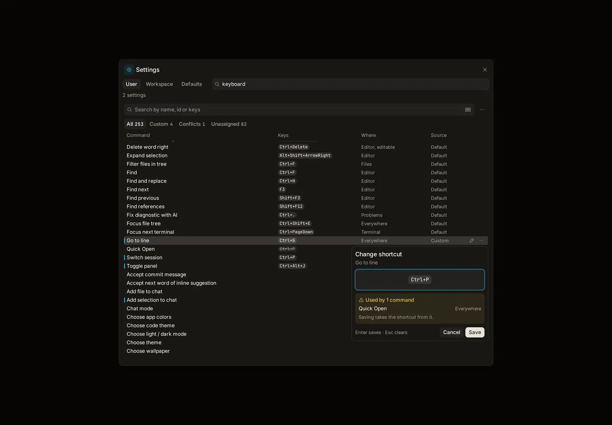        |
| 1440  | Recording a chord the browser keeps                          | 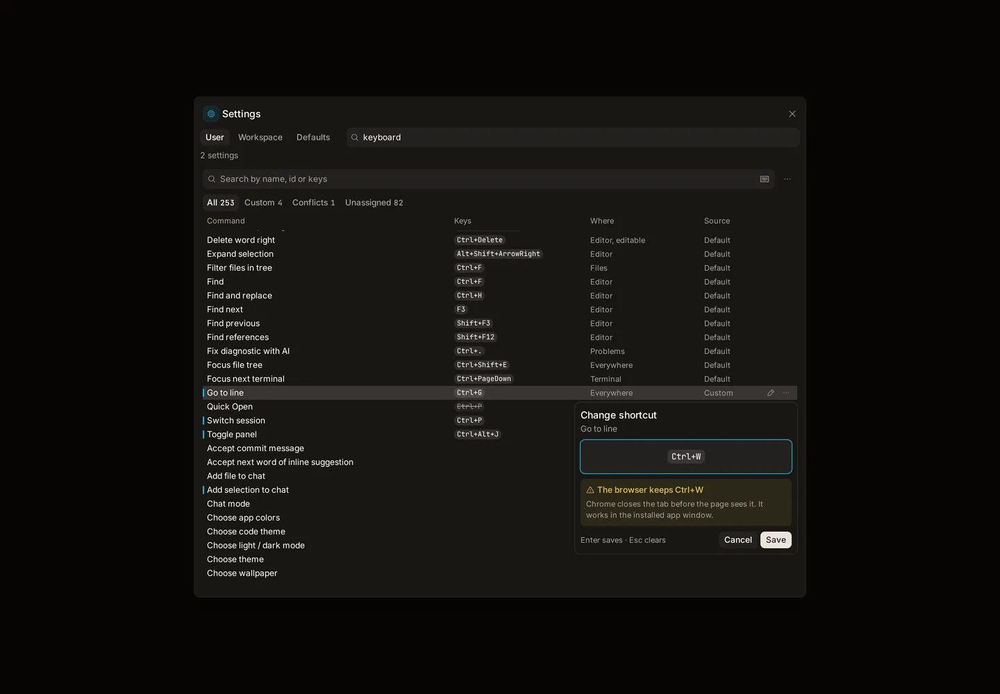       |
| 1440  | Row menu                                                     | 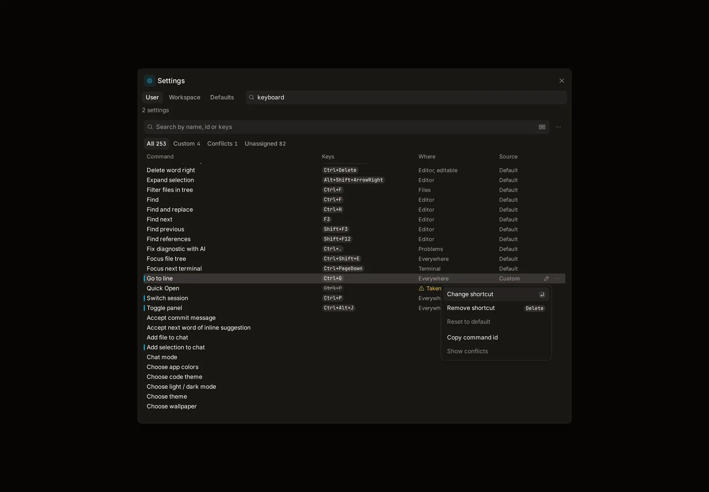          |
| 1440  | Record keys search                                           | 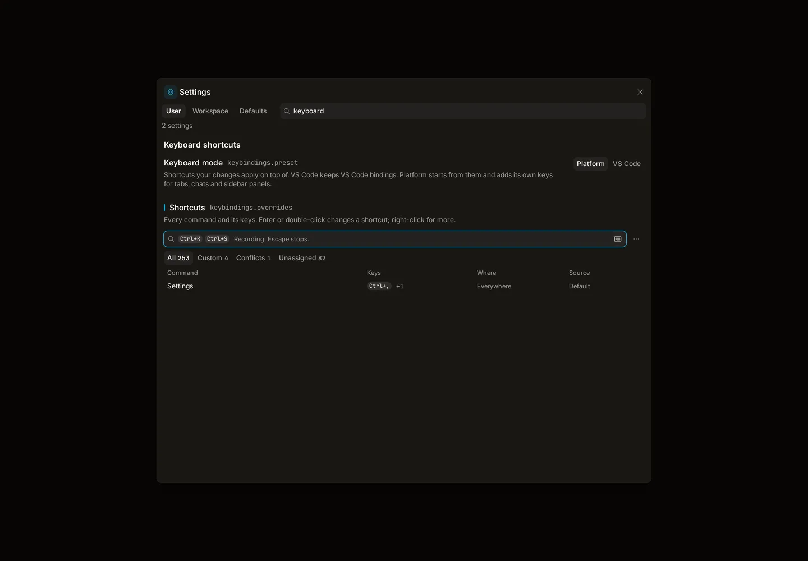 |
| 820   | Top of the list (still the desktop layout, container 772 px) | 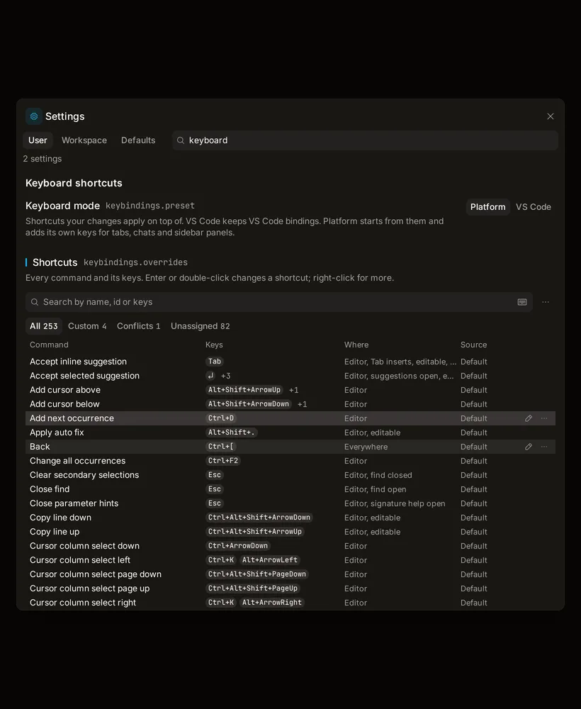           |
| 390   | Top of the page                                              | 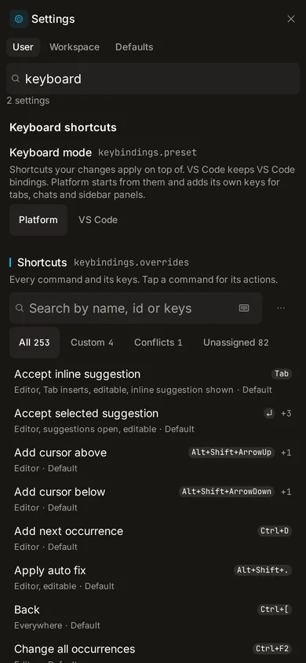     |
| 390   | Custom, shadowed and removed rows                            | 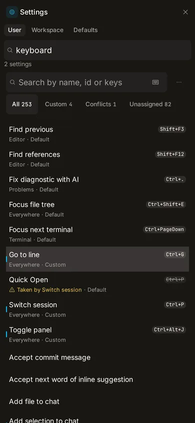          |
| 390   | Row menu at touch size                                       | 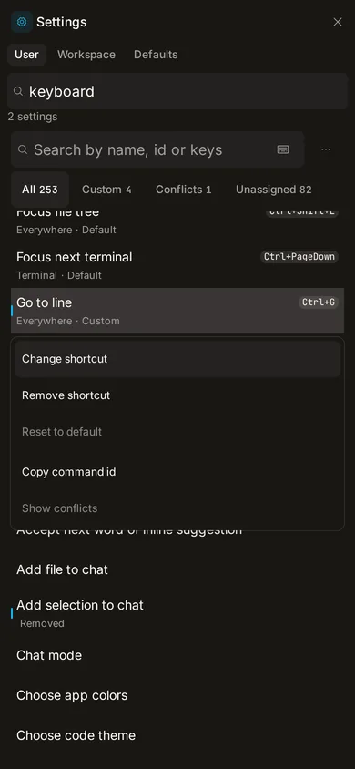     |
| 390   | Recording without a keyboard                                 | 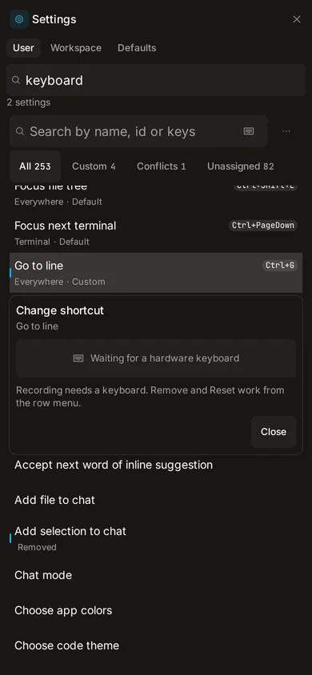   |

The phone shots show the Record keys toggle; the built page hides it until a keyboard has been
seen. Phase 1 ports this markup to `/dev/shortcuts` over the Phase 1 row model, which is the page
the owner opens on the phone.

## Primitives to reuse

From lane L1 (PR #30, `origin/lane/L1`, not yet on `main`):

- `packages/ui/src/components/kbd.tsx` — `Kbd`. L1's call sites pass `formatChord(keys)`, one chip
  per chord. The recorder wants a larger chip; add a `size` prop in Phase 3 instead of a class at
  the call site.
- `packages/ui/src/components/tabs.tsx` — `TabsList variant='segmented'` with the sliding
  indicator, for the filter control and Keyboard mode.
- `packages/ui/src/patterns/listbox-keys.ts` and `use-listbox.ts` — typeahead that stays on a row
  that still matches; turn typeahead on for the list.
- `scroll-fade` utility and `VirtualList`'s `fade` prop — vertical only. The filter control fits
  at 390 px, so no sideways fade is needed.
- `packages/ui/src/components/hold-button.tsx` — for Reset all shortcuts in the toolbar menu.
- `apps/web/src/keymap/hooks/use-command-shortcut.ts` — reads the effective chord for a command.

On `main`: `ListRow` / `listRowClassName`, `useListbox`, `VirtualList` (needs a `scrollMargin`
pass-through, below), `InputGroup`, `DropdownMenu` and `ContextMenu`, `Popover`. Plan 080 is on
`main`: the preset reads "Platform" and "VS Code" through `settingOptionTitle`, and the registry
title is "Keyboard mode".

**`VirtualList` in the page scroller.** Use `renderLayout` with the settings scroller as
`scrollRef`, and add a `scrollMargin` prop that forwards TanStack's option; the list measures its
own offset inside the scroller with a `ResizeObserver` on the section above it. Pass
`scrollPaddingStart` equal to the sticky toolbar's height so `scrollToIndex` does not park the
active row under the toolbar.

**Sticky toolbar surface.** The toolbar must paint the surface of the region it sits in:
`bg-popover-solid` in the settings dialog, `bg-background` when Settings is an editor tab. Set the
token once on the page root (a CSS variable) and read it in the toolbar, so it stays one surface.

## Smaller findings

- Title case is mixed in the table: 12 titles such as "Split Editor Right", "Focus First Editor
  Group" and "Open Search Editor" sit among sentence-case ones, and the list sorts and shows them
  side by side. Fix in `client-core/commands` metadata when Phase 2 lands.
- The registry `description` of `keybindings.overrides` is JSON grammar. Plan 167 adds a
  `details` field that goes to `schema.json` and the reference; if it has landed, the grammar moves
  there, otherwise it stays in `description` and the page shows its own sentence.
- `recordingControl` treats bare Escape, Backspace and Enter as controls. VS Code keeps Escape and
  Enter as controls and lets Backspace record.
