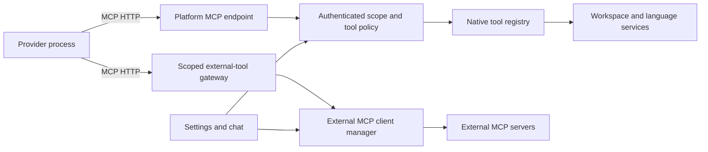

# Implement stateless MCP support

Status: M0 research done 2026-09-25 (both providers call a 2026-07-28 endpoint in probes); M0 in-repo build not started. Requested 2026-09-11. **M0 approved; M1+ not approved.**

Decided 2026-09-25: owner — approve milestone M0 only. The owner wants to discuss M1 onward before
anything else in this plan starts; M0's exit result is the input to that conversation.

This is the prerequisite for [native code intelligence](088-native-code-intelligence.md).
[Root PLAN.md](../PLAN.md) owns execution order. The
[implementation comparison](../docs/serena-implementation-comparison.md) records the evidence and design choices.

## Deliver the prerequisite

Give Platform two explicit capabilities: consume external MCP servers, and expose native Platform
tools to coding agents over authenticated MCP. Deliver both through the current Bun/Elysia backend,
provider adapters, settings, secrets, and chat controls. Do not introduce a second inference loop.

Require MCP protocol revision `2026-07-28` and the official TypeScript SDK v2. This is the precise
meaning of the requested “MCP 2.0”: SDK major version 2 plus the stateless protocol revision.
JSON-RPC `2.0` alone does not identify the MCP revision. The official
[specification](https://modelcontextprotocol.io/specification/2026-07-28) and
[SDK release documentation](https://ts.sdk.modelcontextprotocol.io/v2/) identify these separately.

This plan promotes MCP management and runtime integration from the unscheduled E7 item in
[the editor strategy](../docs/editor-parity-implementation-plan.md). Plans 068 and 077 are completed
ownership foundations. Reuse the [verified federation transport](../docs/federated-environments.md).
Remote acceptance must prove MCP authentication and tool calls over it. Plans 080 and 085 are not
MCP prerequisites; the web navigation migration is already implemented.

## Reconcile the baseline

Before implementation, capture HEAD and the existing dirty diff. The planning baseline is Platform
`eb926925427022c99e44fb2a2b8fbe582550bdbc`; it already contains unrelated working changes.
Recheck these anchors and preserve those changes:

| Existing owner                                                    | Work to build on                                                            |
| ----------------------------------------------------------------- | --------------------------------------------------------------------------- |
| `apps/server/src/app.ts`                                          | Application composition and route authentication order                      |
| `apps/server/src/auth.ts`                                         | Browser Origin protection; currently rejects native requests without Origin |
| `apps/server/src/provider/types.ts`                               | Provider session, runtime epoch, cwd, and permission scope                  |
| `apps/server/src/provider/adapters/codex.ts`                      | App-server launch, thread configuration, MCP events                         |
| `apps/server/src/provider/adapters/utils/claude-query-options.ts` | Claude SDK options and inherited settings                                   |
| `apps/server/src/machines/proxy-http.ts`                          | Federation forwarding; currently removes Authorization                      |
| `packages/contracts/src/settings/keys.ts`                         | Registry and settings scope                                                 |
| `apps/server/src/settings/secrets.ts`                             | Secret storage, currently specialized for provider environments             |

Search the executable-plan inventory again before assigning work. There was no executable MCP
plan when this document was written. Existing MCP event normalization is not a Platform-owned
connection manager or native tool endpoint.

## Fix the wire contract first

Use a single POST MCP endpoint with self-contained requests. Require per-request version and client
capability metadata. Implement `server/discover`; calling it must not create application scope or
be required before a tool call. Explicit application handles may survive requests, but transport
identity must never choose a workspace, conversation, or principal.
[Base protocol](https://modelcontextprotocol.io/specification/2026-07-28/basic),
[versioning](https://modelcontextprotocol.io/specification/2026-07-28/basic/versioning).

Accept JSON responses and request-scoped SSE. Carry and validate `MCP-Protocol-Version`, `Mcp-Method`,
and applicable `Mcp-Name` headers against the body, including the specified encoding rules. Support
schema-declared `x-mcp-header` mappings in the outbound client. Return 405 for GET and DELETE on the
MCP endpoint. Never mint or echo `Mcp-Session-Id`; ignore an obsolete supplied ID. Closing a request's
SSE stream cancels that request. Change notifications use `subscriptions/listen` through POST.
[HTTP binding](https://modelcontextprotocol.io/specification/2026-07-28/basic/transports/streamable-http).

Use the SDK's `createMcpHandler` with `legacy: 'reject'`. Set outbound clients to
`versionNegotiation: { mode: { pin: '2026-07-28' } }`;
installing v2 alone does not opt a hand-constructed client into the new protocol. Do not use the
default legacy handshake, automatic downgrade, or an old `sessionIdGenerator: undefined` recipe as
proof of conformance. Test through an injected fetch driving the real application; the SDK's old
in-memory linked transport is not a substitute for a modern wire exchange.
[SDK protocol migration](https://ts.sdk.modelcontextprotocol.io/v2/migration/support-2026-07-28.html).

Mount the fetch-native SDK handler without consuming its request body twice. Supply verified auth
to the handler explicitly. Check Host and any supplied Origin before dispatch. The SDK fetch
handler does not provide these checks automatically. Retain Platform's exact origin rules rather
than weakening them to a hostname-only allowlist.
[Web-standard SDK integration](https://ts.sdk.modelcontextprotocol.io/v2/serving/web-standard.html).

Pin exact tested SDK package versions in the lockfile during implementation. The first gate must
verify the published package APIs and capture actual request/response bytes; documentation examples
are not the acceptance test. Unsupported older peers get a clear version error. Do not add a legacy
protocol implementation or silently route native tools around MCP to make an incompatible provider pass.

## Establish ownership

Keep the wire adapter small and give the existing domain services authority over work.



Use one gateway endpoint with authorization-filtered catalogs for both native and approved external
tools. The gateway must preserve each tool's origin and effect policy. An external server named
“platform” must never shadow a native tool. Provider-native inherited integrations remain visible
as unmanaged configuration until explicitly imported; prevent duplicate managed registrations.

Introduce these modules only as their milestones gain consumers:

| Proposed location                         | Responsibility                                                        |
| ----------------------------------------- | --------------------------------------------------------------------- |
| `packages/contracts/src/mcp.ts`           | Configuration, status, tool binding, and management contracts         |
| `apps/server/src/mcp/server.ts`           | SDK registration and request adapter                                  |
| `apps/server/src/mcp/access.ts`           | Authenticated grants, revocation, effect policy, scope resolution     |
| `apps/server/src/mcp/catalog.ts`          | Tool/resource/prompt identity, schemas, filtered discovery            |
| `apps/server/src/mcp/connections.ts`      | External HTTP clients and stdio process ownership                     |
| `apps/server/src/mcp/service.ts`          | Management operations, discovery, status, and lifecycle               |
| `apps/server/src/mcp/routes.ts`           | Browser-authenticated management routes, distinct from agent endpoint |
| `apps/server/src/provider/mcp-binding.ts` | Provider-specific endpoint and credential injection                   |
| `apps/web/src/features/mcp/`              | Feature-local management components, hooks, providers, and state      |

Keep MCP SDK types at the adapter. Derive public configuration types from schemas and reuse existing
environment, session, provider, and secret-reference types. New stateful services do not live in `utils/`.

The caller's experience is: enable an integration, inspect its tools, choose allowed effects, then
start a chat whose provider receives a scoped endpoint automatically. Native callers outside Platform
receive a revocable connection credential through the same management flow.

The proposed domain boundary has three operations:

```ts
interface McpAccess {
  issue(input: IssueToolBinding): Promise<ScopedToolBinding>
  authenticate(request: Request): Promise<AuthorizedToolScope>
  revoke(bindingId: ToolBindingId): Promise<void>
}

type ToolGrantOwner =
  | {
      readonly kind: 'provider'
      readonly sessionId: SessionId
      readonly runtimeEpoch: RuntimeEpoch
    }
  | { readonly kind: 'external-client'; readonly clientId: ManagedClientId }

interface ToolCatalog {
  list(scope: AuthorizedToolScope): Promise<DiscoveredCapabilities>
  call(input: AuthorizedToolCall, signal: AbortSignal): Promise<ToolOutcome>
}
```

These are design signatures, not existing APIs. `AuthorizedToolScope` is constructed only at the
authenticated boundary and contains immutable environment, workspace/worktree, grant owner, and
allowed effects. Provider owners include session/runtime epoch; managed external clients have their
own credential lifetime and revocation, without a fabricated chat session. Tool arguments cannot
broaden scope. `ScopedToolBinding` contains a secret
reference, not a credential value fit for serialization into a settings document.

## Implement in verifiable milestones

### M0. Prove SDK and provider interoperability

Decided 2026-09-25: owner — approved. Stop at M0's exit and bring the result to the owner.

- Record exact SDK and installed provider versions. Check Claude SDK and Codex app-server schemas
  for per-process or per-session MCP endpoint/header configuration. Inspect local code first.
- Build the narrow fetch integration and a real `workspace_info` read tool backed by existing
  workspace ownership. Use this to prove stateless requests, auth, and scope before adding semantic tools.
- Prove that both production providers discover and call the tool over revision `2026-07-28`.
  If either cannot, identify and implement the provider upgrade required in this milestone. Keep
  the milestone open until a real MCP call passes; dynamic non-MCP tools do not satisfy it.
- Never edit user-global provider configuration to inject Platform's endpoint. Bind credentials
  to the provider runtime's captured session/worktree, including resume, fork, and restart.

Exit: a no-Origin authenticated native request succeeds, direct calls need no earlier handshake,
and both providers produce an attributable real tool result.

### M1. Add scoped authentication and runtime binding

Not approved yet: the owner discusses M1+ after M0 (2026-09-25).

- Mount agent authentication separately from the browser guard. Preserve browser route protection.
  Validate loopback Host, exact permitted Origins when supplied, token audience, expiry, revocation,
  environment identity, worktree, tool effects, and runtime epoch.
- Reuse the secret store for durable external credentials. Issue short-lived native grants through
  the existing authenticated local management channel. Keep grant revocation as application state,
  separate from protocol sessions. Never trust self-reported MCP client metadata for authorization.
- Resolve native tool paths, symlink destinations, mutation targets, and returned resource references
  through a grant-derived filesystem boundary. The existing server can serve `/`; project identity
  and index scope alone do not enforce checkout containment. Reuse path validation mechanisms with
  the grant's permitted roots, including separately approved read-only dependency roots.
- Default remote providers to their owning machine's local endpoint. Keep the MCP listener on
  loopback and use existing SSH access for external clients. General public HTTPS hosting and OAuth
  authorization-server construction belong to the separate environments pairing milestone.
- Do not forward credentials through the current generic machine proxy. If a remote management path
  needs forwarding, implement a scoped exchange addressed to the destination environment and test it.
- Revoke bindings on session close or permission reduction; rotate on runtime replacement. Handle
  in-flight work under its original scope and recheck authorization at mutation commit.
  Managed external-client grants expire or revoke independently of provider sessions.

Exit: two environments with identical relative paths cannot read, approve, or mutate each other's
resources, including after an active-workspace switch.

### M2. Build the managed external MCP client

- Add typed HTTP and stdio definitions. HTTP uses the strict revision above; stdio uses the same
  self-contained protocol and is a managed child process, not a conversation identifier.
- Register machine/application execution settings. Store command, arguments, working directory,
  endpoint, header references, and environment references with stable integration IDs. Workspace
  settings may suppress approved tools but cannot select executables, endpoints, or credentials.
- Add explicit import preview for supported provider configs and local discovery. Import turns
  entries into registry settings and secret references. It must not enable or execute unreviewed entries.
- Implement enable, disable, start, stop, restart, remove, status, bounded stderr, crash reporting,
  process cleanup, connection deadlines, and credential refresh. HTTP restart means reconnect and
  refresh discovery, not spawning a remote server. Install actions use approved package/source
  metadata and verify the destination mount before large downloads.
- Key shared connections/processes by environment, integration revision, credential identity, and
  execution context. Do not share a workspace-specific stdio process across incompatible working
  directories. Gateway grants restrict tool invocation, not the external process's filesystem access.
  Present its actual execution authority; any sandbox guarantee requires an enforced process sandbox.
- Implement tools, resources, resource templates, prompts, argument completion, filtered discovery,
  catalog refresh, and subscriptions. Cache catalogs by integration configuration, authorization,
  and capability scope. A read-only annotation is descriptive, never permission to bypass policy.
- Implement OAuth client flows using SDK support, issuer-bound credentials, PKCE/state validation,
  protected-resource discovery, scope escalation, and secret redaction. Do not build a parallel OAuth stack.

Exit: a real controlled MCP peer can be configured, authenticated, discovered, called, restarted,
disabled, and removed without leaking a child, stream, token, or stale catalog.

### M3. Integrate tools, resources, and prompts into chat

- Inject the scoped gateway into both providers. Namespace external tool identities by stable
  integration ID and retain provenance in results, logs, and tool cards.
- Adapt structured and textual results once. Bound output before it enters model context. Preserve
  resource references, pagination, errors, and unsupported-capability results without truncating JSON.
- Route effect decisions through existing approval policy. Previously granted scope does not need
  another confirmation on every call. Approval must bind the exact operation and original workspace.
- Add resource browsing/attachments, prompts as composer commands, tool selection, integration
  health, and actionable errors. Use existing UI primitives, loading states, tokens, and settings access.
- Implement MRTR input requests and explicit continuation state for elicitation. Reauthenticate
  resumptions, bind them to request contents and expiry, and prevent resumed calls from repeating
  side effects. Support subscription refresh and cancellation through the SDK's modern entry points.
- Expose long operations through the negotiated Tasks extension when supported. Define a core
  explicit-operation-handle fallback for our own tools; do not pretend old `tasks/*` methods are core.
- Do not advertise deprecated sampling or roots capabilities. Workspace access comes from grants;
  host-model sampling is not needed for native code intelligence.

Exit: both providers can use a native tool and an external tool; prompts/resources work in chat;
cancel, permission denial, input continuation, and integration failure remain distinguishable.

### M4. Complete conformance and operational proof

- Add one wide operation event with environment, session, integration, tool, revision, operation ID,
  duration, outcome, cancellation, and bounded-result statistics. Never log bearer tokens, secret
  headers, source bodies, or memory contents by default.
- Verify the exact wire revision and required metadata through the real application. Exercise JSON,
  request SSE, POST subscriptions, header mismatches, unsupported versions, and malformed schemas.
- Validate JSON Schema 2020-12 at the boundary with bounded schema complexity and no automatic
  remote `$ref` fetch. Keep SDK protocol errors distinct from domain tool errors.
- Run leak and isolation checks for concurrent clients, disconnect, provider restart, server restart,
  disabled integrations, permission revocation, and remote SSH routing.

Exit: record the SDK/provider versions, wire traces with secrets removed, focused checks, and live
provider evidence. Plan 088 remains dependency-blocked until M0–M4 pass.

## Verify plausible failures

Use existing app fixtures and `app.handle` with injected SDK fetch. Never open a test socket to our
server. App Vitest runs under `bun --bun vitest`; use focused files in the owning app/config. Protocol
package-only tests use ordinary Vitest if a runtime-neutral package is introduced. Real provider
verification reuses the running development server. Do not start another dev server.

| Failure to catch                                         | Required proof                                                                         |
| -------------------------------------------------------- | -------------------------------------------------------------------------------------- |
| SDK silently speaks an older revision                    | Wire assertion of modern metadata and no initialize; fresh direct tool call            |
| Request B inherits request A's workspace or capabilities | Alternate authenticated callers on the same transport and across fresh handlers        |
| Server-wide filesystem access escapes a checkout grant   | Server root `/`, one authorized checkout, rejected sibling paths and escaping symlinks |
| Catalog or continuation leaks across principals          | Same integration, different grants, conflicting allowlists                             |
| OAuth credentials reused for a different issuer          | Real SDK auth flow against controlled HTTP boundary fixtures                           |
| Disconnect closes shared domain services                 | Cancel one request while another completes                                             |
| Provider ignores injected MCP configuration              | Real provider discovers and calls the scoped tool                                      |
| Raw settings or logs reveal credentials                  | Semantic write, raw edit, export, and error-path redaction checks                      |
| Gateway masks a failed tool as success                   | Domain error, transport error, denial, and cancellation each reach chat correctly      |

## Completion checklist

- [ ] M0–M4 have recorded evidence and no provider bypass.
- [ ] Inbound and outbound paths use the pinned stateless revision.
- [ ] Management, resources, prompts, approvals, OAuth client flows, and lifecycle are usable.
- [ ] Native and external tools preserve machine/worktree ownership and authentication.
- [ ] Settings reference is regenerated with `bun run settings:reference` when registry entries land.
- [ ] Documentation records supported versions and configurations; no legacy compatibility path was added.
- [ ] Remote acceptance proves authenticated MCP tool calls over the verified federation transport.

## Research findings (2026-09-25)

Research 087, read from origin/main `9f3438258` (no lane branch changes this plan's content). Scope is
M0 only, per the owner decision. Research day rules forbid product code, so the interop proof ran as
throwaway probes in `/work/tmp/research/087/` (disposable). The in-repo M0 build remains, listed at
the end.

### M0 answers

**Versions.** Measured 2026-09-25 with `npm view` and the installed binaries:

| Component                                     | Version                                                                      |
| --------------------------------------------- | ---------------------------------------------------------------------------- |
| `@modelcontextprotocol/server`, `client`      | 2.1.0 (`core` 2.1.0), npm latest on 2026-09-25                               |
| `@modelcontextprotocol/sdk` (v1)              | 1.30.0 in Platform's lock, pulled in only as the Claude SDK peer (`^1.29.0`) |
| `@anthropic-ai/claude-agent-sdk`              | 0.3.281 in Platform (bundles Claude Code 2.1.281); npm latest 0.3.282        |
| Claude Code CLI (installed, used by Platform) | 2.1.282                                                                      |
| Codex CLI / app-server                        | 0.157.0 (`rust-v0.157.0` = `00c972ed5d6f`), rmcp `=3.2.0`                    |
| Elysia                                        | 1.4.30                                                                       |

**Per-session endpoint and header configuration exists in both providers, with no global config.**

- Claude: `Options.mcpServers` takes `{ type: 'http', url, headers, alwaysLoad }` per `query()` call
  (`sdk.d.ts` `McpHttpServerConfig`). Platform builds options in one place,
  `claudeQueryOptions` (`apps/server/src/provider/adapters/utils/claude-query-options.ts:111`).
  The injected server reports `source: "dynamic"` and wins over a project `.mcp.json` entry with the
  same name (probe `ws-d`).
- Codex: `thread/start`, `thread/resume` and `thread/fork` each take
  `config: HashMap<String, JsonValue>` (`app-server-protocol/src/protocol/v2/thread.rs:100,410,604`
  at `rust-v0.157.0`). Platform's pinned schema already types it
  (`codex-protocol/generated/schema.gen.ts:2146`). HTTP servers take `url` and `http_headers`
  (`config/src/mcp_types.rs:578-590`).
- Codex speaks 2026-07-28 only when the thread has `features.mcp_2026_07_28 = true`. The flag is
  `Stage::UnderDevelopment`, off by default (`features/src/lib.rs:1367` at the tag, unchanged on
  upstream main `a0b85c7a`). Enabled, the client uses `ClientLifecycleMode::Auto` with
  `preferred: [2026-07-28]` and a 2025-06-18 fallback (`rmcp-client/src/protocol_mode.rs:26`).
  Each such thread emits a `warning` notification; per-thread `suppress_unstable_features_warning = true`
  silences it.

**The server side works as the plan specifies.** `createMcpHandler(factory, { legacy: 'reject' })`
mounted in Elysia 1.4.30 as `.post('/mcp', ({ request }) => mcp.fetch(request, { authInfo }), { parse: 'none' })`,
with our own Host, Origin and bearer checks in front. `curl -i` against it:

| Case                                                           | Result                                                                          |
| -------------------------------------------------------------- | ------------------------------------------------------------------------------- |
| Direct `tools/call`, no Origin, bearer, stale `Mcp-Session-Id` | 200 JSON, tool result bound to the token's grant, no session header in response |
| No bearer / foreign Origin / wrong Host                        | 401 with `WWW-Authenticate` / 403 / 421 (our guard)                             |
| `Mcp-Name` disagrees with body; `Mcp-Method` absent            | 400, `-32020` header/body mismatch (SDK)                                        |
| Legacy `initialize` 2025-06-18; version 2099-01-01             | 400, `-32022`, `supported: ["2026-07-28"]` (SDK)                                |
| Modern header without `_meta` envelope                         | 400, `-32602` names the missing envelope (SDK)                                  |
| GET, DELETE                                                    | 405 (SDK)                                                                       |
| `server/discover`                                              | 200, `supportedVersions: ["2026-07-28"]`, creates no state                      |

The factory runs once per request with `ctx.authInfo`, so scope comes from the verified token and
nothing survives between requests. `parse: 'none'` leaves the body for the SDK. Tool input schemas
can stay valibot: `toStandardJsonSchema` from `@valibot/to-json-schema` 1.7.1 (already in the lock)
satisfies `registerTool`, and validation failures come back as `isError` tool results.

**Both production providers discover and call the tool over 2026-07-28.** A `workspace_info` probe
tool returned the grant bound to the bearer token (owner, session, cwd):

- Claude Code 2.1.282 through the Agent SDK, `haiku`, `bypassPermissions`: wire sequence
  `server/discover` → `subscriptions/listen` (SSE, held open) → `tools/list` → `tools/call`, all
  `MCP-Protocol-Version: 2026-07-28`, no Origin, no `initialize`. The model called
  `mcp__platform__workspace_info` and answered with the bound cwd. 3.5 s, $0.037.
- Codex 0.157.0 app-server, default model: `server/discover` → `tools/list` →
  `resources/list`/`resources/templates/list` (404 `-32601`, harmless) → `tools/call`. The turn
  produced an `mcpToolCall` item, `status: completed`, and a final answer with the bound cwd. 8.7 s.
  `mcpServer/tool/call` calls the same connection without a model turn, which suits tests.
- Codex without the flag sends `initialize` at 2025-06-18 and fails startup with the SDK's `-32022`
  text in `mcpServer/startupStatus/updated`. That is the plan's "clear version error".
- Outbound client: SDK v2 `Client` defaults to `versionNegotiation.mode: 'legacy'` and sends
  `initialize` at 2025-11-25, which a `legacy: 'reject'` server refuses; `{ pin: '2026-07-28' }`
  sends `server/discover` then `tools/call`. This confirms the plan's warning.

**Credential binding holds across resume and restart, and nothing is persisted.**

- Each probe started a fresh CLI or app-server process, so resume is also restart. Claude `resume`
  with a rotated token and Codex `thread/resume` with a rotated token both called with the new grant.
- Codex `thread/resume` without `config` has no `platform` server: per-thread config does not
  persist, so every start, resume and fork must re-inject it. Three threads in one app-server with
  different tokens and no config stayed isolated (A, B, A, then "unknown MCP server").
- The token appeared nowhere in the Claude transcript JSONL, the Codex rollout, `state_5.sqlite` or
  `logs_2.sqlite` (grep, including WAL files).

**Hazards found:**

1. Codex merges per-thread overrides into a same-named user `config.toml` entry, even when the
   whole table is given. A user `[mcp_servers.platform]` with `bearer_token_env_var` broke our
   binding in both override shapes. `config/read` exists to detect a collision before `thread/start`.
2. Codex adds `_meta.threadId` to `tools/call`, and Claude adds `claudecode/toolUseId` and
   `clientInfo`. These are self-reported and must never select scope. The plan already requires this.
3. Claude holds one `subscriptions/listen` SSE stream per session for its lifetime. The SDK caps
   these at `maxSubscriptions` (default 1024) per handler. Closing them needs a hook into session close.
4. The server rejects every no-Origin request (`apps/server/src/auth.ts:76-78`) and installs that
   guard as a parent `onBeforeHandle` (`apps/server/src/app.ts:354`). The MCP route must mount
   before that line with its own guard, as `webRoutes` does at `app.ts:348`.
5. Mesh preserves the inbound Host (`/work/projects/mesh/internal/serve/handler.go:284`). A loopback
   Host check therefore keeps the production endpoint unreachable from the tailnet via
   `omarchy.mesh.shaulavo.dev`, which is what we want.

**Workspace ownership to bind.** Provider runtimes already receive `cwd` from
`context.worktree.canonicalPath` together with `sessionId` and `runtimeEpoch`
(`apps/server/src/orchestration/provider-command-reactor.ts:397,1014`;
`ProviderRuntimeStartInput` in `apps/server/src/provider/types.ts:52`). A grant issued for
`(sessionId, runtimeEpoch, worktreeId, canonicalPath)` covers everything the M0 `workspace_info`
needs.

### Recommendations

- Recommendation: server name `platform` for the injected endpoint, set `alwaysLoad: true` on
  Claude (one small catalog; otherwise the tool hides behind tool search), and refuse to bind with a
  named error when Codex `config/read` shows a user or project `mcp_servers.platform`.
- Recommendation: Codex threads carry `features.mcp_2026_07_28` and
  `suppress_unstable_features_warning` in the same per-thread `config`. Pin the tested Codex version
  in the provider probe and fail the binding loudly if `mcpServer/startupStatus/updated` reports the
  version error. Never fall back to a legacy leg.
- Recommendation: M0 grants are opaque random tokens held in server memory, keyed to
  `(sessionId, runtimeEpoch)` and dropped when the runtime epoch changes. Durable storage and the
  secret store wait for M1.
- Recommendation: M0 tests drive `app.handle` with SDK v2 `Client` in pin mode over an injected
  `fetch`, plus one Codex `mcpServer/tool/call` check that needs no model turn. Live model calls
  stay a manual acceptance step.

### Owner questions (M1 onward)

1. **Codex depends on an under-development flag.** (a) Accept `features.mcp_2026_07_28` per thread,
   version-pinned and checked; (b) hold the Codex half until upstream promotes it; (c) serve a
   2025-era leg to Codex, which the plan forbids. Recommendation: (a). It is the only way to meet
   the plan's revision rule today, and it touches no user config.
   Decided 2026-09-26: recommendation (owner deferred) — (a): Codex's per-thread flag, pinned to a checked version.
2. **Split external MCP management out of 087?** Both providers already manage the user's own MCP
   servers natively, and plan 088 needs only the native endpoint. (a) Keep M2 and M3 (managed
   external client, OAuth, stdio lifecycle, gateway) in 087; (b) cut 087 to the native endpoint
   (M0, M1, the relevant M4 checks) and move external management to its own unscheduled plan.
   Recommendation: (b). It unblocks 088 soonest and avoids a second MCP manager beside the
   providers' own.
   Decided 2026-09-26: recommendation (owner deferred) — (b): 087 is our own tool endpoint; M2/M3 move to [Plan 174](174-external-mcp-servers.md).
3. **How wide should M1 be?** It currently covers remote federation routing, managed external-client
   credentials and the filesystem boundary together. (a) As written; (b) M1 = local provider grants
   plus a checkout-contained filesystem boundary, with remote/SSH routing and external-client
   credentials in a later milestone. Recommendation: (b).
   Decided 2026-09-26: recommendation (owner deferred) — (b): M1 is local tokens plus file access confined to the session's checkout.
4. **Approval for native tools.** (a) Read-only native tools run without a prompt in every runtime
   mode, and mutating tools go through the existing approval flow; (b) every native call follows
   the session's runtime mode. Recommendation: (a). Claude would otherwise route each read through
   `canUseTool` in approval-required sessions.
   Decided 2026-09-26: recommendation (owner deferred) — (a): read-only tools run without an approval prompt.

### Remaining M0 work (approved, not started)

1. Add pinned `@modelcontextprotocol/server` 2.1.0 (and `client` for tests). Mount
   `apps/server/src/mcp/server.ts` before the browser auth guard, with Host, Origin and bearer checks
   and an in-memory grant map.
2. Add `workspace_info` backed by the session's worktree, and an `app.handle` test covering the curl
   table above plus two alternating grants.
3. Inject the binding in `claudeQueryOptions` and in Codex `thread/start`/`resume` `config`, then
   record one live call per provider through the dev server as the exit evidence.
