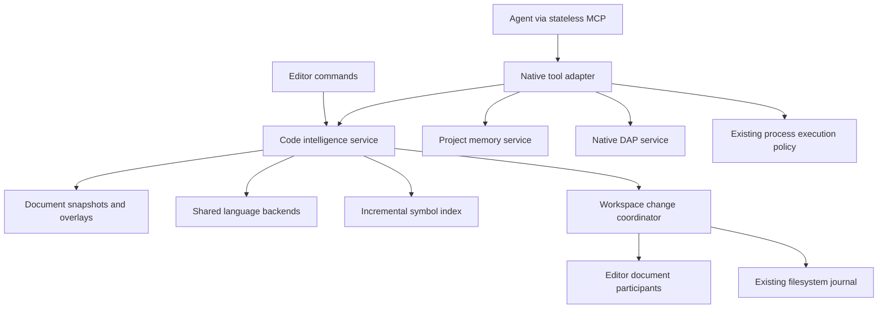

# Build native code intelligence for agents and the editor

Status: proposed, implementation not started. Requested 2026-09-11.

Hard prerequisite: [Plan 087, stateless MCP](087-stateless-mcp.md), including real provider
interoperability. [Root PLAN.md](../PLAN.md) owns scheduling. The
[Serena comparison](../docs/serena-implementation-comparison.md) supplies the implementation evidence.

## Deliver the full capability

Build Platform-owned semantic retrieval, navigation, editing, refactoring, diagnostics, project
knowledge, and debugging. Agents use these capabilities through the strict stateless MCP endpoint
from Plan 087. Editor commands use the same domain services without making HTTP calls to themselves.

This is the full program, not a read-only prototype followed by an unspecified future. Read tools
are an early milestone. Completion includes symbol edits, coordinated undo/recovery, memory,
advanced refactoring, and debugging. Serena remains a reference and benchmark, not a runtime
dependency. Neither its Python service nor its paid JetBrains plugin ships as our implementation.

“Full” means the capability inventory below is implemented with an explicit tested language/backend
matrix. It does not mean every language server supports every operation. Never label missing
semantic analysis as a successful empty result or silently replace a semantic refactor with regex.

## Reconcile the current foundations

The planning snapshot is Platform `eb926925427022c99e44fb2a2b8fbe582550bdbc` and Serena
`701e7c843f46c6a649203a488cece1bf19f1df90`. Capture current HEADs and dirty diffs before implementation,
including the sibling Editor repository if its public contracts must change.

| Current source                                                      | Reuse and required change                                                                                                                            |
| ------------------------------------------------------------------- | ---------------------------------------------------------------------------------------------------------------------------------------------------- |
| `apps/server/src/lsp/proxy-session.ts`, `LspSessionPool`            | Keep backend lifecycle and process reuse. Extract typed requests, cancellation, capability selection, and document provenance from socket ownership. |
| `apps/server/src/lsp/registry.ts`                                   | Reuse language/server matching, settings, dependency discovery, and spawning. Registry entries are not capability certification.                     |
| `apps/server/src/lsp/typescript/session.ts`                         | Extend the existing TS service through LSP handlers; never start a separate TypeScript semantic engine for agents.                                   |
| `apps/server/src/lsp/typescript/handlers/document-symbol.ts`        | Correct selection ranges and preserve multiple declaration spans. Current first-span/full-range output is insufficient for reliable editing.         |
| `apps/server/src/lsp/typescript/handlers/code-action.ts`            | Add real refactor discovery/resolution; diagnostic quick fixes are not a general refactor provider.                                                  |
| `apps/web/src/features/editor/state/workspace-document-service.ts`  | Preserve browser document authority, revisions, snapshots, and mutation leases.                                                                      |
| `apps/web/src/features/editor/state/workspace-edit-service.ts`      | Preserve preview, dirty-buffer handling, history, and recovery. Extract shared coordination, not a second implementation.                            |
| `apps/server/src/fs/workspace-edit.ts`, `workspace-edit-journal.ts` | Sole filesystem transaction and recovery path, including operation IDs, generations, and leases.                                                     |
| `apps/server/src/fs/search.ts`, `path.ts`, `watch.ts`               | Reuse inventory/search, path containment, ignore policy, and change events.                                                                          |
| `packages/contracts/src/workspace-edit.ts`                          | Extend existing persistence contracts instead of inventing parallel write semantics.                                                                 |

Three current behaviors must change before semantic mutation is enabled:

1. `attachExistingDocument` can replace backend text when another owner supplies different text.
   An agent opening the disk version must not overwrite the language server's view of a dirty editor.
2. The proxy strips versions from published diagnostics. A diagnostic response needs revision and
   backend provenance before an agent can treat it as current.
3. TypeScript advertises diagnostic support without dispatching pull diagnostics. Audit actual
   requests and negotiated capabilities together; either implement a capability or stop advertising it.

## Define the caller's experience

An agent can ask for `OrderService/submit`, receive candidates with paths and snapshot-bound
references, inspect one definition and its references, and prepare a change. A prepared change
returns a preview and operation ID. Commit rechecks every affected revision and the existing
permission policy. A lost response is recovered by operation ID without applying the change twice.

The user sees that same change in the editor's preview/history. Unsaved text remains unsaved unless
the operation explicitly includes saving it. An agent operating headlessly uses disk snapshots.
An agent attached to an editor sees the selected owner's published overlay, including unsaved text.
Switching the visible workspace does not retarget a running tool, edit, approval, or debugger.

Read responses state their source view and completeness. If indexing is incomplete or a language
server cannot answer, the agent sees that fact and can refine the query or use an explicit text search.

## Choose the shared domain architecture



Choose a domain request API over the shared language backend. Reject a hidden loopback LSP client:
it would inherit socket-shaped document ownership, risk dirty-buffer replacement through `didOpen`,
and still require the same ownership redesign. Also reject a separate Serena-style backend/index/edit
stack. Adopt Serena's name selectors, grouped references, and compact results above our shared services.

Keep standard LSP between our domain layer and language backends. Language-specific adapters belong
beside the backend implementation. MCP handlers never call TypeScript compiler internals directly.
The domain boundary hides backend selection, document synchronization, indexing, provenance, and
edit preparation. Callers supply intent and an authorized document view, not a sequence of LSP messages.

Introduce these contracts and owners as their consumers land:

| Proposed location                                  | Owner                                                                     |
| -------------------------------------------------- | ------------------------------------------------------------------------- |
| `packages/contracts/src/code-intelligence.ts`      | Queries, symbol references, capability matrix, result unions              |
| `packages/contracts/src/document-overlays.ts`      | Overlay publication, owner epochs, mutation participation                 |
| `apps/server/src/documents/service.ts`             | Registered editor overlays, snapshot selection, disconnect/conflict state |
| `apps/server/src/lsp/backend.ts`                   | Extracted process/request lifecycle, shared with the WebSocket adapter    |
| `apps/server/src/code-intelligence/service.ts`     | Semantic query and edit-intent API                                        |
| `apps/server/src/code-intelligence/symbols.ts`     | Incremental index and symbol identity                                     |
| `apps/server/src/code-intelligence/references.ts`  | Reference grouping and containment lookup                                 |
| `apps/server/src/code-intelligence/diagnostics.ts` | Revision-aware diagnostic queries and validation                          |
| `apps/server/src/code-intelligence/changes.ts`     | Prepared semantic changes over existing transactions                      |
| `apps/server/src/memory/service.ts`                | Versioned project/global knowledge with access policy                     |
| `apps/server/src/debug/service.ts`                 | DAP adapter/process lifetime and explicit debug handles                   |
| `apps/server/src/mcp/native-tools.ts`              | Schemas, descriptions, and adaptation to these domain services            |

Keep pure edit planning in the existing runtime-neutral owner where possible. If both Bun and the
web need an extraction, use a shared package with an actual pair of consumers. Editor retains text
engine operations; Platform retains product policy and persistence. Do not move Editor internals
into contracts or import web feature modules into the server.

The following signatures are proposed shapes. Derive implementation types from schemas and reuse
existing identity/revision types rather than adding competing brands:

```ts
type DocumentView =
  | { readonly kind: 'disk' }
  | { readonly kind: 'editor'; readonly owner: DocumentOwnerId; readonly epoch: OwnerEpoch }

type SnapshotStamp =
  | { readonly kind: 'disk'; readonly version: FileVersion }
  | {
      readonly kind: 'editor'
      readonly owner: DocumentOwnerId
      readonly epoch: OwnerEpoch
      readonly revision: DocumentRevision
    }

type SymbolTarget =
  | { readonly kind: 'query'; readonly selector: SymbolSelector }
  | { readonly kind: 'resolved'; readonly reference: ResolvedSymbolReference }

interface CodeIntelligence {
  searchSymbols(input: SymbolQuery, context: CodeRequestContext): Promise<SymbolPage>
  inspectSymbol(input: SymbolTarget, context: CodeRequestContext): Promise<SymbolDetail>
  references(input: SymbolTarget, context: CodeRequestContext): Promise<ReferencePage>
  diagnostics(input: DiagnosticQuery, context: CodeRequestContext): Promise<DiagnosticResult>
  prepareEdit(input: CodeEditIntent, context: CodeRequestContext): Promise<PreparedCodeEdit>
}

interface WorkspaceChanges {
  commit(input: CommitPreparedEdit, context: AuthorizedOperation): Promise<ChangeResult>
  status(input: OperationIdentity, context: AuthorizedOperation): Promise<ChangeResult>
}
```

`CodeRequestContext` contains authenticated environment/worktree scope, the explicit view, deadline,
and abort signal. `ResolvedSymbolReference` includes document identity, snapshot stamp, backend
generation, declaration discriminator, and separate selection/definition/edit ranges. Name paths
are selectors, not durable identity. Reordering overloads cannot silently retarget an old reference.

Results distinguish complete, partial, pending, unsupported, ambiguous, stale, and failed outcomes
where each applies. Pages carry a continuation or a reason that narrowing is required, coverage,
and returned/omitted counts when known. Never report an exact omitted count without enumerating it.
Cursor state is explicit, scoped to the query/view/index generation, bounded, and invalidated on drift.

## Preserve document and transaction authority

The browser's `WorkspaceDocumentService` owns its editable buffers. Publish versioned overlays to
the backend; do not promote the LSP text cache into the document store. Registry scope is environment,
worktree, owner ID, and owner epoch. Reconnect cannot resurrect an old owner's authority.

Choose one view for each request. C1 implements separate compatible analysis contexts when disk
and live overlays differ; it must not leave this as an unscheduled follow-up. An editor-view request
uses that owner's published overlay set over disk, after a publication barrier. An unopened file
with no overlay uses disk; an expected overlay with missing/stale publication returns pending or conflict.
When a background tool and the editor use the same view, reuse the backend. Never alternate two
divergent views through a shared backend without an isolation guarantee. Separate worktrees remain
separate contexts even when the repository identity is shared. Reuse backend instances for compatible
views and create isolated instances through the same registry for divergent views. Bound resources
and return pending/resource-limit outcomes rather than silently using another view. This is one
backend implementation with explicit context keys, not a second agent-specific language stack.

Queries capture a read set and verify its stamps before returning. Mark results partial/stale when
the backend's project analysis cannot be proven to match that set. Multi-file semantic changes also
capture the analysis/index generation and touched-file stamps. Do not imply a filesystem-wide atomic
snapshot from a sequence of unrelated file reads.

Extend existing workspace-change coordination with registered editor participants. Preparation
captures immutable buffer and disk versions without holding typing-blocking leases during review.
Immediately before commit, acquire bounded mutation leases and revalidate the complete read/write
set. Expire stale prepared changes explicitly. Commit uses
the existing journal and publishes participant receipts with the same operation ID. Finalize only
after required participants acknowledge, or record a recoverable incomplete operation. Define
disconnect behavior before and after the disk commit; rollback may itself conflict and must remain
visible. Do not claim distributed atomicity that the system cannot provide.

Journal participant intents and expected outcomes before dispatch, including buffer-only changes.
Persist the pre/post snapshot information and receipt identity needed to distinguish unapplied,
applied, and unknown outcomes after a lost acknowledgement. Reconcile reconnects against owner
epochs and current snapshots. A surviving disk journal does not recover an irretrievably lost browser
buffer by itself; retain an explicit recovery-required outcome and recoverable snapshots.

Preserve current dirty-buffer semantics. A preview states which edits affect only buffers and which
persist to disk. Headless edits persist through the journal. Connected dirty buffers are never
silently saved, overwritten, or discarded. Undo/redo rechecks current versions and uses the same
operation history whether the change came from MCP or the editor.

Stateless MCP permits these application services to persist. Operation IDs, memory revisions, index
generations, document owners, and debug handles must be supplied explicitly and authorized on every
request. Closing an MCP stream must not destroy a shared LSP process or forget a committed operation.

## Implement the complete tool inventory

The names below are proposed domain actions, not a promise to copy Serena's wire names. Generate
the actual catalog from one schema/metadata table, including effect, support, and output contracts.

| Capability family       | Required behavior                                                                                                                                            | Milestone |
| ----------------------- | ------------------------------------------------------------------------------------------------------------------------------------------------------------ | --------- |
| Project/workspace       | List authorized projects, inspect configuration/capabilities, explicit cross-project reads, index status/rebuild, backend status/restart                     | C1–C2, C6 |
| File discovery          | List/find, ignore-aware path search, text/regex search, scoped dependency search, exact file/range reads with overlays                                       | C2        |
| Symbol retrieval        | Workspace/file search; exact/substring/suffix name queries; kind filters; depth; outlines; definition bodies; hover/signatures/docs; ambiguity candidates    | C2        |
| Relationships           | Definition/declaration/type definition/implementation; references grouped by containing symbol; incoming/outgoing calls; type hierarchy                      | C2, C5    |
| Diagnostics             | File/symbol/workspace/affected-reference queries; severity/source grouping; freshness; before/after validation; discover and selectively run inspections     | C3        |
| Text and symbolic edits | Create/delete files; literal/regex/bulk/range replacement; replace definition; insert before/after; rename symbol/file/directory; reference-checked deletion | C4        |
| Semantic refactoring    | Discover/apply code fixes and refactors, organize imports, extract, move, inline, unused-code removal with coverage and blockers                             | C5        |
| Memory and guidance     | Project/global memory CRUD, find/read/edit/rename, readonly/exclusion policy, onboarding, generated initial guidance, context/tool profiles                  | C6        |
| Execution               | Workspace-scoped commands, bounded output, cancellation, process handles and results through existing execution policy                                       | C6        |
| Debugging               | Launch/attach, breakpoints, continue/pause/step, threads/stack/scopes/variables, expression evaluation, stop/disconnect                                      | C7        |
| Operations              | Settings, health, logs, per-tool usage/latency/output statistics, dependency setup and recovery                                                              | C1–C8     |

Advanced dependency search, hierarchy, move/inline, propagated deletion, and debugging are advertised
through Serena's JetBrains backend. Our equivalent phases need native language or DAP implementations;
the Python wrappers in the reference do not supply those engines.

## Execute the milestones

### C0. Capture a reproducible comparison and capability baseline

- Finish Plan 087 first. Then record actual backend capabilities and representative responses for
  the installed language servers, including the custom TypeScript service.
- Turn the comparison document into a versioned fixture inventory. Include overloads, merged
  declarations, decorators, Unicode/CRLF, large files, generated/dependency code, dirty buffers,
  references outside a function, incomplete syntax, and two divergent editor owners.
- Build a reusable benchmark driver using public interfaces. Compare our existing LSP/search path,
  Serena's open-source implementation at the pinned revision, and our new domain/MCP implementation.
  Serena's older transport may be used only by this isolated comparison driver, not the product.
- Record correctness first, then cold/warm latency, memory, processes, files visited, backend calls,
  response bytes, and model tokens under one specified tokenizer. Capture fixture size and hardware.
  Separate semantic-equivalent comparisons from capabilities one side lacks.

Exit: a machine-readable capability matrix, fixed fixtures, baseline results, and calibrated
positive/negative controls exist. Do not benchmark an empty index as a successful fast query.

### C1. Extract native language requests and explicit document views

- Extract backend request access from the socket adapter in one pass. Migrate browser callers and
  remove obsolete paths. Preserve request IDs, timeout/cancellation, server-originated requests,
  negotiated position encodings, dynamic registrations, and multi-server-per-document behavior.
- Add overlay publication and owner epochs through existing document synchronization. Model divergent
  owners explicitly. Preserve backend generation and document stamps through query results and edits.
- Extend pool identity with an analysis-context key and isolate divergent snapshot sets through the
  existing backend factory. Prove simultaneous disk and dirty-editor analysis, then identical-view
  reuse. Release idle contexts without disposing live editor backends or active requests.
- Fix TypeScript symbol selection ranges, declaration spans, and advertised diagnostics. Add the
  missing handlers or accurately withhold capabilities. Test backend restarts and configuration changes.
- Reuse registry dependency resolution. Surface missing language binaries with install/setup actions
  under application/machine policy. Heavy downloads/cache data use verified `/work` storage.

Exit: headless and editor-view requests share the appropriate backend without changing another
owner's text; concurrent requests, disconnect, and cancellation have isolated outcomes.

### C2. Build retrieval, navigation, and incremental indexing

- Implement all retrieval and file discovery rows above. Prefer backend `workspace/symbol` when it
  satisfies the query. Add TypeScript support through its existing language service handler.
- Build an incremental per-file symbol index from the existing file inventory and change events.
  Key entries by environment, root, language/backend generation, configuration fingerprint, and
  content revision/hash. Overlay entries shadow disk entries only in their explicit document view.
- Coalesce changed files and bound concurrent backend work. Invalidate rename/delete, branch switch,
  ignore/config changes, dependency changes, server upgrades/restarts, and overlay close. Persist
  derived index data only if measurements justify it; corruption is disposable cache, not migration work.
- Support name-path queries and disambiguation. Preserve overloaded and merged declarations.
  Separate declaration selection, full definition, and language-safe edit ranges.
- Group references by file, obtain each outline once, and use interval containment to identify the
  smallest containing symbol. Keep unmatched locations as file-level results. References are not
  automatically calls; call hierarchy needs backend call information.
- Bound collection and serialization. Page results, omit bodies by default, and fetch snippets or
  documentation on demand. Never construct an unbounded answer and truncate the final JSON string.

Exit: the same symbol queries work through MCP and editor callers with explicit freshness,
coverage, ambiguity, and output budgets; one-file changes do not trigger full-tree rescans.

### C3. Add trustworthy diagnostics and validation

- Implement pull/push backend adapters with document version, server generation, and analysis state.
  Handle backends that omit versions conservatively; a timeout is not “no diagnostics.”
- Provide file, symbol, workspace, and affected-reference queries. Merge multiple diagnostic sources
  without discarding their identity; deduplicate only equivalent diagnostics.
- Add inspection discovery and selective execution using backend code-analysis/lint capabilities.
  Expose stable inspection IDs, descriptions, configuration, and supported scopes. Certify a useful
  TS/JS inspection catalog through our existing TypeScript/ESLint integration; report unsupported
  selective execution explicitly for other backends instead of pretending it equals all diagnostics.
- Validate completed edit transactions or explicit validation requests. Capture before/after evidence
  on comparable snapshots. Intermediate edits may intentionally introduce errors and must not trigger
  automatic rollback. Retain pending, unsupported, stale, and verified-clean states.

Exit: edits cannot receive a clean verdict from an old publication, an unimplemented handler,
or an empty cache. Editor diagnostic presentation improves through the same provenance.

### C4. Deliver coordinated text and symbol editing

- Extract/share pure edit planning and register editor transaction participants. Extend existing
  operation status/recovery contracts for headless initiation and browser participation.
- Implement every text/symbol edit in the inventory through prepared changes. Validate all target
  stamps before commit. Stable occurrence selections include source revision and match digest.
- Define definition boundaries per language, including decorators, docstrings, comments, indentation,
  newline conventions, overloads, and partial syntax. Reject ambiguous body boundaries with a useful
  alternative. A generic LSP symbol range alone is not sufficient evidence for every language.
- Implement rename/create/delete resource operations with import-aware language behavior where
  supported. Preserve symlink containment and cross-root policy through the filesystem owner.
- For reference-checked deletion, disclose search coverage and unresolved/dynamic/exported uses.
  Complete static reference search is not proof that reflection or external consumers do not exist.
- Route permission checks, preview, commit, retry, undo/redo, and recovery through the shared path.
  Propagate cancellation before irreversible commit; after commit, return or recover the recorded
  outcome instead of inventing a cancellation success.

Exit: headless and dirty-buffer multi-file edits, failed commits, participant loss, duplicate calls,
stale previews, and restart recovery pass. The editor can preview and undo an agent's change.

### C5. Implement advanced semantic refactoring

- Add typed backend capability adapters for applicable refactors, refactor edit resolution, code-action
  commands, and file-operation requests. Commands that can cause edits must remain in the same
  transaction scope, including server-originated `workspace/applyEdit`.
- Extend the existing TS backend for declaration/type/implementation lookup, call/type hierarchy,
  organize imports, extract, move, and inline where its compiler service supports them.
- Where an advertised operation lacks a backend API, implement a language-owned AST transformation
  with symbol resolution and explicit preconditions. Keep this under the existing backend; do not
  create another compiler project. TypeScript/JavaScript is the first complete refactoring target.
- Implement reference-aware unused-code removal with a concrete closed-world analysis boundary,
  preview, and blockers for exports, unresolved references, side effects, and dynamic access.
- Implement explicit propagated deletion: preview the selected symbol, usage changes, import
  removal, and newly unused declarations as one change graph. Require language-owned transformations
  and the same coverage/blocker rules; deleting usages is a distinct intent from refusing a deletion
  when references remain. Do not cascade through uncertain or side-effectful declarations.
- Certify these minimum TS/JS forms rather than claiming every compiler refactor is implemented:

  | Operation         | Required positive case                                        | Required refusal/boundary cases                                                     |
  | ----------------- | ------------------------------------------------------------- | ----------------------------------------------------------------------------------- |
  | Extract           | Function and constant from a valid selection                  | Changed evaluation order, unsupported control flow, captured mutable state          |
  | Move              | Declaration to another file with import and re-export updates | Private capture, unresolved consumers, initialization side effects                  |
  | Inline            | Local variable and function with proven-safe uses             | Repeated side effects, closure capture, `this` binding, unsupported overload forms  |
  | Hierarchy         | Incoming/outgoing calls and base/derived types                | Dynamic targets and incomplete analysis reported explicitly                         |
  | Propagated delete | Selected usages, imports, and newly unused declarations       | Cycles handled as a graph; public/dynamic/side-effectful code blocks unsafe cascade |

- Run the same capability tests against Python, Rust, Go, and Swift adapters where installed. Support
  differences remain visible and test-backed; they cannot be inferred from a server name.

Exit: every advanced operation has a working native implementation on the primary TS/JS target,
and other tested language/backend pairs report their actual support. An unimplemented primary
operation keeps this milestone open rather than being reclassified as a future enhancement.

### C6. Add project knowledge, guidance, and execution tools

- Implement explicit authorized project lookup and cross-project read queries. Do not create a
  global `activate_project` state. Write scopes stay bound to the original worktree.
- Add versioned Markdown memory documents with stable IDs, project/global scope, tags/topic paths,
  search, readonly policy, and exclusions. Reuse filesystem/path/search infrastructure. Global storage
  lives in application data; project knowledge uses a documented project-owned location. Select paths
  through the settings registry. Secrets never enter memories automatically.
- Keep memory as a small domain service consumable by future notes features; no Logseq graph service
  or UI is required. Readonly and ignored rules apply to list/search/read as well as writes. Rename
  updates internal references transactionally; conflicting edits use existing version checks.
- Generate onboarding and initial instructions from actual capabilities, scope, and settings. Tool
  profiles suppress approved tools without granting new execution rights. Avoid a second configuration
  hierarchy competing with the settings registry or duplicating built-in provider tools by default.
- Expose command execution by reusing the existing execution/approval owner. Extract it only if it is
  provider-private; do not run shell commands through a raw MCP subprocess shortcut. Return explicit
  operation handles for long commands, bounded output, status, and cancellation.
- Add health/index status, per-tool statistics, restart/rebuild actions, and actionable setup errors
  to existing settings/log/status UI. Avoid a second standalone dashboard.

Exit: memory survives reconnect/restart, scope and revision conflicts work, project queries cannot
retarget mutations, and all operational tools use the existing settings and process policy.

### C7. Build native debugging through DAP

- Add a DAP service and adapter registry; LSP cannot implement debugging. Register executable and
  launch configuration in application/machine settings with secret references and existing execution
  approvals. Resolve debug resources on the owning environment.
- Support launch and attach, breakpoints, pause/continue/step, threads, stack, scopes, paged variables,
  evaluation, termination, and adapter disconnect. Certify Node TS/JS through
  [vscode-js-debug](https://github.com/microsoft/vscode-js-debug) and Python through
  [debugpy](https://github.com/microsoft/debugpy), recording exact adapter/runtime versions.
- Certify Bun separately. It speaks the
  [WebKit Inspector Protocol](https://bun.sh/docs/runtime/debugger), so Node debugging evidence does
  not establish Bun support. Verify and reuse its maintained DAP adapter if available; otherwise
  implement the necessary inspector adapter behind our debug service. This work remains inside C7.
- Test launch and attach independently, TypeScript source maps, remote source-path mappings,
  pending/verified breakpoints, child-process ownership, and adapter crash cleanup. Terminating a
  launched process and disconnecting from an attached process have distinct policies.
- Use an explicit debug handle scoped to principal/worktree/process generation. Frame and variable
  references include stop generation so resuming invalidates old references. Stateless MCP requests
  must never infer “the current debugger” from connection identity.
- Treat expression evaluation and launch/attach as execution effects. Bound output and variable
  expansion. Track request cancellation independently from terminating the debuggee.
- Feed the existing chat/tool and editor location UI from this domain service. Expose structured
  debugger actions; a general REPL is not required to reproduce the useful control and inspection
  capabilities advertised by Serena.

Exit: real sample programs can stop at a breakpoint, inspect locals, evaluate an approved expression,
step, resume, and terminate through MCP. Stale frame IDs and unauthorized attach fail explicitly.

### C8. Certify the full feature and close the comparison

- Run the C0 benchmark driver on the final implementation. Report comparable correctness, latency,
  resource use, and output costs for cold/warm/edited/large-project cases. Preserve regressions and
  unsupported differences in the report rather than hiding them in an aggregate score.
- Verify both providers on representative retrieval, refactoring, memory, and debugging tasks using
  the running application. Record observed task completion and token use, not agent self-ratings.
- Prove remote machine/worktree isolation, restart recovery, revoked permissions, resource cleanup,
  disabled tool profiles, and all registry settings' live consumers.
- Update the capability matrix, permanent design docs, settings reference, and root roadmap. Delete
  this executable plan only when the checklist is complete; do not close it after C2 or C4 alone.

## Use focused verification

Follow the repository's real-app fixture rules. Use `bun --bun vitest` for app node/dom tests and
plain Node Vitest for the separate browser project. Test runtime-neutral packages with plain Vitest.
Use real temp repositories, source files, and the in-process server. Inject only external network
boundaries and language/debug/process factories. Run installed real language servers and DAP adapters
for capability certification; use the existing running dev server for interactive verification.

| Plausible failure                                           | Required evidence                                                                     |
| ----------------------------------------------------------- | ------------------------------------------------------------------------------------- |
| Agent reads disk while editor analyzes different text       | Dirty overlay and conflicting-owner cases with exact returned bodies                  |
| Symbol selector edits a different overload after change     | Ambiguity and stale-reference refusal, Unicode/decorator/multiple-span fixtures       |
| Index reports absence before indexing finishes              | Partial coverage and positive control that becomes discoverable                       |
| Reference grouping mislabels top-level expressions as calls | File-level fallback and true call-hierarchy cases                                     |
| Multi-file edits partially succeed without recovery         | Fault injection before/after each journal/participant boundary; replay same operation |
| Diagnostics report stale errors or false clean state        | Delayed/out-of-order publication and backend restart                                  |
| Backend command writes outside the prepared change          | Captured server-originated edit and rejected unscoped side effect                     |
| Warm performance conceals expensive invalidation            | Cold index, one-file edit, branch switch, config change, dependency change            |
| Debug values survive resume incorrectly                     | Old frame/variable handles rejected after stop generation changes                     |
| Cross-machine continuation changes destination              | Two environments with identical paths, UI switch, reconnect, and grant revocation     |

Each milestone records focused commands, artifact paths, versions, and baseline deltas. Set numeric
performance budgets from the C0 measurements before tuning; do not invent timing promises in this plan.
The structural targets are shared backend processes per compatible analysis context, incremental
invalidation, one outline retrieval per referenced file, and bounded response construction.

## Completion checklist

- [ ] Plan 087 is complete and both providers use the stateless MCP path.
- [ ] C0–C8 pass with the complete capability inventory accounted for.
- [ ] The primary TS/JS refactoring target and Node/Bun/Python debugging targets are certified.
- [ ] Every other supported language/backend has an explicit tested support matrix.
- [ ] Agents and editor commands share document, language, and mutation services.
- [ ] No second direct disk writer, global active-project state, or protocol-session workspace state exists.
- [ ] Dirty-buffer preview, undo/redo, participant failure, and headless recovery are verified.
- [ ] Memory, onboarding, execution, health, and settings are usable and persisted appropriately.
- [ ] Comparative measurements and remaining limitations are published with reproducible evidence.
