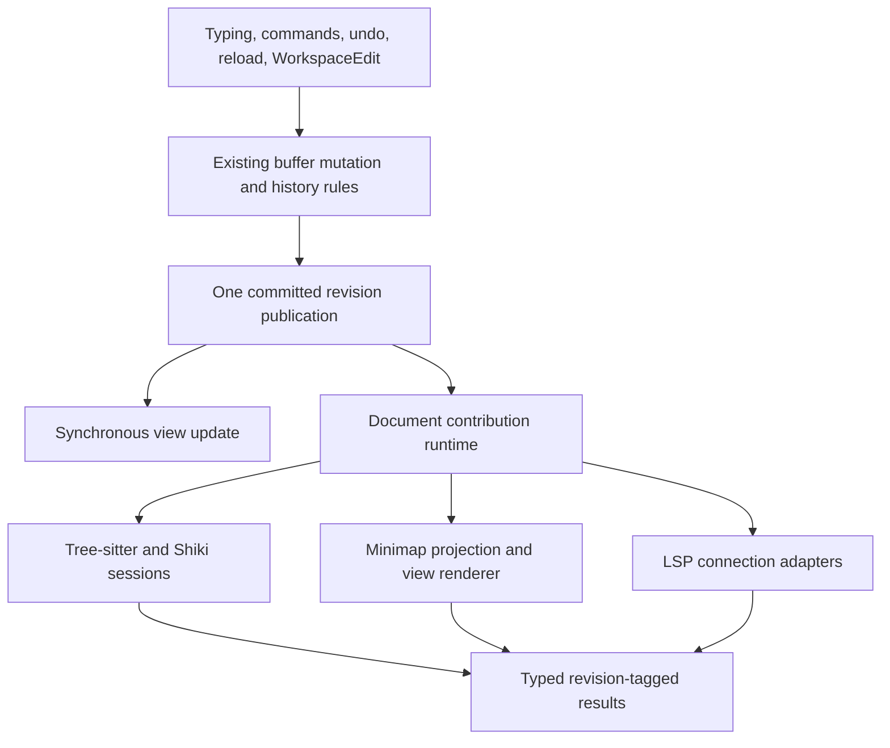

# Plan 099: Route document consumers through one contribution runtime

Status: proposed; implementation has not started. Requested on 2026-09-12.
Owner: Editor and Platform. Priority P1, effort XL, change risk high.
Inspected Platform: `2f9528ac1e147615cf81431ef8509f551af4b290`.
Inspected Editor: `64926519bfdd39f4afcfae225019a932d3e27785`.

The editor already has contribution registration, immutable text snapshots, and an edit chain.
Its consumers independently manage how documents reach their workers. Replace those independent
source subscriptions, synchronization cursors, reset decisions, and freshness checks with one
document-owned contribution runtime. Keep typed feature APIs and independent execution policies.

A keystroke in either of two views must publish one document revision. Compatible syntax sessions
share that source and their reusable analysis. Each view retains its own viewport and presentation.
A slow language server must not delay typing, syntax work, or another document.

This document plans the refactor. It does not start production implementation, a branch, a commit,
or a PR. The planning work covers grounding, competing designs, synthesis, and review. Implementation
begins only when requested. Reconcile both checkouts and their dirty diffs before executing it.

## Scope and completion boundary

Route every successful buffer mutation through one publication operation. Route every first-party
secondary document consumer through the contribution contract. Include ordinary editors, multiple
views, hidden retained documents, prepared opens, and diff syntax sessions.

Migrate Tree-sitter, Shiki, minimap, browser TypeScript LSP, and Platform's external LSP integration.
Audit find, Markdown, folds, gutters, scope lines, and other document-reading plugins for bypasses.
Keep synchronous, inexpensive consumers synchronous through their existing typed contribution
hooks. This plan does not move every reader to a worker or turn every API into a promise.

Deliver the common runtime with ordinary worker synchronization first. It must work with SAB
unavailable. Evaluate the existing SAB text transport separately. A shared allocator or packed
shared piece tree is not a prerequisite and is not promised by this plan.

The existing text buffer remains the sole authority for content. Platform continues to own files,
environments, save policy, and WorkspaceEdit transactions. The refactor must remove superseded
paths in the same migration unit that replaces them. No compatibility aliases or permanent dual
publication paths remain at completion.

## Current code and constraints

Editor paths below are relative to the sibling `Editor` repository. Platform paths are relative
to this repository. Line numbers describe the inspected baseline and must be checked for drift.

| Existing source                                                                                                                                                 | What the refactor must preserve or replace                                                                                                                       |
| --------------------------------------------------------------------------------------------------------------------------------------------------------------- | ---------------------------------------------------------------------------------------------------------------------------------------------------------------- |
| [Text buffer](../../Editor/packages/editor/src/documentSession.ts), `PieceTableEditorTextBuffer`, around lines 488 and 1320                                     | Owns history, snapshots, revisions, edit chain, and publication. Extend this owner.                                                                              |
| Same file, `undo`, `redo`, `commitPrepared`, `reverseReceipt`, sequence operations, `commitLogicalOnly`, and `emitChange`                                       | Several mutation paths separately update revision state and emit. Include every path, including logical changes with unchanged text.                             |
| [TextSnapshot](../../Editor/packages/editor/src/documentTextSnapshot.ts), line 20                                                                               | Supplies range reads, line lookup, and chunk iteration. Keep this reader contract; do not expose piece-tree internals to contributions.                          |
| [DocumentEditChain](../../Editor/packages/editor/src/editor/editChain.ts), line 103                                                                             | Composes edits since a sync point and detects gaps and segment changes. Extend it instead of creating feature-local edit journals.                               |
| [Plugin contracts](../../Editor/packages/editor/src/plugins.ts), lines 618 and 950                                                                              | Already provide typed registration and view lifecycle. Add document lifetime below view lifetime.                                                                |
| [Secondary-view projection](../../Editor/packages/editor/src/public/secondaryViews.ts), line 70                                                                 | Shares document/version/view data with minimap. Its callable JS reader is not itself a worker message.                                                           |
| [Work scheduler](../../Editor/packages/editor/src/editor/workScheduler.ts)                                                                                      | Already supplies task classes, cancellation, deadlines, and replacement. Reuse it without imposing one serial queue across workers.                              |
| [Tree-sitter source](../../Editor/packages/tree-sitter/src/treeSitter/source.ts) and [client](../../Editor/packages/tree-sitter/src/treeSitter/workerClient.ts) | Build complete piece descriptors and track sent chunks. Optional SAB payloads are converted back into cached worker strings. Replace generic source bookkeeping. |
| [Shiki client](../../Editor/packages/editor/src/shiki/workerClient.ts), lines 394 and 465                                                                       | Materializes initial text and independently chooses incremental edits or a text-diff fallback. Preserve tokenizer state; remove source-history reconstruction.   |
| [Minimap client](../../Editor/packages/minimap/src/workerClient.ts), lines 210, 1106, and 1477                                                                  | Owns another update baseline, edit rebasing, and rendering sequence. Keep clipped summaries and raster behavior; move common document progress out.              |
| [LSP document sync](../../Editor/packages/lsp-plugin/src/documentSync.ts), lines 45 and 388                                                                     | Already consumes the shared edit chain, but owns attachment and progress per lane. Keep protocol-specific version and URI rules.                                 |
| [Prepared documents](../../Editor/packages/editor/src/editor/preparedDocument.ts) and [diff syntax](../../Editor/packages/diff/src/diffSyntax.ts)               | Create or transfer sessions outside the ordinary mounted-view path. They must use the same contribution runtime.                                                 |
| [Platform runtime](../apps/web/src/features/editor/state/runtime.ts) and [document state](../apps/web/src/features/editor/state/document-state.tsx)             | Own retained documents within an environment. They must supply explicit ownership, not an active-editor singleton.                                               |
| [WorkspaceEdit service](../apps/web/src/features/editor/state/workspace-edit-service.ts), around line 1000                                                      | Commits local buffer changes before awaiting server finalization. Compensation can emit reverse changes later. Preserve this visibility and ordering.            |

The earlier local Chromium check found SAB unavailable on Platform at `http://127.0.0.1:3300/`.
That is one observed environment, not a permanent capability claim. Recheck the actual deployment
when measuring. Historical parse timings do not prove a current end-to-end SAB benefit.

## Chosen architecture

### Publish once, synchronize on demand

Use one canonical publication operation inside the buffer owner. It installs the committed
snapshot and revision, records the existing edit chain, and makes that revision available to
views and contributions. It does not run worker adapters or wait for their results.

Contributions retain typed domain sessions. A session receives an exact revision when its work
requires that revision. The runtime advances its source from the last successfully synchronized
point immediately before dependent work runs. Always-active consumers declare retained demand.
They do not subscribe to the raw buffer themselves.



“One place” means one owner of document publication and synchronization policy. It does not mean
one worker, a global serial queue, or one untyped request/result format.

### Alternatives and synthesis

| Candidate                                                                              | Decision                                                                                                                                                       |
| -------------------------------------------------------------------------------------- | -------------------------------------------------------------------------------------------------------------------------------------------------------------- |
| Push every committed revision into each contribution session                           | Use its canonical publication and document lifetime model. Do not eagerly prepare or deliver source for consumers that have no current demand.                 |
| Document-owned revision reader with typed requests and retained synchronization demand | Chosen base. It centralizes progress while allowing hidden views and obsolete work to skip unnecessary computation. Stateful parsers survive between requests. |
| Uniform worker-message wrapper around existing clients                                 | Reject. It would leave each feature responsible for its own document baseline, resets, and result freshness.                                                   |
| Move the authoritative document into a worker or SAB immediately                       | Reject for this refactor. It changes synchronous editing and storage ownership before the shared consumer boundary is proven.                                  |

The public contract hides synchronization and lifetime management. Feature code retains only the
knowledge required by its parser, tokenizer, renderer, or external protocol. Do not create chains
of forwarding services that merely repeat the same arguments.

## Contribution API sketch

All names in this section are proposed. The examples express the caller contract, not code ready
to paste into production. Reuse current capability tokens, task classes, snapshot methods, and
revision types wherever their semantics match.

### Caller usage

Plugin activation registers document contributions through the existing plugin context:

```ts
context.registerDocumentContribution(createTreeSitterContribution({ languages }))
context.registerDocumentContribution(createShikiContribution({ registrations }))
context.registerDocumentContribution(createMinimapContribution())
context.registerDocumentContribution(createLanguageServerContribution({ connections }))
```

The document runtime resolves typed feature operations from those contributions. A view can ask
for tokens or a minimap frame without knowing worker IDs, synchronization cursors, or SAB fields:

```ts
document.contributions.request(
  syntaxTokens,
  { range },
  {
    kind: 'latest',
    audience: syntaxAudience,
    accept: (tokens) => syntaxPresentation.apply(tokens),
  },
)

document.contributions.request(
  minimapFrame,
  { viewport },
  {
    kind: 'latest',
    audience: minimapAudience,
    accept: (frame) => minimapPresentation.apply(frame),
  },
)

connection.document.contributions.retain(languageServerSync, {
  logicalRevisionScope: connection.logicalRevisionScope,
})
```

Keep domain conveniences such as syntax range queries and language-service hover. They delegate
to typed operation tokens internally. There is no public `send(featureName, unknownPayload)` API.
Viewport observers can update demand without reopening a source session.

Prepared work requests an explicitly pinned revision. Adoption transfers its existing ownership
and useful sessions/results. A headless diff consumer registers contributions in an explicit
runtime scope and obtains the same document attachment contract without constructing a DOM view.

### Domain types and responsibilities

```ts
interface DocumentRevision {
  readonly identity: DocumentIdentity
  readonly point: DocumentSyncPoint
}

interface DocumentRead {
  readonly revision: DocumentRevision
  readonly text: TextSnapshot
}

type ContributionDemand<Result> =
  | {
      readonly kind: 'latest'
      readonly audience: ContributionAudience
      readonly accept: (result: Result) => void
    }
  | {
      readonly kind: 'pinned'
      readonly revision: DocumentRevision
      readonly owner: ContributionOwner
      readonly accept: (result: Result) => void
    }

interface DocumentContributions {
  request<Input, Result>(
    operation: DocumentOperation<Input, Result>,
    input: Input,
    demand: ContributionDemand<Result>,
  ): ContributionTask<Result>

  retain<Input>(operation: OrderedDocumentOperation<Input>, input: Input): EditorDisposable
}

type ContributionOutcome<Result> =
  | { readonly kind: 'completed'; readonly result: Result }
  | { readonly kind: 'cancelled' | 'superseded' | 'disposed' | 'unavailable' }
  | { readonly kind: 'failed'; readonly failure: ContributionFailure }

interface ContributionTask<Result> extends EditorDisposable {
  readonly settled: Promise<ContributionOutcome<Result>>
  cancel(): void
}
```

`DocumentIdentity`, operations, audiences, owners, revisions, and tasks are opaque runtime-issued
handles. Brands alone do not prove ownership: the boundary validates the issuing runtime and
live generation. A path, equal text, or equal revision number is insufficient identity.

Derive `DocumentRevision.point` from the existing `DocumentSyncPoint`. Do not introduce a parallel
content counter. Keep document incarnation, worker generation, contribution configuration, and
view demand identity separate. They invalidate different work. Capture them when work is admitted.
Never add current provenance to an old result after it arrives.

Each `request` is one-shot and captures its exact source and input at admission. `latest` controls
acceptance, not silent retargeting. If a newer source/configuration supersedes the request, settle
it as superseded. A retained view contribution schedules a fresh request using its current demand.
The separate ordered `retain` API stays active until released. `ContributionFailure` uses the
existing structured diagnostic/error model and identifies the failed operation and owner.

An audience belongs to a view or another result owner. It records the currently accepted domain
configuration and demand. The runtime stamps and checks results before calling `accept`.
The callback receives the token's concrete result type. Domain result shapes remain distinct.

`ContributionTask` supplies cancellation, disposal, and a typed settled outcome. Cancellation,
supersession, owner disposal, and failure settle callers; none leaves a hanging promise or pending
loading state. Ordinary hover and token requests cannot submit arbitrary mutations.

Contribution definitions declare their typed operations, session configuration identity, and
processing policy. Backend session creation and execution remain private to the implementing
package. Their definition has this conceptual shape:

```ts
interface DocumentContribution<Session> {
  readonly provider: ContributionProviderKey<Session>
  readonly configuration: ContributionConfigurationKey
  readonly operations: readonly BoundDocumentOperation<Session>[]
  createSession(context: ContributionSessionContext): Session
}
```

Operation bindings are created by typed factories that preserve each operation's input/result
types. They do not expose wire messages. Session cleanup is a required part of the provider's
bound lifecycle, rather than optional arbitrary methods on `Session`.

Key a logical session by issuing runtime/environment, buffer incarnation, registered provider
identity, and configuration identity. The provider defines a typed, stable configuration key at
registration; do not stringify arbitrary options or compare factory closures. Compatible view
registrations retain the same binding. Releasing one registration decrements its ownership only.
Conflicting definitions under the same provider/configuration key fail at registration.

Keep endpoint generation in the delivery state, separate from this logical binding. A restart
replaces its reader and backend instance without making live owners invent a new document identity.
Resolve domain operations using the existing effective language, theme, provider selection, and
priority rules. For example, Shiki and Tree-sitter cannot both win one token output by registration
order. Capture the selected provider/configuration with the request; preserve distinct structural
and highlighting capabilities where current policy uses them.

A backend handler receives a `DocumentRead` and execution context with cancellation and canonical
delta lookup to that fixed target. A stateful parser/tokenizer records which revision its own
state actually represents. It requests `changesBetween(analysisRevision, targetRevision)` through
the common reader service. Source acknowledgement alone does not prove its analysis state is
current. A missing analysis delta triggers the adapter's explicit rebuild from the exact target.
The adapter owns domain state; the runtime owns source-history lookup and gap detection. A handler
cannot advance the authoritative document or substitute another target revision.

Use a discriminated declaration for replaceable computation versus ordered synchronization.
Do not represent policy as unrelated `latest`, `ordered`, and `replay` boolean flags. Keep task
priority separate from synchronization ordering. LSP requests can wait behind their own document
synchronization barrier while other executors continue running.

## Canonical publication and mutation rules

Extract one private publication operation from `PieceTableEditorTextBuffer`. Call it after the
existing mutation/history decision succeeds. It performs the shared snapshot, revision, edit-chain,
and notification work currently repeated across mutation paths.

The operation accepts typed transition data derived from the existing change and transaction
types. It preserves origin, source view, logical revision count/scope, edits, and before/after
identity. Do not make contributors reconstruct these from two full strings.

Inventory and migrate these paths explicitly:

| Transition                                                                                        | Required behavior                                                                                                                                 |
| ------------------------------------------------------------------------------------------------- | ------------------------------------------------------------------------------------------------------------------------------------------------- |
| Typing, paste, IME commit, delete, indentation, multi-cursor, programmatic edit                   | One publication for each accepted buffer transaction. Preserve edit ordering, selection mapping, and undo grouping.                               |
| Undo and redo                                                                                     | Publish a new monotonic sync point over the restored immutable text. Text equality does not erase history or source identity.                     |
| Reload, replacement, synchronize, read-only/static document replacement                           | Publish the exact replacement and a reset boundary where existing edit history cannot bridge it.                                                  |
| Prepared transaction commit, forward sequence segment, receipt reversal, reverse sequence segment | Preserve mutation leases, barriers, receipts, ordered segments, and compensation. Publish each transition at the same accepted boundary as today. |
| Logical-only prepared commit                                                                      | Advance logical revision accounting even when text and text version stay unchanged. Avoid unnecessary reparsing.                                  |
| Sync-segment rotation                                                                             | Invalidate old synchronization cursors even when no text edit event occurs. The next delivery must detect the segment change.                     |
| Selection, viewport, theme, language, and view configuration                                      | Send typed view/configuration updates. Selection or scrolling must not manufacture a document edit or resend source text.                         |

Keep synchronous caret, selection, and essential view state updates on their current path.
Secondary contribution publication only records immutable references and pending demand.
Listener exceptions cannot prevent another consumer from observing an accepted commit. Define
and test reentrant mutation ordering: all observers finish seeing revision R before a nested
publication is delivered as R+1. Do not recursively invoke arbitrary contribution code during commit.

Each dispatch frame retains immutable before/after reads and metadata captured for that transition.
A nested commit may advance the live buffer before the earlier notification finishes. Event-derived
processing must read its frame, not call `getSnapshot()` on the mutable head and combine R+1 text
with R edits. Queue nested notification frames in commit order and release their pins after dispatch.

Platform's WorkspaceEdit service remains the transaction coordinator. A local committed segment
is visible before server finalization today; a failed finalization can cause compensation.
This plan preserves both transitions. It neither waits until global finalization to publish nor
collapses resource segments into an invented cross-document atomic event.

## Shared delivery and backend-specific adapters

### Common synchronization state

Own source progress once per document and execution endpoint. Compatible contribution sessions
within that endpoint reuse a reader. Different workers can require separate ordinary mirrors;
the runtime must not claim that message passing makes those copies shared memory.

Before dispatching work for revision R, establish that the endpoint can read R. Use its last
successfully applied sync point and `DocumentEditChain` to obtain a valid advance. Missing history,
a changed document incarnation, or a restarted worker requires an exact snapshot reset.

The existing `changesSince` advances to the live head. Extend the core chain with an explicit
`changesBetween(base, target, scope)` operation over retained revision records; a newer live head
must not leak into a request pinned to R. Return a typed unavailable result when the interval is
not retained. Revision handles pin the exact immutable source only while a live owner needs it.
If an endpoint has already advanced past R, use its retained reader for R or a bounded isolated
analysis instance. Never move an ordered endpoint backward to answer an old request. If that exact
read cannot be supplied within its retention policy, settle the request as unavailable.

Keep the worker protocol private. A typed internal protocol distinguishes attach/reset, advance,
release, and acknowledgement. Every message carries the document and endpoint generations and
its exact base/target identity. An advance with the wrong base cannot be applied optimistically.
Do not expose functions or class instances as serialized snapshot payloads.

For ordinary local workers, send initial text chunks and then canonical edit batches. Construct
a worker-local immutable reader using the existing DOM-free text operations. Validate UTF-16
offset and edit-batch coordinate conventions at the boundary. Preserve lone surrogates, surrogate
pairs across chunk boundaries, line endings, and sparse separated edits exactly.

Applied-source progress and completed-analysis progress are different states. A successfully
applied source update remains applied if its parse is later cancelled. Replacing a computation
must not drop an intermediate delta needed by the next update. A request pinned to R must read R,
or settle as unavailable/cancelled; it must never silently read the newest document instead.

The main thread is the only document writer. Worker mirrors may update their own replicas, but
they cannot write back to the source. A contributed edit proposal must re-enter the existing
command or WorkspaceEdit admission path with its captured source evidence.

### Preserve useful differences

| Adapter                | Common runtime owns                                                                                | Adapter retains                                                                                                           |
| ---------------------- | -------------------------------------------------------------------------------------------------- | ------------------------------------------------------------------------------------------------------------------------- |
| Tree-sitter            | Source attachment, edit-chain delivery, endpoint generation, source retention, result admission    | Grammar/query state, incremental tree edits, injections, bounded parser strings, syntax-specific cancellation checkpoints |
| Shiki                  | Source progress, document/configuration lifetime, ordered readiness, result admission              | Language/theme registrations, tokenizer state, required string conversion, packed token production                        |
| Minimap                | Document identity/progress, changed-region delivery, common source lifetime, view-demand freshness | Clipped line projection, incremental summary patches, canvas ownership, raster cache, immediate slider movement           |
| Browser TypeScript LSP | Document attachment and common source progress for its local adapter                               | TypeScript project/VFS state, protocol methods, semantic caches, diagnostics                                              |
| External LSP           | Captured document source and lane ownership, canonical changes, lifecycle orchestration            | URI transitions, language/server configuration, protocol versions, serialization, connection ordering, save notifications |

Minimap does not need a full-document worker mirror merely to conform to the API. Its document
contribution may derive clipped summaries from the common reader and send those to its renderer.
The renderer receives a typed projection, not a fake `TextSnapshot` that cannot answer arbitrary
range reads. Move projection computation off the input path and keep only measured useful work.

Model source-reader endpoints and projection sinks as different internal contracts. A source
reader acknowledges canonical document progress. A projection sink acknowledges a derived payload
with source revision, projection configuration, and projection base/target identity. The common
delivery owner handles ordering, generations, and reset admission for both. Minimap retains its
summary indexes and patch algorithm as derived state; it does not retain another authoritative
document edit journal. This distinction keeps its compact protocol without pretending it has a
full source mirror.

For string-consuming libraries, materialize at the adapter boundary, preferably inside their
worker. Do not cache a second full main-thread document per contribution. Keep sparse changes
sparse rather than materializing the span between the first and last edit.

LSP synchronization obeys its protocol. An external server cannot read browser memory. Requests
requiring revision R follow the messages that establish R on that connection. A WebSocket send
is not a server acknowledgement: distinguish locally ordered delivery from worker-applied source
acknowledgement. Preserve scoped logical version accounting during full synchronization and URI
reopen. Do not infer version progress from text equality or replay side effects after reconnect.

## Scheduling, retention, and lifetime

| Case                     | Required invariant                                                                                                                                                                 |
| ------------------------ | ---------------------------------------------------------------------------------------------------------------------------------------------------------------------------------- |
| Latest computation       | At most one admitted running computation and one newest pending target per declared replaceable lane, unless a measured algorithm explicitly requires bounded parallel work.       |
| Ordered synchronization  | Advance source monotonically within a generation. Compose canonical edits only when semantics permit. Keep lifecycle/save/side-effect barriers in order.                           |
| Slow reader              | Retain bounded history and pinned snapshots. Reset a lagging replaceable reader when history expires. Never retain an unbounded list of commits.                                   |
| Ordered lane overload    | Declare a bounded policy with a structured failure or protocol-valid reset/reopen. Never silently drop operations that cannot coalesce.                                            |
| Worker crash             | Invalidate only that endpoint's reader and dependent work. A subsequent admitted request reattaches from a valid revision. Failed mutations are not replayed.                      |
| Close and reopen         | A new document incarnation rejects old messages even if path and revision numbers match.                                                                                           |
| Multiple views           | Share compatible document sessions. Keep canvas, viewport, selection, and presentation state per view. Releasing one view does not dispose another's session.                      |
| Configuration change     | Reuse source storage where valid, invalidate domain caches/results by their configuration identity. Different grammars, servers, or themes must not alias incompatible sessions.   |
| Hidden retained document | Stop unnecessary presentation demand. Preserve synchronization explicitly retained by a connection or document owner.                                                              |
| Prepared open            | Transfer ownership once without opening the worker document again or repeating valid analysis. Cancellation releases unclaimed work; the former owner cannot dispose adopted work. |
| Diff/headless consumer   | Use an explicit runtime/document scope through the contribution registry. Do not require a mounted editor or introduce package singletons.                                         |
| Disposal                 | Stop admission, settle work, release reader pins and listeners, and perform endpoint cleanup under its owner. Late messages cannot restore disposed state.                         |

Reuse `EditorWorkScheduler` task classes and its burst deadline behavior. Keep separate queues
for separate executors and domains. A remote request must not block local workers. Avoid one
timer, promise chain, or source copy per contribution per keystroke.

Keep result admission common, with domain-specific validity predicates for language, theme,
query, and view demand. A stale result may only be retained as explicitly identified historical
paint under the existing paint contract. It cannot become current syntax, diagnostics, or edits.
Cancellation is an efficiency mechanism; exact identity checks still enforce correctness.

## Performance contract

The structural target is to remove repeated document work, not wrap it in more abstractions.
Measure the baseline and the final complete consumer path on the same workloads.

The new publication work must have cost independent of total document characters, lines, and
piece count. A commit stores one canonical revision/transition and performs bounded work per
interested endpoint. Existing editing/history costs remain separately visible.

Enforce these work limits:

- No full-text materialization, whole-tree flattening, line-index rebuild, worker message encoding,
  parser execution, or waiting for an endpoint during synchronous publication.
- No document-text delivery for a selection-only or viewport-only update.
- No duplicate source attachment or source reset for compatible views sharing a document/endpoint.
- No fresh full descriptor per small edit. Transfer changed text and bounded metadata; initial
  attach and explicit reset are separate measured operations.
- No new generic token-object expansion. Preserve packed arrays, transferables, lazy reads, and
  reusable domain caches where they already work.
- No unbounded retained revisions, source chunks, queued requests, or stalled disposal promises.
- No inferred zero-copy claim. Report actual clone, encode, decode, materialize, and retained-byte
  costs separately for each endpoint and transport.

Use existing wide diagnostics. Correlate publication, source delivery, execution, result admission,
and visible application by document identity, revision, endpoint generation, and operation.
Record bytes/units read, encoded, cloned or transferred; resets and their reasons; composed edits;
live pins; queue length; and discarded work. Rejected application attempts are not accepted results.

Count total `readRange` units and index/descriptor work, not only full-text method calls.
[E031's measurements](../../Editor/docs/performance/e031-projection.md) show that line-by-line
reads can hide a whole-document pass behind a zero full-read counter.

Do not put a generic runtime mode, cache budget, or SAB toggle in user settings merely for this
refactor. Benchmark controls belong to the harness. Any actual user-facing setting follows the
existing settings registry and ships with its consumer.

## Migration units

Each unit ends with a working artifact and focused evidence. Do not leave a new API unused,
introduce temporary production compatibility layers, or mark a unit complete because it compiles.

### 0. Freeze the baseline and inventory every consumer

Record both revisions, dirty diffs, built exports, link resolution, package versions, browser,
hardware, fixture hashes, viewport, and enabled contributions. Recheck current capability flags.
Use complete frozen package sets for comparison; freezing only core misses changes in adapters.

Generate an inventory of mutation publishers, raw buffer subscriptions, provider session creation,
worker document messages, source materialization, and private core imports across all Editor
packages and Platform consumers. Classify every occurrence as core mutation, document contribution,
view presentation, domain adapter, or host transaction policy. Resolve every unclassified caller.

Run the unchanged controls and instrument calibration described below. Save raw samples and a
fixed comparison policy before implementing the runtime. This unit produces the deletion list
and confirms each observable on a known-good control.

First extend the benchmark harness to make the expanded consumer matrix executable. The current
stress input fixture enables Tree-sitter directly. Add explicit consumer configurations to workload
identity, controls that actually instantiate them, and readiness/output assertions for each.
Calibrate the new configurations independently while preserving the existing input matrix.
Freeze benchmark source fixtures as files with hashes. Platform's default live `editor.tsx` fixture
must not change between baseline and candidate merely because the refactor edits that component.

### 1. Converge buffer publication

Extract the shared publication operation and migrate every path in the transition table.
Preserve current mutation decisions, undo groups, leases, receipts, logical-only changes, and
segment rotation. Preserve synchronous view behavior and existing external publication timing.

Prove exact consumer-observed revisions and edits for normal commits, nested notification,
prepared batches, undo/redo, sequences, and compensation. Remove superseded publisher code.
The existing consumers still receive the canonical current event contract in this unit.

### 2. Build the common runtime with two real consumers

Add document contribution registration, typed operations, revision handles, audiences, and bounded
delivery state. Prove replaceable work and ordered progress with real document fixtures.

Migrate Tree-sitter and Shiki source attachment through the common ordinary worker reader. This
is the first production slice, not an unused framework. Preserve their incremental domain state
and packed results. Remove their feature-owned source history/recovery and direct caller bypasses.
Keep only domain-specific synchronization required to update parser/tokenizer state after the
common reader advances.

Migrate every caller of these two backends in this unit: mounted controllers, prepared creation
and adoption, diff/headless syntax, examples, framework wrappers, and Platform registration.
Remove the replaced provider session entry points only after their entire caller set uses the
contribution contract, in this same unit. Do not defer those callers to unit 5 or add a temporary
compatibility adapter. Public cutover therefore follows the host prerequisites listed below.

Use their real worker results to prove source equivalence, lifecycle independence, exact pinned
reads, missed-history reset, and stale completion rejection. Compare input and syntax-visible
costs before proceeding. Rework the design if a consumer must recreate generic cursor logic.

### 3. Migrate minimap without increasing source volume

Register its document projection through the runtime and retain view-specific rendering demand.
Replace edit collection/rebasing and authoritative source-baseline tracking with common delivery.
Keep clipped summaries and changed-line patches. Do not allocate a full minimap document mirror
unless a measured alternative justifies it.

Verify long lines, sparse edits, scroll-only updates, folds, theme changes, hidden views, and
two canvases on the same document. Compare transferred bytes, range-read volume, frame latency,
and retained memory. Delete the old document synchronization route from view updates.

### 4. Migrate local and external language-service synchronization

Move document attachment/progress into retained contribution demand. Connect LSP's existing
scope-aware edit-chain use to the same delivery owner. Keep its protocol adapter responsible
for version mapping, URI lifecycle, connection barriers, and full-sync capability.

Migrate both the browser TypeScript worker and Platform's real external-server lanes. Verify
multiple servers per document, identical paths in different environments, rename/reopen, save,
workspace edits, logical-only revisions, late responses, and reconnect. No global connection queue.
Delete duplicate generic source-progress and recovery code, preserving protocol-required state.

### 5. Complete retained ownership and remaining contribution paths

Prepared and diff syntax callers already migrated with their backends in unit 2. Verify their
ownership with all migrated consumers together. Make document ownership independent of view
mounting. Migrate remaining first-party reader bypasses found in unit 0. Keep synchronous
features on narrow synchronous contribution hooks.

For every remaining family, migrate its full caller set and delete the replaced public entry
points in the same unit. Preserve typed language-service and view APIs through the contribution
registry. Recheck React, Solid, standalone examples, built consumers, and Platform for bypasses.

### 6. Decide the SAB implementation beneath the contract

Compare ordinary strings/chunks, transferable buffers where ownership permits, and the existing
SAB chunk path under the new runtime. Separate this comparison from the improvement due to
centralized publication and synchronization. Preserve the SAB cancellation mechanism where
supported and useful; it is a different use from text storage.

Keep a SAB source implementation only if complete-consumer latency or memory savings beat the
declared target and repeated-control variation without regressing input latency. Otherwise delete
the old `shared-utf16` path and its obsolete tests. Record unavailable channels as unavailable.
If no representative SAB-capable channel can be measured, remove the unproven text transport as
an explicit complexity decision, not a measured performance loss. Record the evidence gap and
keep the ordinary runtime rollout independent of SAB availability.
If shared immutable storage is still promising, update E013 against this runtime as a separate
measured implementation proposal. Do not keep an unused production SAB abstraction for that future.

### 7. Enforce the boundary and close the refactor

Add a focused source/import boundary check that rejects generic worker-document synchronization
outside the runtime and approved domain adapters. Cover public export bypasses and direct provider
session creation. Prefer an AST/import check with narrow, documented exceptions over matching
words such as `postMessage`, which also carry legitimate domain results.

Run the final correctness and performance matrices against the frozen baseline. Check the complete
source inventory again and show that the old paths are gone. Publish permanent API/lifecycle and
performance references, reconcile linked plans, and delete this executable plan only after its
completion conditions pass.

## Proposed module ownership

Paths here are proposals, not existing files. Match current package naming conventions during
implementation and keep the public interface smaller than the behavior it hides.

| Location                                                                                     | Responsibility                                                                                                    |
| -------------------------------------------------------------------------------------------- | ----------------------------------------------------------------------------------------------------------------- |
| Editor `packages/editor/src/documentSession.ts`                                              | Existing mutation/history owner and canonical publication.                                                        |
| Editor `packages/editor/src/document/contributions.ts`                                       | Typed document contribution contracts and operation tokens. Export through current package entry points.          |
| Editor `packages/editor/src/document/state/contribution-runtime.ts`                          | Document attachments, demand, revision ownership, progress, result admission, and disposal.                       |
| Editor `packages/editor/src/document/state/worker-reader.ts`                                 | Private local-worker protocol, source acknowledgement, ordinary mirror ownership, reset, and endpoint generation. |
| Editor `packages/editor/src/document/utils/transfer.ts`, only if extraction earns its place  | Pure encoding/decoding and immutable read construction. No mutable caches or owners in `utils`.                   |
| Existing feature packages                                                                    | Typed domain operations, parser/tokenizer/project state, projection algorithms, and external protocol adaptation. |
| Existing view controllers and prepared/diff owners                                           | Presentation demand, adoption, and runtime ownership. No second source synchronization mechanism.                 |
| Platform `features/editor/state/runtime.ts`, document state, and language-server composition | Bind explicit environment/document owners and retained lifetimes to the common Editor contract.                   |

Avoid a new package unless a real dependency boundary requires one. Do not add feature barrels,
global registries, or wrappers whose only behavior is forwarding the same arguments.

## Verification and performance gates

### Behavioral proof

Add tests only where they catch these plausible failures. Use real buffers and real worker
implementations. Mock external HTTP/process boundaries using the repository's existing fixtures.

| Scenario                                                             | Failure the check must catch                                                                           |
| -------------------------------------------------------------------- | ------------------------------------------------------------------------------------------------------ |
| Every mutation path, including logical-only and sequence transitions | Missing or double publication; lost logical revisions; changed undo grouping.                          |
| Two views and two compatible consumers                               | Duplicate worker open/source copies; disposal of another view's session; configuration aliasing.       |
| Slow worker, cancellation, and exhausted edit history                | Wrong-base patch application, unbounded queues, or a result computed from the wrong revision.          |
| Worker crash, document close/reopen, and endpoint replacement        | Old generation results accepted as current; failed operations replayed.                                |
| UTF-16 boundaries, line endings, sparse edits, undo branches         | Text corruption, normalization changes, or a broad read across untouched regions.                      |
| Scroll/selection/theme changes                                       | Unnecessary text synchronization or mismatched presentation configuration.                             |
| Prepared adoption and diff/headless consumption                      | Double initialization, lost first-paint tokens/folds, leaked leases, late prepared result application. |
| Multi-server LSP, environment switching, save, and compensation      | Cross-owner edits, protocol order/version loss, or publication delayed until server finalization.      |
| Reentrant notification and a failing contribution                    | Out-of-order revisions or an accepted commit hidden from another observer.                             |

### Measurement matrix

Use the existing [input latency instrument](../../Editor/docs/performance/input-latency.md) and
its calibrated ordinary-code, 500,000-short-line, and one-megabyte-line fixtures. Preserve the
single-view and two-visible-plus-one-hidden configurations and the six native input scenarios.

Add contribution configurations: disabled, each supported consumer individually, the actual
Platform configuration, and supported multiple-consumer combinations. Include cold open, warm
typing bursts, large paste, sparse multi-cursor edits, undo/redo, replacement, prepared adoption,
worker restart, delayed consumers, and long retention/disposal runs.

1. Run at least three unchanged controls, an independent unchanged holdout, and a real delayed
   negative control. Confirm that the holdout passes and the negative control fails.
2. Freeze comparison rules and raw baseline samples before candidate measurements. Record
   separate source/build identities for baseline and candidate.
3. Require all existing blocking input comparisons to pass without relaxing their limits. The
   inspected E002 instrument has 108 blocking comparisons and 36 advisory screenshot-duration
   comparisons. Reconcile instrument changes explicitly; do not gate on the count alone.
4. Prove exact text, accepted revisions, mounted coverage, visible changed pixels, and cleanup.
   Screenshot completion time is not a substitute for native input-to-frame measurements.
5. Compare publication overhead, time to visible syntax, open/scroll latency, total source reads,
   encoded/transferred bytes, allocations, and retained memory. Require the new runtime to remove
   the measured duplicate work and show a latency or memory improvement beyond control variation
   in the declared multiple-consumer workload. No overall speed claim from an isolated microbenchmark.
6. Reject a candidate that passes correctness by delaying visible work, disabling contributions,
   weakening cancellation, hiding full reads behind line iteration, or recalibrating away a regression.

Report main-renderer heap, worker source/cache payloads, and parser/WASM memory separately. The
existing page instrument does not measure all worker and WASM memory. Moving text into workers
cannot count as a total-memory reduction based on page CDP alone. If complete memory accounting
is unavailable, mark it unavailable and establish adoption through measured latency improvement
plus bounded ownership/retained-payload evidence.

### Existing command entry points

These commands are implementation checks, not tests run during this planning task. Select the
files/cases for the current unit. Recheck package scripts before execution. Run public export
typechecks/builds and affected framework/Platform typechecks after API migration.

From the Editor root:

```sh
bun run --cwd packages/editor test -- test/documentSession.test.ts test/editChain.test.ts test/preparedDocument.test.ts
bun run --cwd packages/editor test -- test/shiki/workerClient.test.ts test/shiki/plugin.test.ts
bun run --cwd packages/editor test -- --project browser test/shiki/workerClient.browser.test.ts
bun run --cwd packages/tree-sitter test -- test/treeSitter-workerClient.test.ts
bun run --cwd packages/tree-sitter test:browser
bun run --cwd packages/lsp-plugin test -- test/documentSync.test.ts
bun run --cwd packages/tree-sitter bench:syntax
bun run --cwd packages/editor bench:transforms
bun run --cwd packages/editor bench:virtualization
bun run bench:input --repetitions 3 --output /work/tmp/plan099/candidate.json.gz
bun run --cwd examples/stress bench:first-paint --output /work/tmp/plan099/first-paint.json
node examples/stress/input-compare.mjs check /work/tmp/plan099/control-1.json.gz /work/tmp/plan099/candidate.json.gz /work/tmp/plan099/calibration.json.gz
```

Run minimap's real browser/unit checks when migrating its renderer boundary. Its `test` script
combines suites, so do not assume an appended filename narrows both. Add or use a focused script
when needed. Add the new runtime tests beside its feature using the package's Vitest setup.

From Platform `apps/web`:

```sh
bun --bun vitest run --project node src/features/editor/tests/runtime.test.ts src/features/editor/tests/prepared-document.test.ts
bun --bun vitest run --project node src/features/editor/tests/workspace-edit-service.test.ts test/integration/workspace-edit.test.ts
```

Run `bench:editor-open:gate`, `bench:editor-typing:gate`, and `bench:editor-scroll:gate` against the
discovered existing servers, with explicit `--app-url` and `--server-url`. Never start another dev
server or use hardcoded-port huge-file aliases. The open calibration wrapper reads
`EDITOR_OPEN_BENCH_APP_URL`, `EDITOR_OPEN_BENCH_SERVER_URL`, and `EDITOR_OPEN_BENCH_ROOT`; it does
not forward arbitrary CLI options. Preserve cross-revision comparisons when implementation hashes
require a separate candidate calibration.

Keep benchmark artifacts, caches, and frozen builds under `/work`. Check the mount and physical
free-space constraints before generating large fixtures. Do not install browsers or download
large payloads onto the system SSD as a side effect of verification.

## Related plans and execution order

[Root PLAN.md](../PLAN.md) remains the scheduler. This plan's internal order is baseline,
publication, common runtime with syntax consumers, minimap, LSP, remaining callers, SAB decision,
and complete validation. Writing the plan does not schedule production execution ahead of another lane.

- [Plan 098](098-document-and-tab-domain.md) owns Platform document and tab identity. Map its
  implemented identity to the Editor buffer incarnation. The current roadmap requires all of
  098 to complete before any implementation of Plan 097 begins; preserve that order.
- [Plan 097](097-async-operation-ownership.md) owns host operation provenance and WorkspaceEdit
  source evidence. Share its implemented captured owner/source types; do not create another host
  operation service. Baseline/publication work in units 0–1 can proceed independently. Public
  backend cutover starts in unit 2 and follows completed 098 and 097 contracts. Refresh anchors and measurements
  at that cutover rather than implement against a competing draft identity or provenance model.
- [E007](../../Editor/plans/e007-chunked-document-consumers.md) and
  [E033](../../Editor/plans/e033-explicit-full-text-boundary.md) supply range/full-text constraints.
  Reconcile overlapping consumer moves instead of implementing parallel abstractions.
- [E032](../../Editor/plans/e032-incremental-edit-batches.md) owns incremental batch improvements.
  Preserve its sparse-region requirements and existing canonical batch semantics.
- [E009](../../Editor/plans/e009-worker-transport-costs.md) supplies transport measurement scope.
  Unit 6 executes its relevant decision against the new runtime and records what remains.
- [E013](../../Editor/plans/e013-shared-document-snapshots.md) remains shared-storage research.
  Its future reader must implement this contribution contract. E010–E012 are not prerequisites here.
- [E014](../../Editor/plans/e014-parallel-search.md) must reuse the common reader and job lifecycle
  if parallel search is implemented. This plan does not add a parallel search engine.
- [Plan 071](071-syntax-highlight-retry.md) remains separate retry policy. Common endpoint lifecycle
  must not accidentally introduce retries or replay failed requests as part of this refactor.

## Completion checklist

- [ ] Every accepted buffer transition has one canonical publication path and preserved semantics.
- [ ] Every first-party secondary document consumer enters through contribution registration.
- [ ] Domain APIs remain typed; synchronous view/input behavior stays synchronous.
- [ ] Source synchronization and result provenance have one owner, including prepared and diff callers.
- [ ] Multiple views, endpoints, environments, logical revisions, and compensation pass focused proof.
- [ ] Queues, mirrors, pinned snapshots, and disposal have measured bounded lifetimes.
- [ ] Old source publishers, duplicate generic sync state, unused APIs, and compatibility paths are deleted.
- [ ] Built exports and all affected framework/Platform consumers use the new contract.
- [ ] Calibrated browser gates pass, and the declared multiple-consumer improvement is measured.
- [ ] The SAB keep/remove decision is documented separately from runtime consolidation results.
- [ ] Permanent architecture/performance references and all overlapping plan links are reconciled.

If two independent adapters need their own generic source cursor, reset policy, or revision check
after migration, the proposed boundary has failed. Redesign it before migrating more consumers.
If the common runtime introduces document-size-dependent publication work or measurable input
regression, revise the data structures rather than hiding the cost with longer debounce delays.
