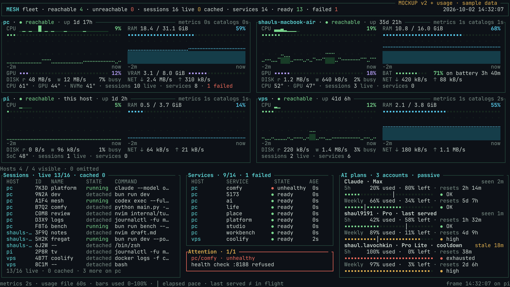
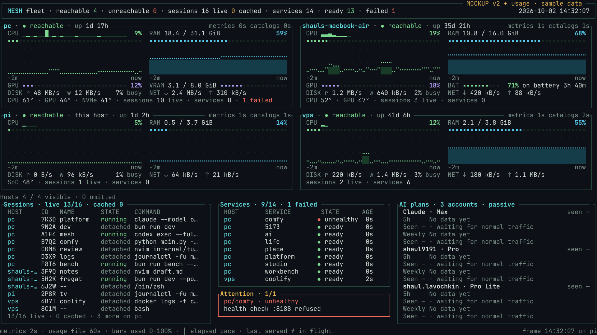

# Plan 287: Passive per-account usage feed and the Mesh TV panel

- Status: Approved
- Date: 2026-10-02
- Owner: Fregat owns the Claude/GPT gateway producer; Mesh owns the generic feed reader and terminal panel.
- Repositories: `ShaulLavo/fregat`, `ShaulLavo/mesh`.
- Scope: Implement the proxy feed and TV panel. This change set is planning and design only.
- Decision: The owner selected CLIProxyAPI plus our gateway as the single source of per-account usage. Fregat consumption is a later follow-up.

## Outcome

The Raspberry Pi's `mesh dashboard --wall` shows Claude Max, ChatGPT Pro and ChatGPT Pro Lite separately: observed allowance used and left, reset countdown, plan, account identity, routing state and observation age. A rotating account pool never masquerades as one account. The viewer contacts only a small versioned JSON feed over the tailnet; neither the viewer nor the producer adds provider quota requests.

The same contract can later serve Fregat and other consumers. Mesh knows about account labels, windows and freshness; it knows nothing about Anthropic SDKs, Codex OAuth, proxy authentication, or provider endpoints.

## Live inventory and verification boundary

Inspected 2026-10-02. Provider tokens, complete auth records, request content, organization IDs and management/client secrets were neither printed nor saved. Production configuration was left unchanged. Two manually issued, tiny inference requests (one per provider) verified actual gateway response headers; no inference loops or quota probes were run for the proxy.

### Fregat: available today, not the chosen source

`GET https://omarchy.mesh.shaulavo.dev/platform/providers/usage`, with `Origin: https://omarchy.mesh.shaulavo.dev`, returned HTTP 200 and these readings:

| Account exposed by Fregat         | Plan | Window                             | Used / left | Reset UTC               | Minutes | Status | Checked UTC             |
| --------------------------------- | ---- | ---------------------------------- | ----------- | ----------------------- | ------: | ------ | ----------------------- |
| Claude provider instance `claude` | max  | `five_hour` / Session              | 20% / 80%   | 2026-10-02 12:59:59.749 |     300 | null   | 2026-10-02 10:03:08.873 |
| Same Claude account               | max  | `seven_day` / Weekly               | 66% / 34%   | 2026-10-07 16:59:59.749 |   10080 | null   | same                    |
| Same Claude account               | max  | `seven_day_fable` / Weekly · Fable | 1% / 99%    | 2026-10-07 16:59:59.749 |   10080 | null   | same                    |
| Codex provider instance `codex`   | pro  | `primary` / Weekly                 | 89% / 11%   | 2026-10-06 19:23:12     |   10080 | null   | 2026-10-02 10:03:09.330 |

This is two accounts, not three. The live Codex response has one weekly window: **primary is a position, not a five-hour duration**. There was no Pro Lite reading. The route includes `accountKey`, `driverKind`, `providerInstanceIds`, `planType`, `checkedAt` and `windows`; windows include `id`, `kind`, `label`, `usedPercent`, `resetsAt`, `windowMinutes`, `status`. Reset-credit metadata exists but is outside the TV feed scope.

Claude mapping also understands Opus/Sonnet weekly windows, dynamic model-scoped windows, and extra usage when supplied. Codex mapping understands primary/secondary durations; it currently excludes model-specific `limitId` snapshots other than `codex`. Those supported shapes are not evidence that this account currently exposes them.

The local Claude login metadata confirms Max, tier `default_claude_max_20x`. CLIProxyAPI's two independently authorized auth records report `plan_type: pro` and `plan_type: prolite`; labels can be `shaul9191 · Pro` and `shaul.lavochkin · Pro Lite`. Both were enabled. Matching Fregat's hashed credential key to a proxy credential is not proven by its usage response; never treat Fregat's single Codex row as the entire proxy pool.

### Fregat probe audit: distinguish reads from explicit resets

Current code: `apps/server/src/provider/usage-store.ts`, `provider/reset-credits.ts`, `provider/adapters/claude.ts`, `provider/adapters/codex.ts`, `provider/utils/usage-windows.ts`, and `apps/web/src/features/chat/hooks/use-provider-usage.ts`.

- Ordinary `ProviderUsageStore.read()` uses one map of in-flight probes per credential-derived account key, and one `probedAtMs` clock. Successful **and failed** probes set the clock when they settle. A subsequent ordinary read cannot probe until five minutes after settlement. Same-account instances share that key. The route waits at most six seconds, then returns its memory snapshot while a slow probe continues.
- Composer mount, its 60-second running refetch (15 seconds at ≥90%), and settled-turn invalidation all read the same store. More readers do not create additional ordinary probes inside the five-minute freshness period. Settings › Usage's history route reads recorded SQLite usage; it is not another plan-quota polling loop.
- This is demand-driven, not a background five-minute timer. After five minutes, an ordinary app read can start the next probe. Runtime rate-limit events can update windows in between without a probe. The memory cache empties on restart; existing `read()` then probes, and drops empty/unsupported/expired accounts from the response.
- **The universal “at most once every five minutes, regardless of caller” claim is false.** `refreshAccount()` waits for a pending probe then calls `readUsage()` unconditionally, bypassing the freshness check and without registering its own request in the in-flight map. Explicit reset-credit consumption calls it. Codex's reset-credit preflight separately calls `account/rateLimits/read` inside `consumeResetCredit()`. These are user-action reset paths, not normal meter reads, but they are independent reads.
- Keep these existing paths unchanged for this build. In the later Fregat follow-up, route active quota callers through one scheduling/serialization owner, with a deliberately specified post-reset refresh exception if still needed. The proxy feed must never invoke any of them. If Fregat ever exposes its own cache-only feed, it needs a distinct synchronous snapshot API that emits all known accounts with `checkedAt: null` and `no-data` on startup; calling current `read()` would violate the constraint.

### CLIProxyAPI and our gateway

Installed paths are operational inventory, not paths for portable tests: `/work/cli-proxy-api/{gateway.js,config.yaml,runtime.json,auth/}`. Repository source is `scripts/claude-gpt/{gateway.ts,run.ts,README.md}` and its tests. Runtime ports are **18318 gateway**, **18317 CLIProxyAPI**; older README examples use 8318/8317, so implementation must use validated runtime configuration.

Live configuration has loopback binding, round-robin routing and session affinity, usage statistics enabled, request logging disabled, empty management `secret-key`, remote management disabled, and the control panel disabled. Auth files contain login/plan metadata and secrets; they do not contain the live per-account quota observations inspected in source.

Read-only localhost requests found:

- Authenticated `/v1/models`: HTTP 200, including `gpt-6.1-sol`.
- `/v0/management/auth-files` and `/v0/management/usage`: HTTP 404. Management is disabled today. Consequently live GPT per-account percentages/cooldowns and exact current selection **could not be inspected**, and no Pro Lite reset time is claimed here.
- One tiny Sol request through gateway: HTTP 200. Header names included `X-Cpa-Trace-Id`; **no `x-codex-*`, `x-ratelimit-*` or Anthropic quota headers crossed that boundary**. Recording only gateway GPT response headers is insufficient. The trace identifier alone does not identify an account.
- One tiny Haiku request through gateway: HTTP 200. Actual quota values included `anthropic-ratelimit-unified-5h-utilization: 0.2`, `5h-status: allowed`, `5h-reset: 1790946000`; `7d-utilization: 0.66`, `7d-status: allowed`, `7d-reset: 1791392400`; aggregate status `allowed`, representative claim `five_hour`. Overage status was `rejected`, with overage disabled; this does **not** mean the ordinary 5h/weekly windows were rejected. These resets are 2026-10-02 13:00 UTC and 2026-10-07 17:00 UTC. No model-scoped Claude window was present in these headers.

Pinned upstream **v8.0.4** already supports passive observations; do not patch the binary:

- `sdk/cliproxy/auth/quota_signals.go`: `QuotaState.ObserveResponseHeadersForProvider` records a bounded, provider-specific header snapshot in `Signals` with `ObservedAt`. Headers include Anthropic unified quota and Codex primary/secondary/window/reset/plan/credits names. A response with no quota signal keeps the prior snapshot; a new quota-bearing response replaces it. HTTP and websocket observations are represented in the state.
- `sdk/cliproxy/auth/conductor_cooldown.go`: applies response observations to the selected credential and model state, so the two pool accounts remain attributable internally even when translation strips downstream headers.
- `internal/api/handlers/management/auth_files.go`: **GET `/v0/management/auth-files`** exposes credential `quota {observed_at, signals}`, `model_quotas`, `cooldowns`, `status`, `disabled`, `unavailable`, `success`, `failed`, `recent_requests`, `auth_index`, and safe account/plan metadata. This is the required cached-state API. Its status `active` means an enabled/schedulable credential, not an in-flight request.
- `sdk/cliproxy/auth/types.go`: cooldown reason/exceeded/recovery live on `QuotaState` and `ModelState`. Management separates their sanitized cooldown view from the passive quota fields. `recent_requests` has **twenty ten-minute buckets**; it is too coarse for exact “currently serving” attribution.
- Usage statistics are proxy-local requests/tokens/cost observations, not subscription capacity. The installed version's `GET /usage-queue` **pops** records: exclude it, along with `POST /quota/fetch`, `/api-call`, auth refresh, resets and downloads. Do not mistake a GET queue drain for a read-only cached-state operation.

Proxy logins could technically authorize a Codex `/usage` probe (T3 does this through management `/api-call`); that would add provider requests, so it is explicitly forbidden for this feature.

### Coverage and freshness

| Traffic path                                | Passes gateway?                      | Passive source                                                                                               |
| ------------------------------------------- | ------------------------------------ | ------------------------------------------------------------------------------------------------------------ |
| `claude-gpt` Claude calls                   | yes, then straight to Anthropic      | Gateway response headers, attributed to the local Claude login/profile                                       |
| `claude-gpt` Sol/GPT calls                  | yes, then proxy rotates Pro/Pro Lite | Proxy's per-credential cached observations                                                                   |
| Clients using CLIProxyAPI `/ai` directly    | gateway dispatcher may be bypassed   | Still covered for GPT through the proxy's management cache                                                   |
| Plain Claude Code with default base URL     | no                                   | No observation until this account next uses the gateway                                                      |
| Current Fregat direct Claude/Codex adapters | no, unless explicitly reconfigured   | Their traffic may consume allowance, but the feed only learns it on the next observed proxy/gateway response |
| Official Codex CLI with its normal login    | no                                   | Same limitation; its independent login is not the proxy pool                                                 |

Do not inspect unrelated sessions' environment values to assert how every running session was launched. Configuration/source proves these routing rules, not that every live session uses the gateway. Both Codex pool identities exist; whether each has recent quota observations must be verified after management is enabled. Claude is covered only when its requests traverse our gateway. At time of investigation, the real gateway Claude response did provide aggregate windows; Fregat's model-specific Fable quota is not guaranteed passively.

Passive values have **unbounded age when an account is unused**, not a five-minute freshness guarantee. Mark stale after 15 minutes, always retain actual observation timestamps, and keep unseen accounts visible as `No data yet`. Unknown is preferable to an extra probe. No fallback polling Fregat.

## Reference survey

Reference clones were refreshed before relying on their current UI: Codex `14a477ea`, OpenCode `1ddb087`, T3 Code `54084ae1`; proxy analysis is pinned to installed tag v8.0.4. Plan [141](141-usage-and-rate-limits.md) has the original reference notes.

- **Codex TUI `/status`:** `codex-rs/tui/src/status/{rate_limits,card}.rs` uses 20-segment bars, window labels, percent remaining, localized reset times and distinct missing/stale states (15-minute threshold). Percent consumed is the protocol's input; the TUI deliberately labels its remaining-oriented bar. Copy its clarity, not its probe mechanism.
- **T3 Code:** `docs/user/usage.md`, `UsageLimitsPooled.tsx`, `packages/shared/src/usageLimits.ts` add plan/account details, stable account segments, reset countdowns and pace against elapsed time. This owner's TV requires separate accounts rather than pooling them. Its `apps/server/src/usage/cliproxyApi.ts` reads auth identities then actively calls provider usage/credits endpoints; do not copy that source strategy.
- **OpenCode:** `packages/core/src/session/projector.ts` records message/step tokens and costs. The inspected TUI `packages/tui/src/component/dialog-status.tsx` is service/plugin status, not evidence of subscription allowance. Local spend/context are separate metrics from account-global quota.
- **[CodexBar](https://github.com/steipete/CodexBar):** provider/account tiles, subscription meters and reset countdowns; quota burndown with capture time and an even-use guide; stale/error dimming. Local cost estimates remain separate.
- **[ccusage](https://github.com/ryoppippi/ccusage):** local transcript token/cache/cost tables and Claude five-hour blocks. Those do not prove account-global used/remaining allowance.

Common UI shape: named account and plan; one independently labeled window at a time; explicitly used or remaining percentage; bounded meter; reset countdown; observation age; optional elapsed-time pace marker. Never infer plan quota by summing local token counts or API-equivalent cost.

## Architecture decision

**Approved: proxy-side passive producer in our existing gateway, cached management snapshots for GPT, direct passive header capture for Claude, and an atomically published static feed.** This is the single source for this feature and later proxied Fregat accounts.

| Option                              | Extra provider calls                                                      | Account coverage                                                       | Cost / decision                                                                                                                                |
| ----------------------------------- | ------------------------------------------------------------------------- | ---------------------------------------------------------------------- | ---------------------------------------------------------------------------------------------------------------------------------------------- |
| A: Proxy passive feed               | zero                                                                      | All two configured GPT pool identities; Claude if gateway sees it      | Chosen. Uses upstream's existing credential attribution and our small adapter; old readings visibly age.                                       |
| B: Fregat cache-only feed           | zero **only with a new snapshot API**                                     | Two live Fregat rows; misses Pro Lite; cannot describe pool rotation   | Rejected for this build. Current route can probe and is tied to browser/device auth.                                                           |
| C: Proxy plus Fregat stale fallback | A cached-only fallback can avoid probes, but ordinary Fregat reads cannot | Potentially more direct-path observations; account matching unresolved | Rejected: two truth owners, timestamp precedence and credential deduplication add complexity. Stale readings do not authorize fallback probes. |
| Mesh-side provider collector        | nonzero or duplicated observer plumbing                                   | Requires credentials and provider logic in Mesh                        | Rejected. Fleet viewer should consume generic data.                                                                                            |

Producer runs only within the already-active gateway/proxy lifecycle. On normal Claude responses, capture an allowlist of quota fields without reading/buffering SSE bodies. On a fixed 60-second tick while that process is already running, read only local cached management auth state, normalize it, and atomically replace sanitized `v1.json`. Multiple feed readers create no new collection or demand. Internal localhost cache reads never pass through the `/ai` activation route.

Serve that file from a **separate tailnet-only Mesh static directory route**, for example `/ai-usage/v1.json`, with an isolated directory containing only sanitized public-to-tailnet JSON. Never serve `auth/`, `runtime.json`, config, or the management port. Static serving belongs to the existing Mesh daemon; add no dedicated collector daemon or provider plugin. A read returns the last file while `/ai` sleeps and cannot start it or extend its idle timer. If the producer host itself is off, fail quickly and retain the Pi's last good cached response; never call wake APIs.

Fregat remains unchanged. Its existing browser route has exact Origin checking plus device-pairing checks (`apps/server/src/auth.ts`, `app.ts`); a spoofed Origin is not a non-browser identity. The observed successful read only proves this request's admission. The independent static feed uses tailnet reachability/ACLs and route isolation, does not inherit Fregat's browser guard, and requires no provider or management token on the Pi. Configure its URL in Mesh's existing local config schema. Browser access, if later required by Fregat, must specify an origin allowlist for this exact sanitized resource or use server-side fetching; never widen all Fregat guards.

## Generic JSON v1 contract

Publish `schemaVersion: 1`; canonical times are UTC RFC3339. Include identities even when windows are empty. Provider is an opaque string to Mesh. IDs are opaque stable non-secret identifiers, not auth filenames, OAuth IDs, token hashes sent downstream, or full email addresses. Labels are non-secret display names such as the local-part plus plan, disambiguated on collisions. An explicit local Claude profile label is preferable to exposing login IDs. Do not persist raw credentials or raw headers in the feed.

Illustrative shape (a no-data account is deliberately included):

```json
{
  "schemaVersion": 1,
  "generatedAt": "2026-10-02T10:20:00Z",
  "accounts": [
    {
      "id": "chatgpt-pro",
      "provider": "codex",
      "label": "shaul9191",
      "plan": "pro",
      "checkedAt": "2026-10-02T10:20:00Z",
      "lastSeenAt": "2026-10-02T10:19:00Z",
      "state": "ready",
      "source": "proxy-state",
      "routing": {
        "mode": "rotating",
        "active": null,
        "lastServedAt": null
      },
      "windows": [
        {
          "id": "primary",
          "label": "5h",
          "usedPercent": 42,
          "resetsAt": "2026-10-02T12:00:00Z",
          "windowMinutes": 300,
          "status": "allowed",
          "lastSeenAt": "2026-10-02T10:19:00Z",
          "source": "passive-header"
        }
      ],
      "cooldown": null
    },
    {
      "id": "chatgpt-prolite",
      "provider": "codex",
      "label": "shaul.lavochkin",
      "plan": "prolite",
      "checkedAt": null,
      "lastSeenAt": null,
      "state": "no-data",
      "source": "proxy-state",
      "routing": { "mode": "rotating", "active": null, "lastServedAt": null },
      "windows": [],
      "cooldown": null
    }
  ]
}
```

- `generatedAt` is producer publication time, **not quota freshness**. `checkedAt` is last successful cache inspection/capture; `lastSeenAt` is an actual upstream quota observation, never changed by a feed read or management scrape. Every window has its own observation time/source. Snapshot failure keeps prior checks and marks producer availability independently.
- Account `state`: `ready`, `cooldown`, `disabled`, `no-data`, `unknown`. Account `source` describes registration/state origin; window `source` is `passive-header` or `proxy-state`. A cooldown may contain `{reason, until, observedAt, source}` from a sanitized allowlist. Distinguish quota cooldowns from authentication/transient errors. No raw upstream error text.
- `routing.mode`: `single`, `rotating`, `unknown`. `active`: boolean **or null**; only a proven in-flight/selected signal may set it. `lastServedAt` requires positively attributed request completion, not a recent-request bucket or the management status string. The TV may show `last seen` and `rotating` where exact last-serving identity is unknown.
- `usedPercent`: number 0–100 or null. Preserve unknown; malformed/absent headers never become 0%. Derive `% left` only from a valid used percentage. Do not combine model-scoped, primary, and secondary quotas; keep their IDs distinct and preserve reported durations. Never assume `primary` always means 5h.
- `resetsAt` / `windowMinutes`: valid timestamp/positive length or null. Derive absolute resets from `reset-after-seconds` **at observation time**, not at each poll. Anthropic utilization is 0–1 and becomes 0–100 once; Codex percentages are already 0–100. Fallback lengths for well-defined Claude 5h/7d header namespaces are 300/10080.
- Window `status`: `allowed`, `warning`, `exhausted`, `unknown`; normalize actual per-window status/limit-reached signals. A quota error/cooldown without a named window belongs on the account, with unknown window percentages. Overage and credits cannot be flattened into a false “agent stopped” claim.
- Unknown model-scoped fields are retained only after their namespace/schema is understood, never invented from the selected model. Claude Fable's window is not guaranteed on a standard inference response.
- Keep the last sanitized snapshot across producer restarts; initialize newly registered accounts with null timestamps and `no-data`. Removed identities leave on the next successful registry snapshot. Publish by same-directory atomic rename with bounded content, preserving the prior file on failure. The feed contains no path or secret material and may be readable by the static-serving daemon without exposing adjacent files.
- JSON and response limit: 64 KiB for this small feed. Unsupported schema, malformed values, transport failure, or oversized response leave the consumer's prior valid snapshot whole and visibly stale. Conditional GET is optional; ordinary GET every 60 seconds is sufficient. No redirects from the static URL into activation, provider, or management routes.

### Exact “currently using” is a capability check, not an assumption

Round-robin plus affinity can serve multiple accounts concurrently; there is no guaranteed single global active account. Installed management exposes schedulability and coarse historical buckets, not a proven in-flight binding. Implementation first checks available read-only state/trace facilities and ordinary response metadata for a real account-selection signal. Until proven, send `active: null`, `lastServedAt: null`; the UI says `rotating`/`last seen` instead of claiming a current winner. The mockup's `last served` badge is illustrative of the positively attributed case.

Do not reconstruct rotation from response timing, plan type, percentages, or bucket maxima. Do not take over account selection in the gateway just to draw a badge. A gateway-added opaque account header would only be honest if upstream provides the selected identity reliably; adding an invented header does not solve attribution. Full active attribution can remain unavailable without blocking honest quota visibility for all three identities.

## TV panel design





[Exact 160×45 cell grid](287-proxy-usage-feed/dashboard-usage.txt). External design/reproduction directory: `/work/reports/pi-tv-dashboard/usage/`, using `../design-v2/src/render.py` and the unchanged Current palette. Main PNG, SVG, TXT and no-data PNG are also carried with this plan for remote review.

At 160×45, preserve v2 rows 0–26: all four hosts, all measurements and four-row graphs. Rows 27–43 become Sessions at columns 0–56 (57 wide), Services/Attention at 58–104 (47 wide), and Usage at 106–159 (54 wide, 50 inner cells). One-cell gaps divide them. Footer is row 44.

Each of three accounts gets five inner rows: identity/plan/routing/age, window values/reset, meter/status, second window values/reset, meter/status. Usage is exactly 17 rows with its frame. Sessions retain 13/16 rows, Services retain 9/14 rows, Attention retains the full failed-service name and reason over two lines. What gives: Sessions' command/name width and per-row age column; Services' width; Attention adds a body line for the narrower reason. Host cards still expose catalog ages.

- Existing `▪` meter, 28 cells, consumed share 0–100%. Green below 75%, amber at ≥75%, red exhausted; words `OK`, `high`, `exhausted` and a dot duplicate color. Values stay ordinary text.
- Explicit `20% used · 80% left · resets 2h 14m`. Long resets use days plus hours. Unknown percentage/reset has no filled bar or fabricated countdown.
- One `│` marker is elapsed share of the real window: `clamp(100 × (1 − (reset − now)/windowLength), 0, 100)`. Hide for exhausted, stale, expired or unknown-length windows. This is an even-use guide, not a prediction.
- `seen 2m`; after 15 minutes, `stale 18m`. The identity line ages the oldest displayed reading; when window ages differ, add each age beside its meter/status and gate its pace separately. A fresh 5h observation cannot freshen an older weekly reading. Feed publication cannot make stale quota look new. Reset-passed windows become historical (`reset passed · awaiting traffic`) or no current data, never silently refill.
- Main mockup contains green, amber, exhausted and stale cases. First-start design lists identities with `No data yet` and `seen —`. Known expected window slots are placeholders only; do not assert an unobserved allowance exists.
- Stable account and window order. Prioritize two aggregate quota windows per account; preserve model windows in the feed and show extra-window/omitted-account counts when space runs out. No automatic paging or hidden failures on an unattended wall display.
- With no configured URL, keep today's dashboard unchanged. Below the width needed for the three-column design, use a compact textual account/window summary and reduce session details first; define 80×24 and resize behavior in Mesh tests. Preserve fleet visibility and failure rows.

Palette reused without new categorical account colors. Measured contrast on Current background: text 13.28:1, muted 5.50:1, title 10.98:1, good 10.87:1, warning 9.46:1, failure 6.24:1. Status words and numbers protect the existing palette's red/green color-vision weakness. PNGs were rendered and read back against `dashboard-v2.png`; generator assertions compare rows 3–26 cell-for-cell with the baseline. TXT grids are 45 rows × 160 cells including spaces. This is design proof, not evidence of a running implementation on the Pi.

## Steps

### 0. Capability and security gate

- [ ] Verify the installed v8.0.4 cached `auth-files` schema using a local disposable proxy test configuration, not production credentials. Confirm a GET does not invoke quota plugins, token refresh, provider calls or a destructive queue operation.
- [ ] Confirm per-account passive observations survive translation and cover successful/error/streaming traffic. Inspect existing read-only attribution facilities; record exact active-state limits. Unknown selection remains a supported result.
- [ ] Coordinator enables management in the real installation at a quiet moment: retain `host: 127.0.0.1`, `allow-remote: false`, disabled control panel, generated management secret in a **0600 file** the gateway can read. Configure the upstream management secret through its supported mechanism; validate file permissions and never print it. Do not reuse the inference client key. Never expose management via `/ai` or any tailnet/public route.
- [ ] Plan the proxy/gateway restart with the coordinator. Both serve live Sol subagents and GPT streams; a restart interrupts in-flight requests and can fail a running agent turn. Wait for a quiet moment with no in-flight work, rebuild/restart once, then verify localhost management and normal routing. Do not perform the restart as part of this documentation task.

### 1. Producer in Fregat's gateway tooling

- [ ] Add a small pure normalization module and versioned feed types/schema beside `scripts/claude-gpt/`; use the repo's existing validation/error/logging conventions. No provider adapter import and no new runtime dependency.
- [ ] Add validated runtime-config fields for the management-secret file, snapshot directory and non-secret Claude profile label(s), following `run.ts` rather than new environment variables. Installer paths are deployment configuration; fixtures derive paths from temp directories.
- [ ] Register both Codex identities from local cached management metadata. Project only safe fields from `auth-files`, quota signals, model quotas and cooldowns. A local auth-directory metadata fallback can retain configured identities when management is down, without reading or propagating token fields.
- [ ] Capture Claude quota headers on ordinary gateway responses, with reliable non-secret profile attribution. Update observation time only when valid quota data arrives. Preserve streaming/abort behavior and capture error statuses without buffering response bodies. Multiple Claude credentials need explicit profile/identity separation; an unidentifiable credential gets a distinct unknown label, never merges into another account.
- [ ] One lifecycle-bound sampler reads localhost cached state no faster than every 60 seconds, bounded timeout/backoff; never starts proxy demand. Serialize its normalized updates and atomic file writes. Preserve last good sanitized values through failures/restart; empty cache produces no-data accounts, not network reads.
- [ ] Keep gateway `/health` and inference readiness behavior unchanged. Feed requests never call `/health`, `/v1/models`, a quota endpoint, or Fregat's usage route. No logs of raw headers, credentials, full emails or error bodies; use safe counts and outcomes in one operation event.

### 2. Independent static publication

- [ ] Provision a dedicated sanitized-file directory beside the installation; publish only `v1.json`. Register a private, isolated Mesh **static** route such as `/ai-usage`, separate from `/ai` serve-on-demand. Do not add a background collector service or inference-demand lease.
- [ ] Verify directory traversal, source-file exposure, public access and management access are refused. Use appropriate static cache policy and bounded client reads; redirect policy must not lead to an activation route.
- [ ] With `/ai` idle/asleep, repeated JSON GETs leave its service state/idle deadline unchanged. With the host unreachable, the Pi retains cached data and sends no wake request. This is an acceptance criterion, not a claim about an untested route today.

### 3. Generic Mesh consumer and layout

- [ ] Add optional usage-feed URL to Mesh's existing local config; avoid credentials/providers in the fleet protocol and daemon host metrics. Consumer lives with `internal/cli/dashboard_monitor.go`/projection/types; rendering composes `internal/tui/dashboard_tables.go`/`dashboard_render.go`.
- [ ] Poll only the configured static URL at most once per 60 seconds, one request in flight, bounded deadline and size, normal TLS verification. No auth-store access, management API, provider API, health request or wake/retry shortcut.
- [ ] Hold last valid response whole across refresh/error; preserve per-window lastSeenAt, calculate countdowns locally, mark staleness from observation time. Reject unsupported schema safely. Stop timers with dashboard shutdown.
- [ ] Render the 160×45 design, independent account windows, stable ordering and explicit omissions. Show exact active/last-served badges only if backed by proven contract data; otherwise show rotation and last observation age. Add compact/resize behavior without hiding hosts or failures.

### 4. Verify, deliver, then deploy separately

- [ ] Fregat focused gateway/feed tests: case-insensitive quota names, 0–1 vs 0–100 scaling, durations, absolute/relative resets, model namespaces, status-only/malformed readings, credits/overage, two rotated accounts, unknown attribution, no-data startup, stale restart preservation, atomic publication and secret redaction.
- [ ] Use injected third-party fetchers/MSW for external HTTP and real temp files; request counters prove arbitrary feed reads cannot create provider requests, management fetches, readiness reads or demand. Exercise streaming success/error/cancellation to prove capture does not delay first byte or read an SSE body.
- [ ] Mesh `httptest` contract tests: slow/oversized/malformed/unsupported feed, 60-second minimum cadence, cancellation and failed refresh retaining prior rows. No real provider or localhost installation is required. Narrow Go layout/snapshot tests cover 160×45 with four hosts and three accounts, 75%/100%, no-data, stale, reset-passed, extra windows/accounts, 80×24 and ASCII console fallback.
- [ ] Run `bun run plans:check` for docs now; focused Bun/Vitest and Go tests when code lands. Heavy browser/build checks go through the repository heavy runner. No live-provider inference in loops or CI.
- [ ] Read implementation screenshots back against this design. Validate on the Pi TV and verify idle `/ai` and unreachable-host behavior without waking anything. Put machine-specific evidence outside committed portable test scripts.
- [ ] Commit/push owned paths in both repositories, independent review before merge, then coordinator deploys gateway, static route and Mesh/Pi update at a quiet moment. No Fregat server/UI deploy is needed for the feed-only tooling unless implementation changes those surfaces. Record actual release and tests; this plan PR does not deploy.

## Follow-up: Fregat reads the proxy feed

Out of scope for this build; preserve the source contract now so this is one integration later.

1. Configure a proxy-backed provider instance to read the same per-account feed on the server. `ProviderUsageStore` needs source-aware account identity/snapshots so proxied accounts cannot run its active `readUsage()` probes. Ordinary direct Claude/Codex probes stay as they are until this follow-up actually ships.
2. Composer currently picks one account by `providerInstanceIds` (`accountUsageFor`). A rotating proxy instance is one-to-many, so the meter must expose the pool's individual accounts and uncertainty. It cannot select an arbitrary account's 100%-left reading and claim that is the next request's allowance.
3. Open question: can an inference request or session be reliably mapped to the actual upstream credential, including failover and GPT subagents? Check an existing account-selection header/trace API. `X-Cpa-Trace-Id` is not proof of such a mapping. An opaque response header added by the gateway is useful only after positive upstream attribution; it must reveal neither auth IDs nor tokens.
4. It may be impossible without upstream changes to get exact per-request identity. That is acceptable: show per-account quotas and `rotating/unknown` rather than changing scheduling, inference routing or inventing a binding. Do not complicate this build with a credential-selection proxy rewrite.
5. Account identities must deduplicate the same actual credential across direct and proxy registrations without merging distinct Pro/Pro Lite accounts. Define precedence/lastSeenAt semantics before allowing two observation sources.
6. Address explicit reset-credit reads separately. The present five-minute guard does not cover `refreshAccount()` or reset preflight. Consolidate scheduling in one owner or document/test deliberate action exceptions. A feed consumer remains read-only and never consumes/reset credits.

## Risks and decisions

- Management enablement is required to prove live GPT percentages; it is scheduled, not done. Passive recording is source-confirmed on v8.0.4. Gateway-visible Claude quota headers are live-confirmed; GPT headers are live-confirmed absent downstream.
- Account coverage is conditional on actual traffic through the proxy/gateway. No-data/stale is an expected state. Exact active-account attribution and passive Claude model-specific windows remain unconfirmed.
- Restarting the proxy can interrupt live Sol agents. Use a quiet moment; do not apply this plan's production setup while writing its PR.
- Future upstream format changes fail to unknown, never guessed 0%/100%. Keep the normalizer small and contract generic; no third-party binary fork.
- The original Fregat-feed option was superseded by the owner's explicit proxy-source decision. This approved plan therefore does not add a Fregat server feed endpoint; its producer lives in Fregat's gateway tooling and publishes static JSON instead.
