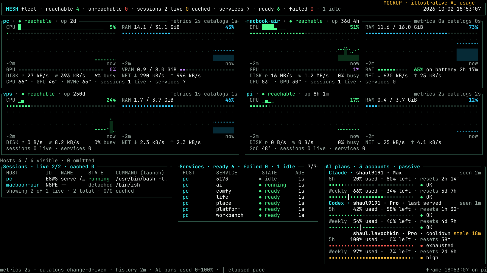
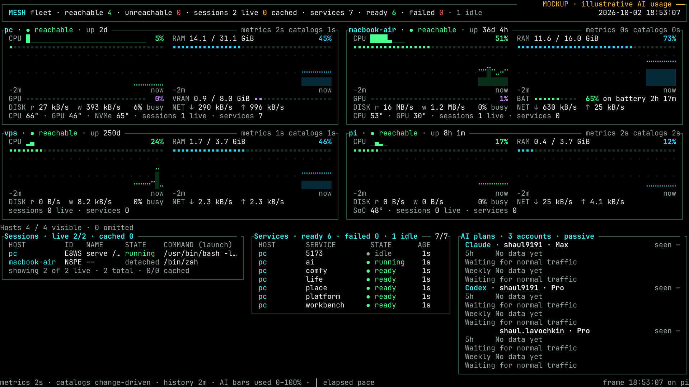

# Plan 289: Passive AI plans feed and the Mesh TV panel

- Status: Approved
- Date: 2026-10-02
- Owner: Fregat owns account usage production under Plan 308; Mesh owns the generic feed client and terminal panel.
- Repositories: `ShaulLavo/fregat`, `ShaulLavo/mesh`.
- Historical decision: Zero extra provider requests. The gateway producer is retired; Plan 308 owns the replacement.

## Superseding owner decision (2026-10-03)

[Plan 308](308-account-usage-feed.md) now owns usage production in Fregat: bounded occasional provider requests, passive/native sources, persistent cache, Settings UI and the Mesh-compatible read-only endpoint. The owner explicitly permits occasional requests and keeps Claude pooling forbidden. Mesh retains this plan's approved v1 consumer and TV design. Its shipped parser and panel are reused through a URL cut-over.

Source-only producer retirement follows the merged prerequisite fixes: Fregat logging [#476](https://github.com/ShaulLavo/fregat/pull/476) at `76e53325a3019fd97cbc7c04ab7daa6400adde7c`, native labels/Settings [#479](https://github.com/ShaulLavo/fregat/pull/479) at `6a7ab3f4f9867620c710f5a83e40175df60bb910`, and Mesh formatting [#137](https://github.com/ShaulLavo/mesh/pull/137) at `f1559b6fbff1fa06f1e62d1eb6de5049c3f18cfe`. Live TV acceptance, consumer cut-over and installed producer retirement remain pending root-coordinator operations; this lane has confirmed none of them. The owner selected the verified DROP archive for gateway, launch, login, reset-order and portable fixture source, independently owned outside Fregat. Source-only installation under `/work/cli-proxy-api/src` remains unexecuted and root-owned. `readCredits` stays in the retained `usage-feed.ts` helper module; orphaned ten-minute provider polling is excluded. The startup schema and both exported constructors reject Claude pool configuration. The deferred `producer-retirement-deploy.sh` protects rollback from repeated signals and bypasses ambient proxies for bounded health checks. Bundle deployment is separate from source installation and leaves runtime JSON untouched. Only the root coordinator installs source or the bundle, removes the live `/ai-usage` route, or deletes its old feed directory. No installed gateway, runtime JSON, proxy, Mesh or Pi changes occurred during source retirement.

## Historical producer delivery

The sections below preserve the prior producer contract and evidence. They are historical; source and deployment instructions for that producer no longer apply.

## Outcome and fixed boundary

The TV dashboard shows **AI plans**, grouped by provider, with independently labeled 5h and Weekly windows per account. Claude `shaul9191` is Max. Codex `shaul9191` and `shaul.lavochkin` are both Pro. Future providers add groups without provider-specific layout branches. Keep unknown and no-data visible; never sum account allowances.

CLIProxyAPI at `127.0.0.1:18317` already has localhost management enabled. Its key lives in `/work/cli-proxy-api/management-key`; never print or log it. Read only `GET /v0/management/auth-files` for cached per-account quota, model quota and cooldown state. No management enablement or proxy restart is required. Never use `/quota/fetch`, `/api-call`, usage-queue drains, provider probes, token refresh or Fregat's active usage route. Never print unredacted config or complete auth records.

The proxy has **no Claude logins and must never get any**. Pooling Claude logins caused a ban. Claude Code uses the existing Bun gateway (now locally owned under `/work/cli-proxy-api/src`): the Mesh `/ai` route has front port `8318`, and the gateway's configured loopback listener is currently `18318`. Runtime configuration is authoritative for the listener; deployment commands must resolve it rather than assume the source default. The gateway passes Claude requests directly to Anthropic on the owner's own login. Capture `Anthropic-Ratelimit-Unified-*` headers alongside `reset-order.ts`; leave request and response bytes, headers, streams, cancellation and routing unchanged. Only one Claude profile is registered here.

No provider SDK, OAuth handling or provider request belongs in Mesh. Existing Fregat direct-provider usage features remain outside this change. Feed consumption by Fregat is a later follow-up.

## Architecture and lifecycle

The already-active gateway owns a bounded, serialized cached-management sampler (at most every 60 seconds) and a passive Claude header observer. Local management reads never traverse `/ai` or establish inference demand. No separate collector daemon. Observation time is the upstream snapshot time, not poll/publication time. Missing or malformed signals preserve unknown; cache failures retain the last sanitized readings.

Publish `v1.json` by same-directory atomic replacement in an isolated sanitized directory. Retain the last snapshot across gateway restarts. The file contains no secrets, full emails, tokens, auth filenames, raw errors, request bodies or raw headers; short approved account labels are allowed. Bound the file to 64 KiB. Runtime options use the existing gateway configuration mechanism, with portable defaults and no new environment knobs. Register settings if a value is consumed through the application settings system.

A **separate tailnet-only isolated Mesh static route** serves that directory, e.g. `https://omarchy.mesh.shaulavo.dev/ai-usage/v1.json`. It serves the last snapshot while `/ai` sleeps, never wakes `/ai`, extends its idle timer, invokes readiness or wakes a machine. Keep management localhost-only; the Pi gets no secret. Feed reads cannot redirect into activation/provider/management routes. Unreachable hosts leave cached stale data on the TV.

Implementation does not modify the installed gateway, proxy, Mesh or Pi. Loading producer code will require a coordinator-scheduled **gateway** restart, which interrupts live agents. No separate proxy management/configuration restart is needed; reloading the gateway runner also respawns its owned Codex proxy. Report exact static-route and deployment commands after source verification; do not execute them during this task.

## Generic JSON v1 contract

Canonical timestamps are UTC RFC3339. Provider strings are generic. IDs are stable non-secret IDs. Include known accounts even before any traffic.

```json
{
  "schemaVersion": 1,
  "generatedAt": "2026-10-02T18:53:07Z",
  "accounts": [
    {
      "id": "claude-shaul9191",
      "provider": "claude",
      "label": "shaul9191",
      "plan": "max",
      "checkedAt": "2026-10-02T18:51:07Z",
      "lastSeenAt": "2026-10-02T18:51:07Z",
      "state": "ready",
      "source": "passive-header",
      "routing": { "mode": "single", "active": null, "lastServedAt": null },
      "windows": [
        {
          "id": "five_hour",
          "label": "5h",
          "usedPercent": 20,
          "resetsAt": "2026-10-02T21:07:07Z",
          "windowMinutes": 300,
          "status": "allowed",
          "lastSeenAt": "2026-10-02T18:51:07Z",
          "source": "passive-header"
        }
      ],
      "cooldown": null
    },
    {
      "id": "codex-shaul.lavochkin",
      "provider": "codex",
      "label": "shaul.lavochkin",
      "plan": "pro",
      "checkedAt": null,
      "lastSeenAt": null,
      "state": "no-data",
      "source": "proxy-state",
      "routing": { "mode": "rotating", "active": null, "lastServedAt": null },
      "windows": [],
      "cooldown": null
    }
  ]
}
```

- `generatedAt` is publication time; `checkedAt` is successful cache inspection/capture; `lastSeenAt` is the actual quota observation. Each window owns its timestamp. Polling does not freshen it.
- Account state: `ready`, `cooldown`, `disabled`, `no-data`, `unknown`. Cooldown is null or `{reason, until, observedAt, source}`, with an allowlisted reason; no arbitrary upstream text.
- Routing mode: `single`, `rotating`, `unknown`. `active` is boolean or null; `lastServedAt` is null without positively attributed response completion. Proxy `active` status means schedulability, and ten-minute request buckets cannot prove the last-serving account. Never invent attribution or rewrite routing to obtain it.
- `usedPercent` is 0–100 or null. Claude utilization 0–1 scales once; Codex percentages are already 0–100. Generic 429/cooldown does not prove any window percentage. Status-only signals can remain unknown percentages.
- Window status: `allowed`, `warning`, `exhausted`, `unknown`. Overage/credits are separate from aggregate windows. Preserve understood model-window namespaces with separate IDs; never infer them from the selected model.
- Reset/length may be null. Resolve relative reset seconds against observation time, not each poll. Preserve Codex primary/secondary durations: primary is a position, never assumed 5h. Defined Claude 5h/7d namespaces have lengths 300/10080 minutes.
- Unsupported schema, malformed/oversized response or transport failure retains the consumer's last valid snapshot whole. At most one HTTP request every 60 seconds, bounded timeout/size, normal TLS, no redirects, cancellation on shutdown.

## Approved 160×45 design





Canonical rules and reproduction live at `/work/reports/pi-tv-dashboard/usage/README.md`; the PNG/SVG/TXT copies here are illustrative approved design, never live quota evidence. OLED is the default; existing six theme role tables supply colors.

Preserve rows 0–26: four host cards in RAM order, all measurements, four-row graphs and host counts. Rows 27–43 have Sessions at columns 0–56 (57 cells), Services/Attention at 58–104 (47), and **AI plans** at 106–159 (54; 50 inner cells). Footer is row 44. Session names/commands shorten first; host names fit. All seven services and both sessions in the reference remain visible. Attention keeps failed-service name and reason over two lines when needed.

Each account takes five rows: identity/plan/routing/age, 5h values/reset, meter/status, Weekly values/reset, meter/status. One provider heading shares its first account's identity row; following accounts indent beneath it. Three accounts plus frame use 17 rows. Provider/account/window order is stable. Extra model windows stay in the feed and show an extra-window count; omitted accounts show counts. No automatic paging.

- Every data line says window, `% used`, `% left`, and `resets <countdown>`. Percentages remain ordinary text.
- Existing 28-cell `▪` meters: green below 75%, amber at ≥75%, red exhausted. Colored dot plus `OK`, `high`, `exhausted` duplicates severity. Identity is direct neutral text, never categorical color.
- `│` shows elapsed share: `clamp(100 × (1 − (reset − now)/windowLength), 0, 100)`. Hide for exhausted, unknown-length, expired or stale observations. It is an even-use guide.
- `seen 2m` ages actual observations. After 15 minutes use `stale 18m`, retaining values. Mixed-age windows stay independently stale; a fresh 5h reading cannot freshen Weekly.
- `last served` requires positive attribution. `rotating` describes pool membership. `cooldown` describes routing; it does not manufacture quota exhaustion.
- Reset passed: keep historical values and say `reset passed · awaiting traffic`, or show no current data. Never silently refill.
- No data: keep configured identities, plans, `seen —`, `No data yet` and `Waiting for normal traffic`; no unobserved routing badge. Expected window slots are placeholders, not observed allowances.
- With no configured feed URL preserve today's dashboard. At smaller supported sizes use compact account/window text while preserving fleet and failure visibility; test 80×24 and resize.

The terminal has no hover. TXT grids are the readable table equivalent. Status colors and text use existing themes; text/status contrast clears 4.5:1 in OLED, with status words as secondary encoding.

## Execution checklist

### 0. Plans and capability

- [x] Renumber original draft 287 to 289; update `plans/README.md`, canonical links and both approved visuals. Run `bun run plans:check`.
- [x] Update Mesh plan 10 with current source facts and approved layout. Both plan PRs received independent HIGH reviews and green CI: Fregat #336 (`ec65e5c9d`) and Mesh #73 (`b64fb55`). Squash-merged before implementation.
- [x] Read only sanitized management schema/projected fields; establish exact quota/cooldown mapping and attribution limits without provider requests. Confirmed against local CLIProxyAPI v8.0.4 source; no secrets exposed in evidence.

### 1. Fregat producer

- [x] Fail-first pure normalization and injected-fetcher tests: two Codex Pro identities; Claude Max; scaling, timestamps, durations, relative resets, malformed/status-only signals, understood model windows, cooldown and honest unknown attribution.
- [x] Capture passive Claude headers beside the existing reset-order observer. Prove byte-identical responses, streaming/abort/error behavior and no body reads by the observer.
- [x] Lifecycle-bound serialized sampler and atomic sanitized publication. Preserve valid prior values through failures/restart; initial registered identities use no-data. Bound fetch time/size and file size. No auth-directory fallback exposing credentials.
- [x] Counters prove zero extra provider calls and no readiness/demand requests. Temp paths derive from OS temp/config, never owner paths in portable tests.
- [x] Record gateway runtime configuration and coordinator deployment/restart requirements. No installed service changes.
- [x] Address independent review: known websocket Spark namespace shares HTTP Bengalfox allowance identity; preserve resets and observation ages without aggregate/model inference.
- [x] Address independent review: physical feed/key isolation rejects root and credential aliases before publication; retain safe OS-temp ancestor aliases and missing-key restart data.

The former producer normalized and restored v1, sampled cached observations, and coalesced atomic publication. Direct-Claude capture was header-only; feed configuration required empty Claude pool entrypoints and no Claude proxy. Its three usage suites previously ran in the root script test inventory. The producer modules, lifecycle wiring, observer, usage tests and Fregat inventory entries have now been removed. Retained gateway/reset-order/launch fixtures run with the independently owned local source.

Independent HIGH review follow-ups passed fail-first and targeted verification: actual websocket Spark allowance maps to the same HTTP Bengalfox window; physical path isolation rejects unsafe root/ancestor/key aliases before writing or fetching, including a dangling key alias into a future feed. A safe ancestor-alias/missing-key restart regression preserves portable temporary paths and cached data. All three usage suites pass 30 tests after these corrections.

Deployment remains deferred: no installed gateway/proxy/Mesh/Pi changes, restarts, provider requests or management requests were performed. Live route isolation, sleeping inference-route behavior, stale-host retention and final Pi appearance remain coordinator acceptance checks below.

### 2. Mesh consumer and panel

Historical delivery checklist. The superseding decision above records a shipped parser and panel.
Verify/link their receipts before marking these original rows; reuse that implementation for
308's URL cut-over. Remaining live route, retention and TV checks stay open until proved.

- [ ] Optional feed URL in existing config, bounded/cancellable generic HTTP client, strict v1 validation, at most 60-second cadence, last-good retention. Never parse JSON in View or per frame.
- [ ] Fail-first stale/no-data/exhausted/reset-passed/unknown routing/mixed-age tests; oversized/bad-schema/HTTP failure/cancellation tests. No real provider calls.
- [ ] 160×45 provider-grouped approved layout across all six themes; overflow counts, ASCII fallback, 80×24 and resize. Keep zero-allocation View and flat render cost, measure before/after.
- [ ] Commit fixture PNG and read it back against the approved image. Run narrow affected tests/gates through the heavy wrapper where applicable.

### 3. Review and delivery

- [ ] Each implementation PR gets an independent Sol HIGH reviewer and green CI, then squash-merge. If main moved only in unrelated files, merge without redundant CI.
- [ ] Report PR URLs, merge commits, Mesh release tag and exact coordinator deploy steps (machine/service/static route). Do not deploy.
- [ ] Coordinator verifies tailnet-only route isolation and repeated reads with `/ai` asleep, no idle extension, unreachable-host cached state, and final Pi TV appearance. These live checks are deliberately deferred, not claimed by portable fixtures.

## Follow-up and risks

Fregat can later consume this same feed, with source-aware identities and no active probes for proxy-backed accounts. Direct-provider quota behavior stays unchanged here. Multiple pools need honest per-account presentation, never a single arbitrary winner. Unknown selection is acceptable.

Passive observations age indefinitely without traffic. Normal gateway responses may lack model-specific Claude windows. Upstream schema drift becomes unknown, never fabricated 0% or 100%. Gateway restart interrupts all live Sol work; only the coordinator schedules it. Proxy management is already on and needs no enablement change or separate restart. Reloading the gateway runner also stops and respawns its owned Codex proxy.
