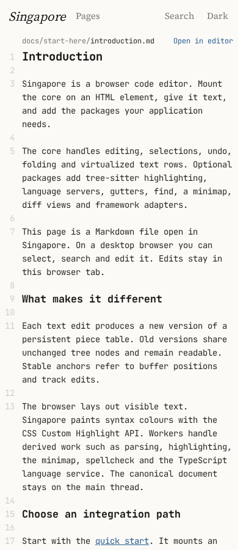
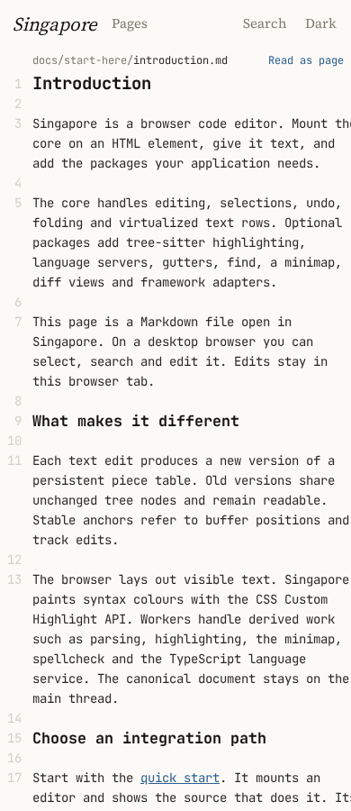
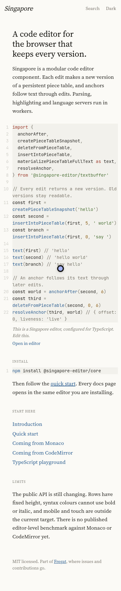
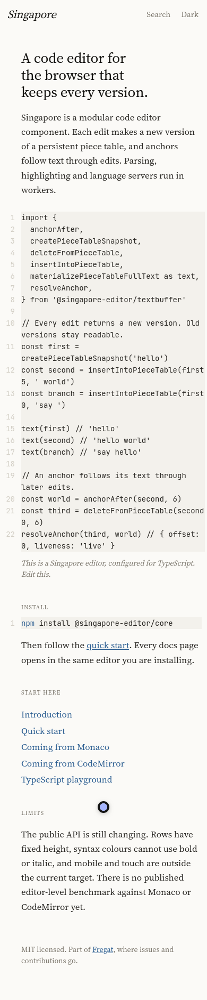

# Plan 340: Singapore pages painted by Singapore

## Status and ownership

- Status: Approved.
- Owner request: 2026-10-09. Static and live pages must look the same, wrap correctly, keep syntax colours, and scroll with the page.
- Parent: [Plan 336](336-packages-as-products.md).
- This PR contains the execution plan and baseline screenshots. Separate implementation agents own the editor changes, wrap fixes and site integration.
- Order: fix and prove editor embedding and snapshot support first, then replace the site's separate renderer. [Plan 338](338-singapore-docs-load-speed.md) owns broader startup and asset work. This plan owns snapshot restore qualification and supersedes its assumption that the separate Node prerenderer remains the first paint.
- [Plan 336 iOS scrolling](336-singapore-ios-scroll.md) remains the owner of its existing device probe. Share results with that lane. No work here requires the owner's Mac.

## Outcome

The first visible code sample and manual page are Singapore's own paint. A live editor takes over without changing line breaks, colours, gutters, content height or the reader's place. The document is the only reading scroll area on phone and desktop. The editor grows when its content grows and wraps within the available width.

Keep a "Go live" / "Go static" toggle. Going static freezes the current edited text using the same capture path. Going live restores that paint before parsing or worker startup finishes. Neither action reloads the page, discards edits, changes the URL or moves keyboard focus unexpectedly.

Generated API reference pages remain ordinary static reference pages. This work covers the home sample, hand-written Markdown manual and any live sample using the shared embedding helper. It makes no Monaco/CodeMirror performance, accessibility-parity or general mobile-support claim.

## Reproduction and evidence

Baseline source: `9a4f59425ea0a5fa88a296d053cc6b5a28b2d3c0`, including the manual shipped in PR #1063. On 2026-10-09, reproduce against both the owner's private preview and a fresh production build from main:

```sh
bun install --frozen-lockfile
bunx turbo run build --filter='./editor/packages/*'
bun run --cwd editor/site build
bun run --cwd editor/site preview --host 127.0.0.1 --port <free-port>
```

Open `/?editor=off`, `/docs/start-here/introduction/?editor=off` and `/docs/start-here/quick-start/?editor=off`. Wait for the bundled font, then press "Open in editor". Repeat at 390 × 900 and 1280 × 900 in Chromium and WebKit. Each case was exercised on both preview and local build, 24 switches in total. There were no page errors or failed required requests in these reproductions. A successful worker load does not mean the result is visually correct.

Raw screenshots, scripts and JSON are preserved in `/work/reports/plan-336/evidence/site-embed/`. These are host-specific investigation artifacts, not portable committed verification scripts. Selected screenshots below are copied into the repository so PR reviewers can see the problem.

### Phone wrapping and scroll ownership

Static introduction, Chromium, 390 px:



After pressing the live button on the same page:



The first paragraph drops from four display rows to three and text runs off the right edge. Later headings move up. The live scroller is 390 × 818 CSS pixels, with a 412 px scroll width in Chromium and 414 px in WebKit. At desktop width it is 752 × 818 with a 768 px scroll width in Chromium and 771 px in WebKit. Both axes belong to `.editor-virtualized`, although CSS hides its scrollbar.

The static phone manual uses document scrolling. Switching changes `.viewport` from natural height to `100dvh - header - path`. The editor host is absolutely positioned inside that fixed box. This changes the reading model even when the overall screenshot bounds appear stable. Static desktop already scrolls inside `.pane`; the requested result changes desktop to document scrolling too.

### The home sample loses its colours

Before the switch, WebKit, 390 px:



After the switch:



This reproduces in both engines, on local and hosted builds, at both widths. The sample box keeps the static height, 638 px on phone and 484 px on desktop. Its live scroll height is 1254 px on phone and 946 px on desktop. Phone scroll widths are 396 px in a 382 px Chromium box and 406 px in a 382 px WebKit box. The static sample therefore remains the wrong height authority after takeover.

The home failure is paint invalidation, not a missing grammar or palette. Eight syntax highlight groups exist, ranges point to connected visible editor text nodes, and the computed `::highlight()` colour for `import` is the expected red. Re-registering the same highlight objects after revealing the host makes the colours appear without loading syntax again. See `highlight-diagnosis.json` and `home-highlight-reinstall.png` in the raw evidence. `home.ts` mounts under `visibility: hidden`, waits for `CSS.highlights.size`, then reveals the host. That readiness check accepts a registered but unpainted highlight.

The quick-start manual's code fences do show colours in the reviewed screenshots. Do not generalize the home failure to every code fence. Add pixel checks for both paths, since a nonempty global highlight registry can also belong to another editor.

## Existing editor contracts

Read these before implementation:

- `editor/packages/editor/src/editor/Editor.ts`: `captureSnapshot`, `setSnapshot`, `paintAppearance` and admission checks.
- `editor/packages/editor/src/editor/paintSnapshot.ts`: format 5 codec and payload/geometry bounds.
- `editor/packages/editor/src/editor/viewSnapshot.ts`: visible paint classification and token runs.
- `editor/packages/editor/src/virtualization/virtualizedTextView.ts` and `scrollViewport.ts`: provisional paint and native scroll geometry.
- `editor/packages/editor/src/virtualization/virtualizedTextViewRows.ts`: `horizontalViewportColumns`, mounted paint facts and provisional row rendering.
- `editor/packages/editor/src/virtualization/fixedRowVirtualizer.ts`: existing `scrollMode: 'static'` renders all rows and fixes logical vertical scroll at zero.
- `editor/packages/editor/src/virtualization/wordWrap.ts`, `displayProjectionWrap.ts` and `virtualizedTextViewLayout.ts`: wrap rules, projection and font advances.
- `editor/packages/markdown/src/replacements.ts`, `linkRender.ts` and `headings.ts`: preview fragments, links and heading semantics.

Do not build another editor or a second line-breaking implementation. Existing static mode is close to the required all-row layout, but still permits horizontal scrolling and does not make the host auto-height. Reuse its row selection and geometry.

The current snapshot is a saved viewport, not a responsive document. `captureSnapshot()` filters rows to the visible window; format 5 admits at most 400 rows and 262,144 UTF-8 bytes. Saved paint records positioned segments, colours, gutter paint and rectangular layers. It does not preserve arbitrary plugin CSS, rich Markdown links or widget DOM. Rows with inline-kind classes or unreplayable widgets refuse capture. The settled quick-start preview returns `null` from capture in both engines at both investigated widths. Plain code is a required known-good control for this observation.

Restore also checks the appearance fingerprint, device pixel ratio and both outer box dimensions. Chromium and WebKit serialize the same font list differently. A Chromium build capture cannot simply be asserted compatible with WebKit, another width, another theme or another DPR. Keep rejection for actual appearance differences. Normalize equivalent serialization and add a document-paint contract where viewport geometry is deliberately recomputed.

## Editor API and implementation decisions

### Content-height layout

Extend the existing option, rather than adding independent height and scroll switches:

```ts
new Editor(element, {
  scrollMode: 'content',
  wordWrap: true,
  wordWrapBreak: 'word',
})
editor.setScrollMode('content')
```

`'virtualized'` and `'static'` retain their current meanings. `'content'` shares static mode's all-row rendering for docs-sized documents, uses the projection's total height as the editor's natural block height, and owns no horizontal or vertical scrolling. Do not add page-viewport virtualization in this plan. Rendering all rows is the simpler correct starting point and permits a complete accessible document.

- Normal document flow owns the host. No absolute fixed-height host, synthetic bottom reading space, wheel forwarding or hidden overflow masking an oversized row.
- Projection changes publish one content extent after edits, syntax-driven replacements, font load, folds and width changes. Avoid height/ResizeObserver feedback loops.
- Wrap width subtracts gutter, reservations and any caret safety space before choosing a break. Painted text and extent must fit the content box.
- Caret reveal, find results, heading links and keyboard navigation scroll the nearest outside scrolling ancestor, usually the document. Use element visibility and standard scroll APIs; do not copy the page's scroll offset into the editor's logical scroll position.
- Provisional content paint reserves the complete captured height while live syntax prepares. It must allow outside page scrolling and ordinary links.
- The simple `new Editor(element); setText(text)` path needs tests alongside document-backed use.
- Very large documents continue using virtualized mode. Document and test a bounded refusal for content mode beyond its supported paint size; never silently truncate a manual or substitute an inner scroll box.

### Responsive document paint

Keep the existing viewport capture for Fregat. Add an explicit document capture through the same API:

```ts
const saved = editor.captureSnapshot({ scope: 'document' })
// saved.paint is the serialized paint accepted by EditorOptions.snapshot.
new Editor(element, {
  scrollMode: 'content',
  snapshot: saved.paint,
  documentKey,
})
```

The document form stores captured logical display rows, styled runs, safe preview fragments, gutter values and the wrap inputs needed to lay them out again. Source Markdown remains separate for editing. The snapshot's display text and styles come from the real editor after syntax and preview settle. They must not come from a second parser or token renderer.

Expose the codec and a lightweight paint mounting entry under `@singapore-editor/core/paint`:

```ts
const paint = decodePaintSnapshot(serialized)
const mounted = paint && mountPaintSnapshot(element, paint, { width })
// mounted.dispose() releases the provisional rows.
```

`mountPaintSnapshot` and the editor's `restorePaint` share the same row painter and wrap code. The lightweight entry does not construct a document session, parse Markdown, start workers or load language grammars. Keep its import graph small and measure it separately. It is the browser bootstrap for responsive first paint, not a new Node renderer.

- Add a bounded versioned document form with explicit row/run/string limits. Keep existing viewport limits intact. Do not raise the 400-row bound globally to make complete manuals happen to fit.
- Capture supported Markdown font weight, font style, decorations, links, heading ids and roles as structured paint facts. Allow only known safe fragment kinds and link targets. Do not serialize arbitrary plugin HTML or execute snapshot content.
- Replay uses the editor's own wrap routine and measured bundled font advances. Width, theme and DPR changes may reflow the document form; a viewport snapshot still requires exact compatible geometry.
- Normalize equivalent font/colour serialization, without treating different fonts or colours as equal. A theme capture must match the selected palette, or use captured theme roles resolved through the shared palette.
- Add an explicit ready/unsupported outcome for captures. Build failure must name the refused construct and page without private source contents. No polling forever and no successful build with a missing page.
- Preserve paragraph/heading/link reading order in static output. Replayed links work before the live editor loads. The live all-row document has the same accessible names and heading ids.

## Build-time snapshot pipeline

1. Move the site's mounting options into one shared configuration used by the live site and a build-only browser capture page. Home TypeScript and manual Markdown use the same fonts, palette, gutters and preview plugins as their live counterparts.
2. Build capture assets, start an owned loopback server on a free port, and use headless Chromium to mount each real editor in content mode. Await fonts, syntax, preview and authoritative presentation readiness. Capture the full document through `Editor.captureSnapshot({ scope: 'document' })`.
3. Decode and restore each capture into a fresh editor before accepting it. Compare pixels and height. Capture the restored editor's HTML for the server-rendered default-width first paint. Extract heading/search metadata from editor-produced semantic facts. Node assembles the page and escapes the serialized payload; it does not parse Markdown or paint tokens.
4. Inline the serialized document paint and restored HTML into the Astro page. A small early browser bootstrap selects the current width and palette, then mounts or reflows that same captured paint through `core/paint` before the first visible editor frame. The bootstrap has no grammar or editor-session dependency. One responsive document capture avoids shipping a full snapshot for every possible phone width.
5. Keep a complete no-JavaScript article produced from the captured semantic rows. Its native wrapping remains a readable fallback; exact static/live parity is required when the shared paint bootstrap runs. For 320/390/1280, verify that bootstrap adjustment happens before first visible paint, not merely before the toggle.
6. On "Go live", mount the real editor with the inline paint already admitted. Open the original source, preserve the document anchor and settle syntax behind the paint. Commit the live rows only after layout and colour parity. On "Go static", capture the current revision, mount that paint and release the editable editor. Keep edited source in tab memory for the next toggle.
7. Remove `src/manual/render.ts` and its Node grammar loading, token HTML, hyphen/slash wrappers and CSS width approximations once capture owns the output. Update renderer tests to test editor-produced artifacts. Preserve links, search, theme, back/forward navigation and generated API pages.

Build captures are deterministic from the checkout, lockfile and bundled font. Cache by source, editor/plugin build, font and capture contract. Never cache solely by page URL. Capture servers and browsers stop on success and failure. Committed commands accept paths and ports; no machine-specific hosting dependency.

## Wrap and line-breaking work list

A separate editor implementation agent owns this section. First add a failing test or browser scenario, then fix the owning geometry or wrap code.

| Finding                                                               | Reproduction and evidence                                                                                                                                             | Work                                                                                                                                                                                                      |
| --------------------------------------------------------------------- | --------------------------------------------------------------------------------------------------------------------------------------------------------------------- | --------------------------------------------------------------------------------------------------------------------------------------------------------------------------------------------------------- |
| Phone prose exceeds the content box and changes row count on takeover | Introduction at 390 px, first paragraph is four static rows and three live rows; live right edge reaches 412/414 px in a 390 px box                                   | Trace projection width, actual font advance, inline replacements and extent. Fix width admission at the cause, then remove site approximations.                                                           |
| Content width admits columns beyond the physical edge                 | `horizontalViewportColumns` uses `Math.ceil(width / characterWidth)`; static CSS intentionally rounds differently on phone and desktop                                | Add fractional-width tests around one glyph boundary, with gutter and caret allowance. Never attribute the entire 22/24 px overflow to rounding alone. Validate extent and longest-row contributions too. |
| Home wrapped height differs from the static height                    | 390 px home box remains 638 px while live scroll extent is 1254 px; desktop 484 versus 946 px                                                                         | Compare actual projected rows and font metrics. Fix content height and breaks together; removing overflow alone would hide text.                                                                          |
| Two independent break policies                                        | Static `leavesHtml` wraps hyphen/slash words in `nowrap` spans and releases wide spans on phones; live `appendWordWrapText` owns its own spaces/CJK/unbreakable rules | Delete the static break policy after shared paint is in use. Add parity fixtures for URLs, package names, links and long inline code.                                                                     |

Additional required regression inputs are tabs at wrap boundaries, trailing spaces, nonbreaking spaces, CJK, combining sequences, emoji/surrogate pairs at a chunk boundary, long identifiers, link replacements, emphasis and a caret revealing Markdown marks. These are test targets, not confirmed bugs from this investigation. If one fails, record its exact text, width and row ends here and fix it under this plan. Do not open issues or leave a new wrap failure unowned.

## Snapshot speed budget

Treat restore speed as a landing-page requirement, separate from worker/parser startup. These are acceptance budgets, not achieved product claims:

- Decode, responsive layout and paint mount at p95 within 8 ms on the reference desktop after the bundled font is ready, 30 independent repetitions per engine and width.
- Within 16 ms at p95 in Chromium with 4× CPU slowdown, and no restore long task over 50 ms. Chromium slowdown is an experiment, not an iPhone measurement. WebKit runs its own unthrottled qualification.
- A server-rendered captured article is visible before full editor code or grammars load. The inline bootstrap does not fetch a worker or wasm to paint.
- No visible blank frame, no toggle-induced layout shift, and zero changed document pixels between static and ready live states at the required widths. Mask only the caret and the toggle label, never text or gutters.
- Start with at most 32 KiB compressed document paint for the home sample, 96 KiB for a representative manual, and 16 KiB compressed for the paint-only entry. Record raw/decoded sizes and total HTML as well. An oversized page fails qualification and gets a measured compression or representation fix.

Measure parse/decode, font wait, document reflow, DOM insertion, forced layout, first painted frame and live settlement separately. Include the largest manual and a fixture above 400 rendered rows. Qualify 320, 390 and 1280 px, cold and warm entry caches, both palettes and DPR 1/2/3. Run a browser trace of the same restore scenario before and after any optimization, with `trace --compare`; report render/mounted-row counts. Do not call registry presence a paint timestamp.

The investigation first tried the settled Markdown capture and a plain-code control. Markdown capture refuses its rich preview paint, so its restore latency cannot be measured yet.

A feasibility experiment on 2026-10-09 used an Intel Core i7-14700K Linux host, Playwright 1.63.0, installed Chromium build 1243 and WebKit build 2359, DPR 1 and the bundled JetBrains Mono. It captured a viewport containing 38 rows from a 60-line TypeScript document and timed the synchronous `setSnapshot` call 20 times in a warm page. All 20 attempts per case admitted provisional paint. The capture was about 43.6 KiB of serialized text.

| Engine   | Width   | Restore p50 | Restore p95 | Maximum |
| -------- | ------- | ----------- | ----------- | ------- |
| Chromium | 390 px  | 5.3 ms      | 6.7 ms      | 7.1 ms  |
| Chromium | 1280 px | 5.6 ms      | 7.0 ms      | 8.5 ms  |
| WebKit   | 390 px  | 8 ms        | 10 ms       | 12 ms   |
| WebKit   | 1280 px | 8 ms        | 9 ms        | 12 ms   |

This is encouraging for a small captured viewport, but WebKit already misses the proposed 8 ms p95 budget. It excludes editor construction, entry download, font loading and the next painted frame. It does not measure complete responsive documents or rich Markdown, and is not a public performance claim. The script and raw samples are `snapshot-code-probe.cjs` and `snapshot-code-probe.json` in the evidence directory. Earlier zero-width probe attempts were invalid controls and are excluded. Phase 2 must publish admitted full-document restore measurements before site integration is accepted.

## Execution phases

### Phase 1: Editor embedding and wrap correctness

- [ ] Add portable failing scenarios for the phone and desktop overflow, content-height changes and hidden-to-visible highlight paint.
- [x] Implement `scrollMode: 'content'` by reusing static all-row rendering. Test outside scroll reveal, edits, resize, font load, syntax replacements and disposal.
- [ ] Fix reproduced wrap/line-breaking failures from the list above. Separate wrap PRs where the root causes differ.
- [ ] Make hidden-to-visible presentation restore existing highlight paint at the owning editor lifecycle boundary. Reuse the existing highlight restoration path where appropriate; no site-wide registry manipulation or timer retry loop.
- [ ] Give each public editor behavior change a patch changeset for affected packages. Do not edit package version numbers.

### Phase 2: Complete and responsive snapshot paint

- [ ] Add document capture, safe Markdown fragment capture, shared replay and the lightweight `core/paint` entry. Keep viewport captures and rejection gates covered.
- [ ] Add capture/restore pixel tests, malformed/oversized payload tests, unsafe link tests, unsupported plugin tests and a complete document above 400 rows.
- [ ] Prove responsive layout and semantic equivalence in Chromium and WebKit, including theme, DPR, fonts and cold startup. Add a patch changeset for core and Markdown API/behavior changes.
- [ ] Measure admitted restore against the speed and payload budgets. Commit a portable benchmark/scenario and evidence before claiming it is landing-page ready.

### Phase 3: Site capture and takeover

- [ ] Replace Node rendering with the build-time browser capture pipeline and inline payload.
- [ ] Move manual and home samples into normal flow with page scrolling. Delete fixed takeover height, hidden scrollbars, wheel forwarding and duplicated wrap CSS.
- [ ] Implement both toggle directions, edited-text preservation, theme, links, search and history on the shared snapshot path.
- [ ] Add a site-specific portable browser scenario and selectors for both home and manual. Extend the existing mobile check to exercise live mode, not only the static phone default.
- [ ] Site-only changes need no changeset. Keep one implementation PR focused on site integration after the editor PRs merge.

### Phase 4: Acceptance and closeout

- [ ] At 320/390/1280 px in Chromium and WebKit, pixel-compare home and representative manual before takeover, after live settlement and after returning static. Same engine, font, theme, DPR and scroll anchor for each comparison. Also capture intermediate frames to catch a switch flash.
- [ ] Match document height and every heading/line anchor. No inner scrollbars or scrollable editor extent, no horizontal document overflow, no clipped source, and no hidden overflow concealing a failure.
- [ ] Confirm syntax colours by screenshot pixels for keywords, strings, comments and numbers after both switches, theme changes and resizing. Check actual editor-owned ranges and connected nodes too.
- [ ] Scroll from page margins and code/prose on phone and desktop. Caret/find/heading reveal uses the page; keyboard focus and all text remain reachable.
- [ ] Block worker/grammar requests, disable JavaScript, and delay the editor entry. The captured article and links remain readable, and a failed live switch retains static paint and edited text.
- [ ] Pass site build, link/sample checks and `bun run --cwd editor/site test:browser`. Extend browser coverage to WebKit and mobile for the new paths.
- [ ] Keep all four `mobile-layout` CI shards green. Run `bun scripts/product-sites/test-mobile.mjs` and the portable `verify-mobile.mjs` flow against built product sites, including live phone takeover.
- [ ] Pass `bun run plans:check`, record final evidence and measured budgets here, and mark the implementing phases complete. No package-performance headline is published from experiment-only numbers.
