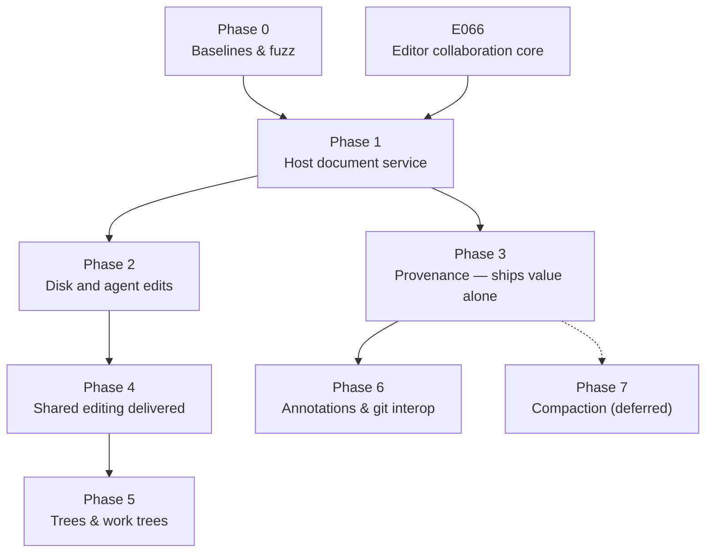

# Delta DB — Implementation Plan

Sub-commit, provenance-carrying version control for Fregat, on one host-ordered edit log.

- Status: Approved (revised 2026-10-08 onto [E066](e066-collaborative-text.md))
- Research: [lane E](../docs/collab-editing/e-fregat-host-and-delta-db.md), with lanes A–D in
  [collaborative editing research](../docs/collab-editing/README.md)

The goal: every version of the code has an address, every change knows what caused it,
annotations survive edits and rebases, and people and agents edit the same file at the same
time. Fregat's machine server is the host for every open document. It orders edits by arrival,
as in Matthew Weidner's
[host-ordered model](https://mattweidner.com/2025/05/21/text-without-crdts.html). The Editor
owns identity, placement, reconciliation and undo (E066); this plan owns the server host, disk
and agent edits, provenance, and history.

## Where the host runs (owner direction, 2026-10-09)

One protocol, three places to host it. The editor core does not know which one it runs under.

1. **Singapore on its own: browsers only.** Peers connect over WebRTC and one browser hosts
   ([E067](e067-webrtc-collaboration-plugin.md), delivered). No server sees the text. This stays
   the standalone editor's path.
2. **Fregat: the person's own Fregat server hosts.** Each machine server hosts its open
   documents, as this plan describes. Its browsers, desktop windows and agents are participants.
   Teammates join that server directly or over WebRTC, where the server takes part as a peer and,
   being always on, is the preferred host. Nothing goes through company servers.
3. **Hosted Delta DB: a paid service run by the Fregat company.** A company server hosts shared
   documents and keeps durable history and provenance for teams whose machines are not always on.
   It is a participant that reads the text, so it is opt-in per workspace.

A middle option for tier 2: the company runs only signaling and TURN relays. Peers still connect
end to end (DTLS), so relays cannot read the text. Host choice follows the dynamic-host idea in
E067: always-on servers win over laptops and phones. The product name is open (owner floated
"Sigma"); this plan keeps "Delta DB" until it is decided.

---

## 1. Ground truth — what already exists

Corrected 2026-10-08 against Fregat `1e066d38b`.

### The editor has most of the substrate

| Property              | Where                                                                                                                  | Status for collaboration                                                                                          |
| --------------------- | ---------------------------------------------------------------------------------------------------------------------- | ----------------------------------------------------------------------------------------------------------------- |
| Piece identity        | `editor/packages/textbuffer/src/pieceTableTypes.ts`: `PieceBufferId` is a branded number from a snapshot-local counter | Local only; E066 adds global `CharId` runs beside it                                                              |
| Tombstones            | Hidden pieces; E006 compacts runs into stand-ins (`standIns.ts`, `compaction.ts`)                                      | Anchors survive compaction, exact deleted order does not; E066 keeps exact tombstones for collaborative documents |
| Text storage          | `buffers.ts`; E006 reclamation can free unreferenced text                                                              | Fine: ordering never needs reclaimed text                                                                         |
| Persistent snapshots  | AVL join/balance (`join.ts`), structural sharing                                                                       | Cheap rollback for participant replay                                                                             |
| Anchors with liveness | `anchors.ts`: `RealAnchor { buffer, offset, bias }` → `{ offset, liveness }`                                           | Become character-ID gaps for transport                                                                            |

### The server is event-sourced, but not for keystrokes

`apps/server/src/orchestration/` stores `orchestration_events` with event IDs, stream versions
allocated under the write lock, causation, correlation and command metadata. Its aggregate kinds
are project/worktree/session. Commands append, project and record receipts in one transaction.
Its subscription pump waits for each acknowledgement before sending the next item
(`ws-rpc.ts`). Reuse its principles, not the pipeline: documents get their own log and stream
(§3).

### Checkpoints and worktrees exist

`checkpoint-reactor.ts` and `git/checkpoint-store.ts` capture the worktree at turn boundaries
under `refs/platform/checkpoints/<session>/turn/<n>` (`orchestration/checkpoint-refs.ts`).
`git/worktrees.ts` provides real git worktrees per thread.

### Who owns text today

Each client runtime's `WorkspaceDocumentService` owns live text for its views; the disk owns
saved bytes. Saves upload whole text; external edits are compared on refresh and either adopted
or raised as conflicts. Agents (Codex, Claude) write through native filesystem tools. The
server's LSP copy is replaced by whichever client attaches last.

---

## 2. The gaps

- **G1 — no global identity.** Closed by E066 (`CharId` runs allocated when an edit is written).
- **G2 — fractional `order`.** Gone as a distributed problem: with host ordering, `order` stays a
  local label and is never sent. Its renumbering cost is measured in E066.
- **G3 — edits in offsets.** Closed by E066's edit envelope and authoring-edge conversion.
- **G4 — no live authority.** Text lives in each client. The server must host each open document.
- **G5 — disk and agents write behind the model.** Saves, external writers and agent tools must
  feed the host, not replace text.

---

## 3. The architectural spine

> **The host-ordered edit log owns accepted history. Each participant materializes the accepted
> prefix plus its own pending edits on the textbuffer.**

- One host document service per machine server. A document has a stable ID distinct from its
  path, and an epoch distinct from its revision.
- A document-owned log in SQLite: per-document sequence, deduplicated participant edit IDs, E066
  envelopes, trusted provenance (actor, session, turn, tool), optional links to orchestration
  events, checkpoints, and the last materialized revision with its disk fingerprint.
- A document stream with batches and cumulative acknowledgements, one subscription per document,
  presence separate from the log. A durability acknowledgement is sent only after persisting.
- The disk is a materialization of a host revision. Saving asks the host to write a revision.

---

## 4. Phases

### Phase 0 — Baselines and fuzz

- Wide evlog events on edit application and reconciliation: piece count, tombstone ratio,
  pending depth, replay duration, publication duration.
- Baselines: typing p50/p99, remote arrival with 1/10/100 pending edits, snapshot memory, anchor
  resolution, identity-run growth over a long session.
- Fuzz: random edits against a string model, plus duplicate submission, reconnect, host restart,
  external writes and a crash between persist and acknowledgement.

**Exit:** committed baselines and a fuzz suite that fails loudly on divergence.

### Phase 1 — Host document service

- Document identity (symlink aliases resolve to one document; worktree copies stay separate;
  rename keeps identity, delete and recreate start a new epoch).
- The document log and stream (§3). Clients become participants through E066's core API; the
  host keeps no undo of its own.
- The pooled LSP copy follows accepted host revisions. Workspace search reads host-held unsaved
  text.

**Exit:** two windows and a remote client edit one file concurrently and converge; a server
restart loses no acknowledged edit.

### Phase 2 — Disk and agent edits

- Saving writes an identified host revision to disk.
- External writers: keep the last materialized text and revision; when the disk settles, diff
  **last materialized → new disk** (not live text → disk), map the old ranges to IDs from that
  revision, and submit the result as an edit. Stale whole-file rewrites and ambiguous overlaps go
  to review, or to an isolated worktree for broad rewrites.
- Host-native agent tools over the Platform MCP bridge: read returns document ID, epoch, revision,
  text and IDs; edit names that revision or those IDs and carries a deduplicated edit ID. The
  server attaches actor, session, turn and tool. Native tools and shell writes keep working
  through the disk path.

**Exit:** an agent edits a file the user is typing in; both edits survive, and the agent's carry
exact provenance while disk-imported ones are labelled inferred.

### Phase 3 — Provenance

Ships value on its own.

- Projection `projection_document_blame`: span → (turn, actor, model, prompt).
- Provenance lives on character spans in the log, independent of storage pieces, so typing can
  still coalesce storage.
- Time travel to any accepted sequence number, not just any commit.

**Exit:** "why is this line here" jumps to the turn that wrote it.

### Phase 4 — Shared editing delivered

- Presence and remote cursors over the document stream.
- Undo of one's own edits across collaborators (E066 step 5), persisted per document identity.
- Reconnect from a checkpoint plus tail; edits from an older epoch are replayed or surfaced.

**Exit:** the owner and two agents edit one file for an hour with no lost or duplicated edits,
and each person's undo touches only their own edits.

### Phase 5 — Trees and work trees

- File-tree operations (create, rename, delete, move) are serialized by the host. A tree CRDT is
  only for host-free use, and is optional.
- Virtualized work trees only if measured against `git/worktrees.ts` (D2).

**Exit:** an agent branch clones, diverges and merges without touching the user's working tree
unexpectedly.

### Phase 6 — Annotations and git interop

Depends on phase 3.

- Comments anchored to character-ID spans, resolvable wherever the span survives.
- Map document versions ↔ git commits; extend checkpoint refs from per-turn to per-sequence.
- Rewrites (rebase, amend) keep IDs when lineage is preserved. When an import discards identity,
  anchors degrade to `liveness: 'deleted'` plus a content-match re-anchor shown in the UI.

### Phase 7 — Compaction

Deferred. Log snapshots and replay checkpoints come early (phase 1). Destructive history and
tombstone compaction waits until pending edits, annotations, retained versions, undo and
disconnected participants are accounted for.

---

## 5. Risk register

| #   | Risk                                | Phase | Mitigation                                                                                            |
| --- | ----------------------------------- | ----- | ----------------------------------------------------------------------------------------------------- |
| R1  | External writers vs the host        | 2     | Diff from the last materialized revision; review stale rewrites; isolated worktrees for broad ones    |
| R2  | Log and tombstone growth            | 7     | Phase 0 growth curves; snapshots early, destructive compaction late                                   |
| R3  | Typing hot-path regression          | 1     | E066 measures every step against the phase 0 baseline                                                 |
| R4  | Provenance lost to coalescing       | 3     | Provenance on character spans, independent of storage                                                 |
| R5  | Binary files                        | 5     | Content-addressed, last writer wins, on a separate path                                               |
| R6  | Divergence found late               | 0     | Fuzz before any semantic change                                                                       |
| R7  | Duplicate or rejected pending edits | 1     | Deduplicate by edit ID, including rejections; dependants of a rejected edit are rejected and surfaced |
| R8  | Acknowledged edit lost on crash     | 1     | Persist before the durability acknowledgement                                                         |

---

## 6. Explicit non-goals

- No browser-hosted documents inside Fregat; the machine server is the host. It may join an
  [E067](e067-webrtc-collaboration-plugin.md) room as a peer to reach teammates.
- No custom B-tree or KV store; SQLite and drizzle carry the log.
- No third-party CRDT engine owning the buffer.

---

## 7. Decision points

**D1 — identity index shape.** Before E066 step 2: a run ↔ storage index beside the textbuffer
versus a separate ID list (Articulated-style). Criterion: typing cost and memory against the
phase 0 baseline. Default: the index beside the textbuffer.

**D2 — virtualized work trees vs plain git worktrees.** Before phase 5. Criterion: measured clone
cost and agent-branch spawn latency against `git/worktrees.ts` on a realistic repository.

**D3 — what compilers and shells read.** Before phase 2 ships: whether the host materializes
accepted edits to disk continuously, on save only, or per agent turn.

---

## 8. Sequencing rationale

Value ships at phase 3 (provenance) once the host exists. Disk and agent correctness (phase 2)
comes before shared editing is called delivered, because agents are the main second writer.
Trees and virtualization stay last.
